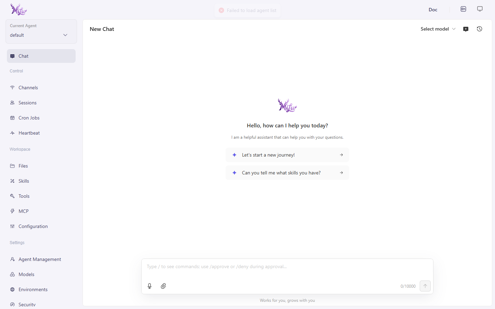

<p align="center">
  
</p>

<h1 align="center">MiLuAssistantWeb</h1>

<p align="center">基于 CoPaw / QwenPaw 项目体系二次开发的 MiLu AI 助手 Web 版，支持模型配置、Skills、工作区、记忆和 Web 控制台。</p>

<p align="center">
  <a href="./README.md">简体中文</a> | <a href="./README.en.md">English</a>
</p>

<p align="center">
  <a href="https://github.com/White-147/MiLuAssistantWeb/actions/workflows/tests.yml"></a>
  
  
  <a href="./LICENSE"></a>
</p>

<p align="center">
  
</p>

MiLuAssistantWeb 是基于 CoPaw / QwenPaw 项目体系二次开发的 AI 助手 Web 版。项目保留了原有的多渠道接入、模型配置、Skills、工作区、记忆、安全防护和 Web 控制台能力，并围绕 MiLu 品牌完成了 Web 端适配。

## 项目定位

- **上游基础**：AgentScope 体系下的 CoPaw / QwenPaw。
- **当前项目**：MiLu 助手项目的 Web 版。
- **延伸项目**：[MiLuAssistantDesktop](https://github.com/White-147/MiLuAssistantDesktop)，基于本项目改造的 Windows 桌面安装包版本。
- **使用场景**：本地或自部署 AI 助手，支持模型配置、Skills、文件处理、记忆、多 Agent、MCP 工具和定时任务。

## 主要改造

- 将原项目的 Python 包名、CLI 入口、运行命名空间、工作目录和环境变量改造为 `milu`。
- 替换 Web Console 的品牌资源、图标和产品命名。
- 增加 MiLu 本地模型 / 本地服务相关默认配置。
- 控制台默认简体中文，并在未配置任何模型时于聊天首页展示模型配置引导字幕。
- 频道按需加载：通过 `milu_ENABLED_CHANNELS` / `milu_DISABLED_CHANNELS` 环境变量控制启动时加载的频道模块，避免未启用的重 SDK（如飞书 lark_oapi）拖慢启动。
- 清理运行数据、用户工作区和私有自定义配置，整理为可公开展示的二次开发版本。
- 为后续 Windows 桌面安装包版本提供 Web 与 Python 后端基础。

## 技术栈

- **后端**：Python、FastAPI / Uvicorn、AgentScope、AgentScope Runtime。
- **前端**：React、TypeScript、Vite、Ant Design。
- **AI 能力**：模型供应商配置、Skills、记忆、多 Agent 协作、MCP 工具、浏览器/文件/Office/PDF 等工具能力。
- **部署方式**：本地 Python 运行、Web 控制台访问，可选 Docker 部署能力继承自上游项目。

## 本地运行

```powershell
cd D:\code\MiLuAssistantWeb
pip install -e .
milu init --defaults
milu app
```

然后打开：

```text
http://127.0.0.1:8088/
```

前端控制台也可以单独启动用于界面检查：

```powershell
cd D:\code\MiLuAssistantWeb\console
npm install
npm run dev
```

## 与 MiLuAssistantDesktop 的关系

本项目提供 Web 应用与 Python 后端。桌面安装包项目在此基础上使用 Electron 与 Inno Setup 打包为 Windows 桌面应用，负责本地启动 Python 后端、加载 Web UI、隔离用户数据目录，并提供更适合交付和售卖的安装体验。

## 开源协议与安全

本项目沿用上游 CoPaw / QwenPaw 项目体系的 Apache License 2.0。详见 [LICENSE](LICENSE)。

安全报告方式见 [SECURITY.md](SECURITY.md)，贡献说明见 [CONTRIBUTING.md](CONTRIBUTING.md)。
