# MiLu 中文文档总览

来源: https://CoPaw.agentscope.io/docs/

以下目录参考官网左侧导航，点击可跳转到本文档内部对应章节。

## 欢迎

- [项目介绍](#intro)
- [快速开始](#quickstart)
- [桌面应用](#desktop)

## 控制

- [控制台](#console)
- [频道配置](#channels)
- [魔法命令](#commands)
- [心跳](#heartbeat)
- [记忆](#memory)

## 智能体

- [智能体的人设](#persona)
- [多智能体](#multi-agent)
- [Skills](#skills)
- [MCP 与内置工具](#mcp)
- [上下文](#context)
- [配置与工作目录](#config)

## 设置

- [模型](#models)
- [安全](#security)
- [CLI](#cli)

## 其他

- [FAQ 常见问题](#faq)
- [问题反馈与交流](#community)
- [开源与贡献](#contributing)
- [路线图](#roadmap)

---

<a id="intro"></a>

## 项目介绍

本页说明 MiLu 是什么、能做什么、以及如何按文档一步步上手。

---

# MiLu 是什么？

MiLu 是一款**个人助理型产品**，部署在你自己的环境中。

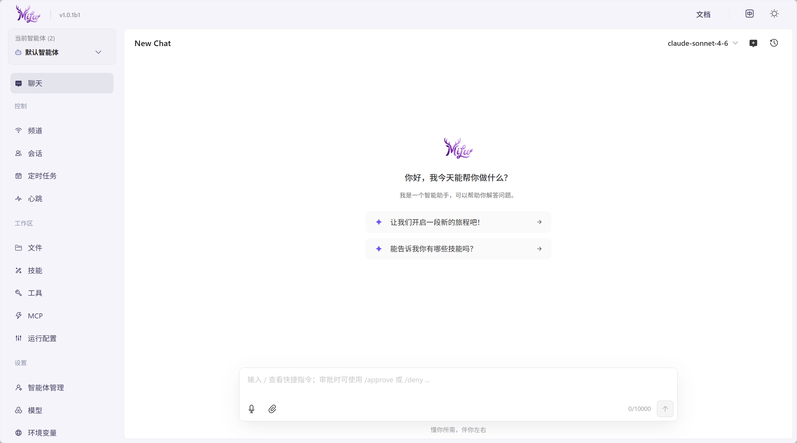

- **多通道对话** — 通过钉钉、飞书、Discord、Telegram 等与你对话。
- **多智能体协作** — 支持创建多个独立智能体，每个智能体拥有独立配置、记忆和技能，
  还可以通过协作技能互相通信、共同完成复杂任务。
- **定时执行** — 按你的配置自动运行任务。
- **能力由 Skills 决定，有无限可能** — 内置定时任务、PDF 与表单、Word/Excel/PPT 文档处理、新闻摘要、文件阅读等，还可在 [Skills](#skills) 中自定义扩展。
- **支持本地模型** — 支持本地运行大模型，无需 API Key，完全离线工作。
- **数据全在本地** — 不依赖第三方托管。
- **多层安全防护** — 内置工具防护、文件访问控制、技能安全扫描等机制，保障运行安全。

MiLu基于[CoPaw](https://github.com/agentscope-ai/CoPaw)构建。

---

# 你怎么用 MiLu？

使用方式可以概括为两类：

1. **在聊天软件里对话**
   在钉钉、飞书、微信、Discord、Telegram等app里发消息，MiLu 在同一 app 内回复，
   查资料、记待办、回答问题等都由当前启用的 Skills 完成。一个 MiLu 可同时接入多个
   app，你在哪个频道聊，它就在哪个频道回。

2. **定时自动执行**
   无需每次手动发消息，MiLu 可按你设定的时间自动运行：
   - 定时向某频道发送固定文案（如每天 9 点发「早上好」）；
   - 定时向 MiLu 提问并将回答发到指定频道（如每 2 小时问「我有什么待办」并发到钉钉）；
   - 定时执行「自检/摘要」：用你写好的一串问题问 MiLu，把回答发到你上次对话的频道。

装好、接好至少一个频道并启动服务后，你就可以在钉钉、飞书、QQ 等里与 MiLu 对话，并享受定时
消息与自检等能力；具体能做什么，取决于你启用了哪些 Skills。

---

# 文档中会出现的几个概念

- **控制台** — MiLu 内置的 Web 管理界面，可以在控制台中对话、配置频道、管理技能、
  设置模型等。详见 [控制台](#console)。
- **频道** — 你和 MiLu 对话的「场所」（钉钉、飞书、QQ、Discord、iMessage 等）。在
  [频道配置](#channels) 中按步骤配置。
- **心跳** — 按固定间隔用你写好的一段问题去问 MiLu，并可选择把回答发到你上次使用的
  频道。详见 [心跳](#heartbeat)。
- **定时任务** — 多条、各自独立配置时间的任务（每天几点发什么、每隔多久问 MiLu 什么等），
  通过控制台或 [CLI](#cli) 管理。
- **技能池与工作区技能** — 技能池是共享的技能仓库，工作区技能是某个智能体真正运
  行时使用的技能副本。详见 [Skills](#skills)。
- **MCP 和工具** — MCP（Model Context Protocol）是一种标准协议，允许接入外部
  工具服务器扩展能力。工具是 MiLu 内置的基础能力（如读写文件、执行命令、
  浏览器等）。详见 [MCP和工具](#mcp) 。
- **智能体/工作区** — 从 v0.1.0 开始，MiLu 支持多智能体，允许运行多个独立的
  AI 智能体。每个智能体拥有独立的工作区、配置、记忆、技能和对话历史，智能体之间
  还可以通过协作技能互相通信、共同完成复杂任务。详见 [多智能体](#multi-agent)。
- **安全机制** — MiLu 提供多层安全防护，包括工具防护（拦截危险命令参数）、
  文件防护（限制敏感路径访问）、技能扫描器（检查技能包安全性）等。详见 [安全](#security)。

各概念的含义与配置方法，在对应章节中均有说明。

---

# 建议的阅读与操作顺序

1. **[快速开始](#quickstart)** — 用三条命令把服务跑起来。
2. **[控制台](#console)** — 服务启动后，在浏览器中打开控制台（`http://127.0.0.1:8088/`），
   **这是配置与使用 MiLu 的中心枢纽**。先在控制台体验对话、配置模型，有助于理解
   MiLu 的工作方式。
3. **[模型](#models)** — 配置云端 LLM 提供商的 API Key，或下载本地模型。这是使用
   MiLu 的**必要前提**。
4. **按需配置与使用**：
   - [频道配置](#channels) — 接入钉钉 / 飞书 / 微信 / Discord / Telegram 等，在对应 app 里与 MiLu 对话；
   - [Skills](#skills) — 了解与扩展 MiLu 能力；
   - [MCP和工具](#mcp) — 接入外部 MCP 工具服务器；
   - [魔法命令](#commands) — 使用特殊命令快速控制对话状态（如 `/new` 开启新对话、`/clear` 清空历史、`/stop` 停止任务、`/restart` 重启服务等），无需等待 AI 理解；
   - [安全](#security) — 配置工具防护、文件防护、技能安全扫描等安全机制；
   - [心跳](#heartbeat) — 配置定时自检或摘要（可选）；
   - [定时任务](#定时任务) 或 [CLI](#cli) — 管理定时任务、清空工作目录等；
   - [多智能体](#multi-agent) — 多智能体配置、管理与协作（v0.1.0+ 新功能）；
   - [配置与工作目录](#config) — 工作目录与配置文件说明。


[返回目录](#MiLu-中文文档总览)

---

<a id="quickstart"></a>

## 快速开始

本节介绍多种方式安装 MiLu：

| 安装方式       | 适用场景                 | 优势                         | 前置要求         |
| -------------- | ------------------------ | ---------------------------- | ---------------- |
| **pip 安装**   | 熟悉 Python 的开发者     | 灵活控制环境，便于开发调试   | Python 3.10~3.13 |
| **脚本安装**   | 不想要手动配置环境的用户 | 零配置，自动管理 Python 环境 | 无               |
| **Docker**     | 容器化部署或生产环境     | 环境隔离，易于迁移           | Docker           |
| **阿里云 ECS** | 云上稳定运行             | 一键部署，稳定可靠           | 阿里云账号       |
| **魔搭创空间** | 无本地环境或快速体验     | 一键部署，云端运行，无需安装 | 魔搭账号         |
| **桌面应用**   | 不熟悉命令行的用户       | 双击即用，图形化界面         | 无               |

> 📖 阅读前请先了解 [项目介绍](#intro)，完成安装与启动后可查看 [控制台](#console)。

> 💡 **安装并启动后的关键步骤**：
>
> 1. 在浏览器访问 [控制台](#console)（`http://127.0.0.1:8088/`）
> 2. **配置模型**（必需）：设置 → 模型 → 配置 API Key 或下载本地模型
> 3. 开始对话测试
> 4. （可选）配置频道以在钉钉、飞书、QQ 等 app 里对话，详见 [频道配置](#channels)

---

## 方式一：pip 安装

如果你更习惯自行管理 Python 环境（需 Python >= 3.10, < 3.14）：

```bash
pip install MiLu
```

可选：先创建并激活虚拟环境再安装（`python -m venv .venv`，Linux/macOS 下
`source .venv/bin/activate`，Windows 下 `.venv\Scripts\Activate.ps1`）。安装后会提供 `MiLu` 命令。

然后按下方 [步骤二：初始化](#步骤二初始化) 和 [步骤三：启动服务](#步骤三启动服务) 操作。

### 步骤二：初始化

在工作目录（默认 `~/.MiLu`）下生成 `config.json` 与 `HEARTBEAT.md`。两种方式：

- **快速用默认配置**（不交互，适合先跑起来再改配置）：
  ```bash
  MiLu init --defaults
  ```
- **交互式初始化**（按提示填写心跳间隔、投递目标、活跃时段，并可顺带配置频道与 Skills）：
  ```bash
  MiLu init
  ```
  详见 [CLI - 快速上手](#快速上手)。

若已有配置想覆盖，可使用 `MiLu init --force`（会提示确认）。
初始化后若尚未启用频道，接入钉钉、飞书、QQ 等需在 [频道配置](#channels) 中按文档填写。

### 步骤三：启动服务

```bash
MiLu app
```

服务默认监听 `127.0.0.1:8088`。若已配置频道，MiLu 会在对应 app 内回复；若尚未配置，也可先完成本节再前往频道配置。

---

## 方式二：脚本安装

无需预装 Python — 安装脚本通过 [uv](https://docs.astral.sh/uv/) 自动管理一切。

### 步骤一：安装

**macOS / Linux：**

```bash
curl -fsSL https://MiLu.agentscope.io/install.sh | bash
```

然后打开新终端（或执行 `source ~/.zshrc` / `source ~/.bashrc`）。

**Windows (CMD):**

```cmd
curl -fsSL https://MiLu.agentscope.io/install.bat -o install.bat && install.bat
```

**Windows（PowerShell）：**

```powershell
irm https://MiLu.agentscope.io/install.ps1 | iex
```

然后打开新终端（安装脚本会自动将 MiLu 加入 PATH）。

> **⚠️ Windows 企业版 LTSC 用户特别提示**
>
> 如果您使用的是 Windows LTSC 或受严格安全策略管控的企业环境，PowerShell 可能运行在 **受限语言模式** 下，可能会遇到以下问题：
>
> 1. **如果你使用的是 CMD（.bat）：脚本执行成功但无法写入`Path`**
>
>    脚本已完成文件安装，由于 **受限语言模式** ，脚本无法自动写入环境变量，此时只需手动配置：
>
>    - **找到安装目录**：
>      - 检查 `uv` 是否可用：在 CMD 中输入 `uv --version` ，如果显示版本号，则**只需配置 MiLu 路径**；如果提示 `'uv' 不是内部或外部命令，也不是可运行的程序或批处理文件。`，则需同时配置两者。
>      - uv路径（任选其一，取决于安装位置，若`uv`不可用则填）：通常在`%USERPROFILE%\.local\bin`、`%USERPROFILE%\AppData\Local\uv`或 Python 安装目录下的 `Scripts` 文件夹
>      - MiLu路径：通常在 `%USERPROFILE%\.MiLu\bin` 。
>    - **手动添加到系统的 Path 环境变量**：
>      - 按 `Win + R`，输入 `sysdm.cpl` 并回车，打开"系统属性"。
>      - 点击 "高级" -> "环境变量"。
>      - 在 "系统变量" 中找到并选中 `Path`，点击 "编辑"。
>      - 点击 "新建"，依次填入上述两个目录路径，点击确定保存。
>
> 2. **如果你使用的是 PowerShell（.ps1）：脚本运行中断**
>
> 由于 **受限语言模式** ，脚本可能无法自动下载`uv`。
>
> - **手动安装uv**：参考 [GitHub Release](https://github.com/astral-sh/uv/releases)下载并将`uv.exe`放至`%USERPROFILE%\.local\bin`或`%USERPROFILE%\AppData\Local\uv`；或者确保已安装 Python ，然后运行`python -m pip install -U uv`
> - **配置`uv`环境变量**：将`uv`所在目录和 `%USERPROFILE%\.MiLu\bin` 添加到系统的 `Path` 变量中。
> - **重新运行**：打开新终端，再次执行安装脚本以完成 `MiLu` 安装。
> - **配置`MiLu`环境变量**：将 `%USERPROFILE%\.MiLu\bin` 添加到系统的 `Path` 变量中。

也可以指定选项：

**macOS / Linux：**

```bash
安装指定版本
curl -fsSL ... | bash -s -- --version 0.0.2

从源码安装（开发/测试用）
curl -fsSL ... | bash -s -- --from-source
```

**Windows（PowerShell）：**

```powershell
安装指定版本
.\install.ps1 -Version 0.0.2

从源码安装（开发/测试用）
.\install.ps1 -FromSource
```

升级只需重新运行安装命令。卸载请运行 `MiLu uninstall`。

### 步骤二：初始化

在工作目录（默认 `~/.MiLu`）下生成 `config.json` 与 `HEARTBEAT.md`。两种方式：

- **快速用默认配置**（不交互，适合先跑起来再改配置）：
  ```bash
  MiLu init --defaults
  ```
- **交互式初始化**（按提示填写心跳间隔、投递目标、活跃时段，并可顺带配置频道与 Skills）：
  ```bash
  MiLu init
  ```
  详见 [CLI - 快速上手](#快速上手)。

若已有配置想覆盖，可使用 `MiLu init --force`（会提示确认）。
初始化后若尚未启用频道，接入钉钉、飞书、QQ 等需在 [频道配置](#channels) 中按文档填写。

### 步骤三：启动服务

```bash
MiLu app
```

服务默认监听 `127.0.0.1:8088`。若已配置频道，MiLu 会在对应 app 内回复；若尚未配置，也可先完成本节再前往频道配置。

---

## 方式三：Docker

镜像在 **Docker Hub**（`agentscope/MiLu`）。镜像 tag：`latest`（稳定版）；`pre`（PyPI 预发布版）。国内用户也可选用阿里云 ACR：`agentscope-registry.ap-southeast-1.cr.aliyuncs.com/agentscope/MiLu`（tag 相同）。

拉取并运行：

```bash
docker pull agentscope/MiLu:latest
docker run -p 127.0.0.1:8088:8088 \
  -v MiLu-data:/app/working \
  -v MiLu-secrets:/app/working.secret \
  agentscope/MiLu:latest
```

然后在浏览器打开 **http://127.0.0.1:8088/** 进入控制台。配置、记忆与 Skills 保存在 `MiLu-data` 卷中；模型配置与 API Key 保存在 `MiLu-secrets` 卷中。传入 API Key 可在 `docker run` 时加 `-e DASHSCOPE_API_KEY=xxx` 或 `--env-file .env`。

---

## 方式四：部署到阿里云 ECS

若希望将 MiLu 部署在阿里云上，可使用阿里云 ECS 一键部署：

1. 打开 [MiLu 阿里云 ECS 部署链接](https://computenest.console.aliyun.com/service/instance/create/cn-hangzhou?type=user&ServiceId=service-1ed84201799f40879884)，按页面提示填写部署参数；
2. 参数配置完成后确认费用并创建实例，部署完成后即可获取访问地址并使用服务。

详细步骤与说明请参考 [阿里云开发者社区：MiLu 3 分钟部署你的 AI 助理](https://developer.aliyun.com/article/1713682)。

---

## 方式五：魔搭创空间一键配置（无需安装）

若不想在本地安装 Python，可通过魔搭创空间将 MiLu 部署到云端运行：

1. 先前往 [魔搭](https://modelscope.cn/register?back=%2Fhome) 注册并登录；
2. 打开 [MiLu 创空间](https://modelscope.cn/studios/fork?target=AgentScope/MiLu)，一键配置即可使用。

**重要**：使用创空间请将空间设为 **非公开**，否则你的 MiLu 可能被他人操纵。

---

## 方式六：桌面应用

如果你不习惯使用命令行，可以下载并使用 MiLu 的桌面应用版本，无需手动配置 Python 环境或执行命令。

### 特点

- ✅ **零配置**：下载后双击即可运行，无需安装 Python 或配置环境变量
- ✅ **跨平台**：支持 Windows 10+ 和 macOS 14+ (推荐 Apple Silicon)
- ✅ **可视化**：自动打开浏览器界面，无需手动输入地址

### 下载与使用

1. **下载安装包**
   前往 [GitHub Releases](https://github.com/agentscope-ai/CoPaw/releases) 下载对应系统的版本：

   - Windows: `MiLu-Setup-<version>.exe`
   - macOS: `MiLu-<version>-macOS.zip`

2. **安装并启动**

   - **Windows**: 双击 `.exe` 文件按向导安装，完成后双击桌面快捷方式启动
   - **macOS**: 解压 `.zip` 得到 `MiLu.app`，首次需右键选择"打开"以绕过系统安全限制

3. **首次启动提示**
   首次启动可能需要 10-60 秒（取决于系统配置），应用需要初始化 Python 环境和加载依赖，请耐心等待浏览器窗口自动打开。

### 完整使用指南

桌面应用涉及系统权限、安全提示、调试模式等细节，请查看 **[桌面应用完整指南](#desktop)** 了解：

- Windows 两种启动模式（普通版 vs Debug 版）
- macOS 如何解除系统安全限制（3种方法）
- 常见问题与解决方案
- 日志查看与问题报告

---

## 验证安装（可选）

服务启动后,可通过 HTTP 调用 Agent 接口以确认环境正常。接口为 **POST** `/api/agent/process`,请求体为 JSON,支持 SSE 流式响应。单轮请求示例:

```bash
curl -N -X POST "http://localhost:8088/api/agent/process" \
  -H "Content-Type: application/json" \
  -d '{"input":[{"role":"user","content":[{"type":"text","text":"你好"}]}],"session_id":"session123"}'
```

同一 `session_id` 可进行多轮对话。

---

## 接下来做什么？

### 必要步骤

#### ✅ 1. 配置模型（必需）

MiLu 需要大语言模型才能工作。你可以选择以下任一方式：

**选项 A：使用云端模型（需要 API Key）**

1. 在控制台进入 **设置 → 模型**
2. 选择一个提供商（如 DashScope、ModelScope 等）
3. 点击 **设置** 按钮，输入你的 **API Key**
4. 点击 **保存**
5. 在顶部 **默认 LLM** 中选择该提供商和具体模型
6. 点击 **保存**

详见 [模型 - 配置云提供商](#models)。

**选项 B：使用本地模型（无需 API Key，完全离线）**

1. 安装本地模型后端：

- MiLu Local（llama.cpp）：在 MiLu Local 提供商设置中下载 `llama.cpp`，详见 [模型 - 配置本地提供商](#models)。
- Ollama：从 [Ollama 官网](https://ollama.com/download) 安装 Ollama，并启动 Ollama 服务。
- LM Studio：从 [LM Studio 官网](https://lmstudio.ai/download) 安装 LM Studio，并启动 LM Studio 服务。

2. 下载模型：

- 对于 MiLu Local（llama.cpp），你可以直接在控制台的提供商设置中下载模型，或者手动将 GGUF 模型文件放到本地模型目录中（默认 `~/.MiLu/local_models/models/<org>/<model>`，例如 `~/.MiLu/local_models/models/Qwen/Qwen3-0.6B-GGUF`）。
- 对于 Ollama 和 LM Studio，需要先在各自服务中添加模型，之后 MiLu 才能自动获取模型列表并连接。

3. 在控制台选择本地提供商和模型

配置好本地模型后，你可以在控制台的 **默认 LLM** 设置中选择它，也可以直接在 **聊天** 页面中切换使用。

#### 🎯 2. 在控制台测试对话

模型配置完成后，在控制台的 **聊天** 页面发送消息测试功能，确认 MiLu 可以正常回复。

---

### 可选扩展

配置模型并测试成功后，可以根据需要进行以下扩展：

#### 📱 接入消息频道

在钉钉、飞书、QQ、Discord、iMessage 等 app 里与 MiLu 对话：

1. 在控制台进入 **控制 → 频道**
2. 选择要接入的频道
3. 按照 [频道配置](#channels) 文档获取凭据并填写
4. 保存后即可在对应 app 中发消息给 MiLu

#### 🔧 启用和扩展技能

赋予 MiLu 更多能力（PDF 处理、Office 文档、新闻摘要等）：

- 在控制台进入 **智能体 → 技能池** 或 **智能体 → 技能**
- 导入内置技能、从 Skill Hub 导入、或创建自定义技能
- 详见 [Skills](#skills)

#### 🔌 接入 MCP 工具

通过 MCP（Model Context Protocol）扩展外部工具能力：

- 在控制台进入 **智能体 → MCP**
- 创建 MCP 客户端，连接外部工具服务器
- 详见 [MCP](#mcp)

#### ⏰ 设置定时任务与心跳

让 MiLu 自动执行任务：

- **定时任务**：在控制台 **控制 → 定时任务** 中创建，或使用 [CLI](#cli) 的 `MiLu cron` 命令
- **心跳**：配置定时自检或摘要，详见 [心跳](#heartbeat)

#### 👥 创建多智能体

创建多个专用助手，各司其职或互相协作：

- 在控制台 **设置 → 智能体管理** 中创建新智能体
- 每个智能体拥有独立的配置、记忆、技能和对话历史
- 启用协作技能让智能体间可以互相通信
- 详见 [多智能体](#multi-agent)

#### 📂 调整工作目录

如需更改配置文件或工作目录的位置，详见 [配置与工作目录](#config)。


[返回目录](#MiLu-中文文档总览)

---

<a id="desktop"></a>

# MiLu Desktop 桌面应用版使用指南

> ⚠️ **Beta 版本说明**
>
> 桌面应用目前处于 Beta 测试阶段，存在以下已知限制：
>
> - **兼容性测试不完整**：未在所有系统版本和硬件配置上进行充分测试
> - **性能可能存在缺陷**：启动速度、内存占用等方面可能需要进一步优化
> - **功能持续完善中**：部分功能可能不稳定或缺失
>
> 欢迎反馈问题，帮助我们改进产品质量。

**下载地址**：[GitHub Releases][releases]

本文档说明如何在 Windows 和 macOS 系统上安装和使用 MiLu Desktop 桌面应用。

[releases]: https://github.com/agentscope-ai/MiLu/releases

# 特别说明

**首次启动可能需要较长时间（10-60秒不等，甚至可能更长），具体取决于您的系统配置。** 应用需要初始化 Python 环境、加载依赖库和启动 Web 服务，请耐心等待窗口出现。后续启动会更快。

## 目录

- [Windows 使用指南](#windows-使用指南)
- [macOS 使用指南](#macos-使用指南)
- [技术支持](#技术支持)

---

## Windows 使用指南

### 系统要求

- **操作系统**: Windows 10 或更高版本
- **架构**: x64 (64位)

### 安装步骤

1. **下载安装包**
   从 [Release 页面][releases]下载 `MiLu-Setup-<version>.exe` 文件

2. **运行安装程序**
   双击 `.exe` 文件，按照安装向导提示完成安装
   - 默认安装位置：`C:\Users\<你的用户名>\AppData\Local\MiLu`
   - 安装完成后会在桌面和开始菜单创建快捷方式

### 启动方式

安装完成后，您会看到**两个启动快捷方式**：

#### **MiLu Desktop** (推荐日常使用)

- **特点**: 静默启动，无终端窗口，界面简洁
- **适用场景**: 正常使用，不需要查看技术日志
- **启动方式**: 双击桌面或开始菜单的 "MiLu Desktop" 图标
- **技术说明**: 使用 VBScript 启动器，后台运行 Python 进程

#### **MiLu Desktop (Debug)** (调试模式)

- **特点**: 显示终端窗口，实时输出运行日志
- **适用场景**:
  - 遇到问题需要查看错误信息
  - 开发测试
  - 报告 Bug 时需要提供日志
- **启动方式**: 双击开始菜单的 "MiLu Desktop (Debug)" 图标
- **日志内容**:
  - 应用启动信息
  - Python 错误堆栈
  - API 调用日志
  - 按 Ctrl+C 或关闭窗口可停止应用

### 常见问题

**Q: 应用启动后窗口白屏，无法正常显示？**
A: 这通常是因为系统缺少 **Microsoft WebView2** 运行时（部分 Windows 10 系统未预装）。
请前往微软官网下载并安装：
[Microsoft WebView2](https://developer.microsoft.com/en-us/microsoft-edge/webview2/)
安装完成后重启应用即可。

**Q: 应用启动后没有反应？**
A: 使用 "MiLu Desktop (Debug)" 模式启动，查看终端输出的错误信息

**Q: 如何卸载？**
A: 在 Windows 设置 → 应用 → 已安装的应用 → 找到 "MiLu Desktop" → 卸载

**Q: 安装包是否安全？**
A:

- 应用未经过 **Microsoft 代码签名**（成本 $200-800/年），Windows Defender SmartScreen 会显示警告
- 这是正常现象，点击 "更多信息" → "仍要运行" 即可
- 代码完全开源，构建过程在 GitHub Actions 上透明可查

---

## macOS 使用指南

### 系统要求

- **操作系统**: macOS 14 (Sonoma) 或更高版本
- **架构**:
  - ✅ **Apple Silicon (M1/M2/M3/M4)** - 推荐，支持 MLX 本地模型加速
  - ⚠️ Intel 芯片 - 可能可以运行，但无法使用 MLX 加速功能

### 安装步骤

1. **下载压缩包**
   从 [Release 页面][releases]下载 `MiLu-<version>-macOS.zip` 文件

2. **解压缩**
   双击 `.zip` 文件自动解压，得到 `MiLu.app` 应用

3. **移动到应用程序文件夹 (可选)**
   将 `MiLu.app` 拖到 `/Applications` 文件夹

### 首次启动：解除系统安全限制

#### 为什么需要手动信任？

MiLu 应用**未经过 Apple 开发者签名和公证（Notarization）**，macOS Gatekeeper 会默认阻止运行。

**为什么没有签名？**

- 📋 开发者签名需要额外成本和流程，后续版本会补上

**当前影响：**

- ✅ **不影响功能**：应用完全正常运行
- ⚠️ **首次需手动信任**：一次操作后永久有效
- 🔒 **安全性**：开源代码可审计，构建过程透明（CI/CD）

#### 如何解除限制？

#### 方法 1：右键打开 (推荐)

1. **右键点击**（或 Control + 点击）`MiLu.app`
2. 在菜单中选择 **"打开"**
3. 在弹出的对话框中，再次点击 **"打开"** 按钮
4. ✅ 之后双击即可正常启动，不会再弹窗

#### 方法 2：系统设置解除拦截

如果仍被拦截：

1. 打开 **系统设置 → 隐私与安全性**
2. 向下滚动，找到类似以下提示：
   _"已阻止使用 'MiLu'，因为无法验证开发者"_
3. 点击 **"仍要打开"** 或 **"允许"** 按钮
4. 输入管理员密码确认

#### 方法 3：终端命令解除隔离

```bash
移除下载隔离属性
xattr -cr /Applications/MiLu.app
```

⚠️ **注意**: 此方法会完全移除安全检查，仅当您完全信任应用来源时使用。

### 🔍 权限请求

首次启动时，macOS 可能会弹窗请求以下权限：

- **桌面文件访问权限**
  用于访问您的文件（如果使用文件相关功能）
  - 点击 **"允许"** 以正常使用
  - 点击 **"不允许"** 应用仍可运行，但部分功能受限

### 启动方式

#### 正常启动（双击）

- 双击 `MiLu.app` 即可启动
- 应用会在后台运行，打开浏览器窗口
- 日志输出到：`~/.MiLu/desktop.log`

#### 终端启动（查看实时日志）

如果应用崩溃或需要查看详细日志：

```bash
切换到应用目录
cd /Applications  # 或您的 MiLu.app 所在目录

设置环境变量并启动
APP_ENV="$(pwd)/MiLu.app/Contents/Resources/env"
PYTHONPATH= PYTHONHOME="$APP_ENV" "$APP_ENV/bin/python" -m MiLu desktop
```

**终端启动的优势：**

- ✅ 实时查看所有日志输出
- ✅ 看到完整的 Python 错误堆栈
- ✅ 便于调试和报告问题
- ✅ 可添加 `--log-level debug` 查看更详细信息

**查看日志文件：**

```bash
查看最近的启动日志
tail -f ~/.MiLu/desktop.log
```

### 常见问题

**Q: 双击后没有任何反应？**
A:

1. 检查 `~/.MiLu/desktop.log` 文件查看错误
2. 使用上述终端命令启动，查看实时输出

**Q: 提示"Apple 无法验证此应用"？**
A: 按照上述"解除系统安全限制"步骤操作

**Q: 如何卸载？**
A: 将 `MiLu.app` 拖到废纸篓，然后删除 `~/.MiLu` 配置文件夹

**Q: Intel Mac 可以用吗？**
A: 可以运行，但无法使用 MLX 模型加速（MLX 仅支持 Apple Silicon）

**Q: 应用为什么没有签名，为什么系统会提示有风险？**

A:

当前采用

- ✅ **开源透明**：所有代码和构建流程公开在 GitHub
- ✅ **CI/CD 可验证**：GitHub Actions 自动构建，日志可查
- ✅ **用户审计**：可以自行检查代码并本地构建
- ✅ **一次信任**：手动信任后永久有效

---

## 技术支持

- **GitHub Issues**: [提交问题](https://github.com/agentscope-ai/MiLu/issues)
- **打包文档**: `scripts/pack/README.md` - 技术细节和本地构建指南
- **日志位置**:
  - Windows: Debug 模式终端查看，或 `%USERPROFILE%\.MiLu\` 目录
  - macOS: `~/.MiLu/desktop.log`

---

## 使用建议

### Windows 用户

- **日常使用**: 使用普通版（无终端窗口）
- **遇到问题**: 切换到 Debug 版查看日志

### macOS 用户

- **首次安装**: 务必按照"解除安全限制"步骤操作
- **调试问题**: 使用终端启动方式查看实时日志
- **权限问题**: 首次启动时请允许文件访问权限


[返回目录](#MiLu-中文文档总览)

---

<a id="console"></a>

## 控制台

**控制台** 是 MiLu 内置的 Web 管理界面。运行 `MiLu app` 后，在浏览器中打开
`http://127.0.0.1:8088/` 即可进入。

**在控制台中你可以：**

- 和 MiLu 实时对话
- 启用/禁用/配置消息频道
- 管理所有聊天会话
- 管理定时任务和心跳
- 编辑 MiLu 的人设和行为文件
- 开关/导入技能以定制 MiLu 的能力
- 开关工具
- 管理MCP客户端
- 修改运行配置
- 管理多智能体
- 配置 LLM 提供商并选择使用的模型
- 管理工具所需的环境变量
- 管理工具和技能的安全功能
- 查看 LLM Token 消耗统计
- 配置对语音消息的处理方式

左侧侧边栏列出所有功能，分为 **聊天**、**控制**、**工作区**、**设置** 四组，点击即可
切换页面。下面按顺序逐一介绍每个功能的操作方法。

> **看不到控制台？** 请确认前端已构建，构建方式见 [CLI](#cli)。

---

## 聊天

> 侧边栏：**聊天 → 聊天**

这是你和 MiLu 对话的地方。打开控制台后默认就是这个页面。


**选择模型：**
聊天页面右上角可以为当前智能体选择需要使用的模型。

**发送消息：**
在底部输入框中输入内容，按 **Enter** 或点击发送按钮（↑），MiLu 会实时回复。

**语音输入：**
发送区支持**语音输入**（需浏览器与系统麦克风权限）。处理方式与 **语音转写** 中的设置一致（例如先转写再交给模型）。

**附件：**
发送区支持上传**附件**，包括文档、图片、音视频等（以界面提示为准，单文件有大小上限）。

**新建会话：**
点击聊天页面右上角 **新建聊天** 按钮，开始一段全新的对话。每个会话独立保存各自的对话记录。

**切换会话：**
点击聊天页面右上角 **聊天历史** 按钮，即可查看及切换历史聊天内容。

**删除会话：**
在聊天历史栏中，点击任意会话条目右侧的 **垃圾桶** 按钮即可删除。

---

## 频道

> 侧边栏：**控制 → 频道**

在这里管理各消息频道（Console、钉钉、飞书、Discord、QQ、微信、iMessage等）的开关和凭据。

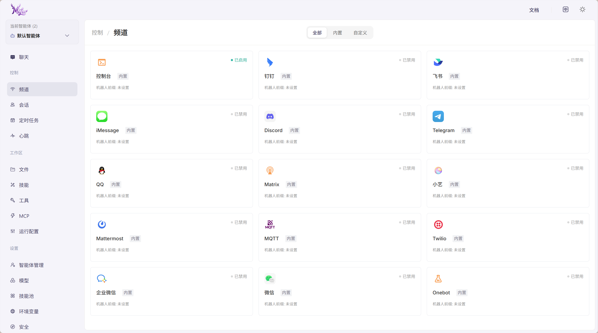

**启用一个频道：**

1. 点击你要配置的频道卡片。

2. 右侧滑出配置面板，打开 **已启用** 开关。

3. 填写该频道必需的凭证——每个频道的需求不同，详情请见[频道配置](#channels)。

4. 点 **保存**，几秒内自动生效，无需重启。

**禁用一个频道：**
打开同一个配置面板，关闭 **已启用** 开关，然后 **保存**。

> 各平台的凭据获取步骤，请看 [频道配置](#channels)。

---

## 会话

> 侧边栏：**控制 → 会话**

在这里查看、筛选和清理所有频道的聊天会话。


**查找会话：**
在搜索框中输入用户名过滤，或用下拉菜单按频道筛选，表格会即时更新。

**重命名会话：**
点击某行的 **编辑** 按钮 → 修改名称 → 点 **保存**。

**删除单条会话：**
点击某行的 **删除** 按钮 → 弹窗确认即可。

**批量删除：**
勾选要删除的行 → 点击出现的 **批量删除** 按钮 → 确认。

---

## 定时任务

> 侧边栏：**控制 → 定时任务**

在这里创建和管理 MiLu 按时间自动执行的定时任务。

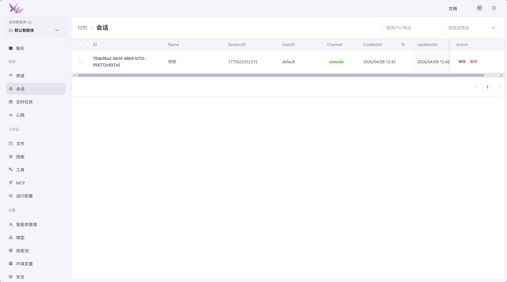

**创建新任务：**

> 如果定时任务没有创建成功，可以参考 [FAQ](https://MiLu.agentscope.io/docs/faq) 的 **定时任务错误排查** 寻找原因

创建定时任务的 **最简单的方式是直接与 MiLu 对话**，让他为你创建。例如你想在钉钉上收到喝水提醒，则在钉钉上与 MiLu 对话：“帮我创建一个定时任务，每隔 5 分钟提醒我喝水。”创建完成后，可以在控制台的定时任务页面看到创建好的定时任务。

另外一种方式是在控制台页面创建：

1. 点击 **创建任务** 按钮。

2. 按区域填写表单：
   - **基本信息** —— 给任务一个 ID（如 `job-001`）、一个名称（如「每日摘要」），
     并打开启用开关。
   - **调度** —— 可选择执行时间；如果选项不满足需求，可填写 **Cron 表达式**（五段式，如 `0 9 * * *` = 每天 9:00）。时区默认采用当前智能体的用户时区，可在此修改。
   - **任务类型及内容**
     - 选择 **text**：发送**消息内容**中的固定文本
     - 选择**agent**：填写**请求内容**，会定时向MiLu转发content.text中的请求文本
   - **投递** —— 选择目标频道（如 Console、钉钉）、目标用户、目标会话ID以及分发模式
     （**流式** = 实时发送，**最终** = 完成后一次性发送）。
   - **高级选项** —— 按需调整最大并发数、超时时间和宽限时间。
3. 点 **保存**。

**启用 / 禁用任务：**
点击行内的开关即可。

**编辑任务：**
先**禁用**需要编辑的任务，点击 **编辑** 按钮 → 修改任意字段 → **保存**。

**立即执行一次：**
点击 **立即执行** → 确认，任务会马上运行一次。

**删除任务：**
先**禁用**需要删除的任务，点击 **删除** → 确认。

---

## 心跳

> 侧边栏：**控制 → 心跳**


为**当前选中的智能体**配置定时「自检」：按间隔把 `HEARTBEAT.md` 里的内容当作用户消息发给 MiLu，并可把回复投递到指定目标。

**常用项：**

- **启用**：打开后才会按间隔执行。
- **间隔**：数字 + 单位（分钟 / 小时）。
- **投递目标**：`main` 仅在主会话执行；`last` 可把结果发到上次与用户对话的频道。
- **活跃时段**（可选）：仅在一天内指定时间段内触发，避免夜间打扰。

修改后 **保存** 生效。文案与语义详见 [心跳](#heartbeat)。

---

## 文件

> 侧边栏：**工作区 → 文件**

在这里编辑定义 MiLu 人设和行为的文件——SOUL.md、AGENTS.md、
HEARTBEAT.md 等——全部在浏览器中完成。

> **多智能体：** 从 **v0.1.0** 开始，MiLu 支持**多智能体**功能。
> 您可以在同一个 MiLu 实例中运行多个独立的智能体，每个智能体拥有独立的
> 工作区、配置、记忆和对话历史。智能体之间还可以互相协作。在控制台顶部可以切换当前操作的智能体。
> 详见 [多智能体](#multi-agent)。

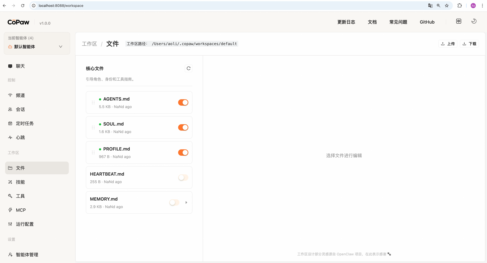

**编辑文件：**

1. 点击文件列表中的文件名（如 `SOUL.md`）。
2. 文件内容出现在编辑器中，关闭预览按钮，修改内容。
3. 点 **保存** 生效，或点 **重置** 放弃修改并重新加载。

**查看每日记忆：**
如果存在 `MEMORY.md`，点击旁边的 **▶** 箭头可展开按日期分组的条目，点击某个日期
即可查看或编辑当天的记忆。

**下载整个工作区：**
点击 **下载** 按钮，工作区会打包为 `.zip` 文件保存到本地。

**上传 / 恢复工作区：**
点击 **上传** 按钮 → 选择 `.zip` 文件（最大 100 MB），当前工作区文件会被替换。
适合在不同机器之间迁移或从备份恢复。

---

## 技能

> 侧边栏：**工作区 → 技能**

在这里管理扩展 MiLu 能力的技能（如读取 PDF、创建 Word 文档、获取新闻等），更详细的内容请看 [Skills](#skills)。

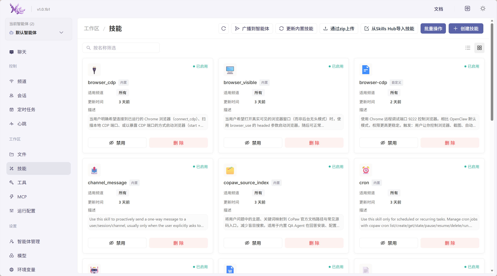

**启用技能：**
点击技能卡片底部的 **启用** 链接，立即生效。

**禁用技能：**
点击 **禁用** 链接，同样立即生效。

**查看技能详情：**
点击技能卡片可查看完整说明。

**编辑技能：**

点击技能卡片 → 关闭内容预览 → 修改技能内容 → 点击保存。

**创建自定义技能：**

1. 点击 **创建技能**。
2. 输入技能名称（如 `weather_query`）和技能内容（Markdown 格式，需包含 `name` 和 `description`）。
3. 点 **创建**，成功后可以在技能列表中看到新创建的技能。

**从技能池载入技能：**

1. 点击 **从技能池载入**。
2. 在弹出的页面中，选择想载入到当前智能体中的技能。
3. 点击 **确认**。

**将技能同步到技能池：**

1. 点击 **同步到技能池**。
2. 选择想要同步到技能池中的技能。
3. 点击 **确认**。

**上传技能：**

1. 点击 **通过 zip 上传**。
2. 选择需要上传的技能 **zip** 文件。
3. 点击 **打开**，成功后可以在技能列表中看到上传的技能。

**从 Skills Hub 中导入技能：**

1. 点击页面上方 **从 Skills Hub 导入技能**。
2. 输入技能 URL，点击 **从 Skills Hub 导入技能**。
3. 等待技能导入，成功后可在技能列表中看到已启用。

**删除技能：**
点击卡片上的 **删除** → 二次确认即可删除。如果技能当前处于启用状态，会自动先
禁用再删除。

---

## 工具

> 侧边栏：**工作区 → 工具**


按**内置工具名称**单独开启或关闭（如读文件、执行命令、浏览器等）。关闭后该 Agent 在对话中无法调用该工具。

可使用顶部的 **全部启用** / **全部禁用** 批量操作。变更即时作用于**当前智能体**。

---

## MCP

> 侧边栏：**工作区 → MCP**

在这里启用/禁用/删除**MCP**，或者创建新的客户端。

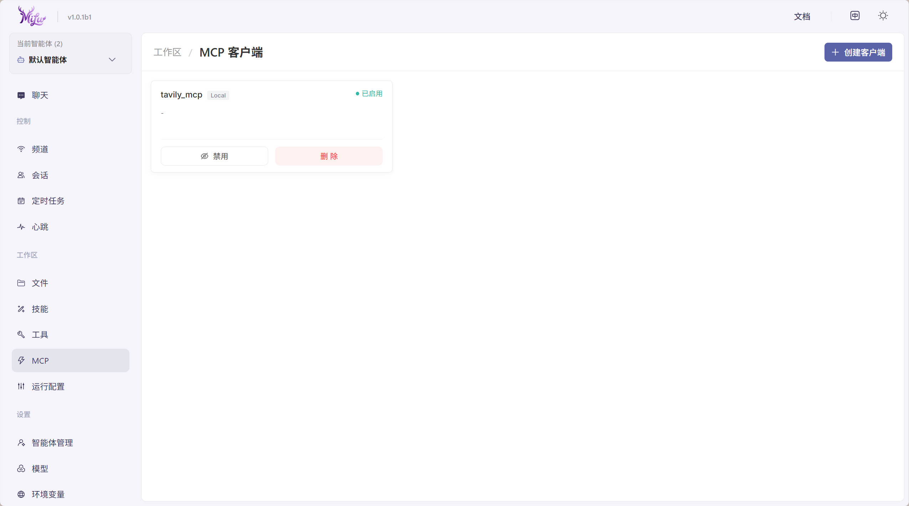

**创建客户端**
点击右上角的**创建客户端**，填写必要信息，点击**创建**，可以看到MCP客户端列表中新增内容。

## 运行配置

> 侧边栏：**工作区 → 运行配置**

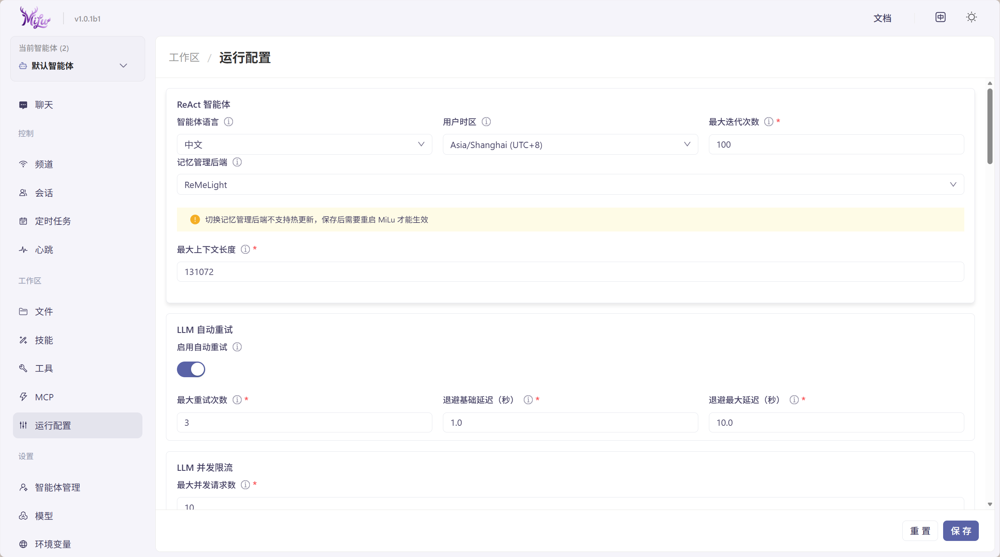

本页集中配置**当前智能体**的运行参数，分多块卡片，改完后点底部 **保存**（**重置** 可重新拉取服务端数据）。

- **React 智能体**：界面语言、用户时区、最大迭代次数、最大上下文长度等。
- **LLM 自动重试**：最大重试次数等。
- **LLM 并发限流**：最大并发请求数等。
- **上下文管理**：最大输入长度等。
- **上下文压缩配置**：上下文压缩阈值比例等。
- **工具结果压缩配置**：最新工具结果范围等。
- **记忆总结配置**：强制搜索最大结果数等。
- **向量模型配置**：是否启用 Embedding 缓存等。

更细的机制说明见 [上下文](#context) 和 [配置与工作目录](#config)。

---

## 智能体管理

> 侧边栏：**设置 → 智能体管理**

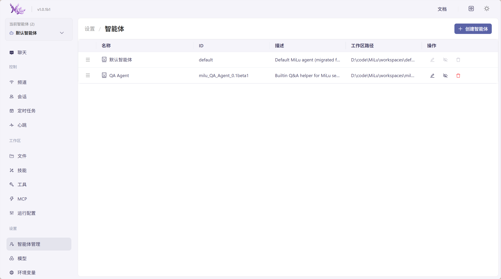

创建、编辑、启用/禁用或删除智能体；列表中的 **描述** 会用于多智能体协作时的分工判断，建议写清用途。

Console 页面左上角的 **当前智能体** 用于切换当前操作对象；**智能体管理** 页面修改的是各智能体的元数据（名称、描述、自定义工作区路径等）。详见 [多智能体](#multi-agent)。

---

## 模型

> 侧边栏：**设置 → 模型**

在这里配置 LLM 提供商，并选择默认模型。详情请见 [Models](#models)。

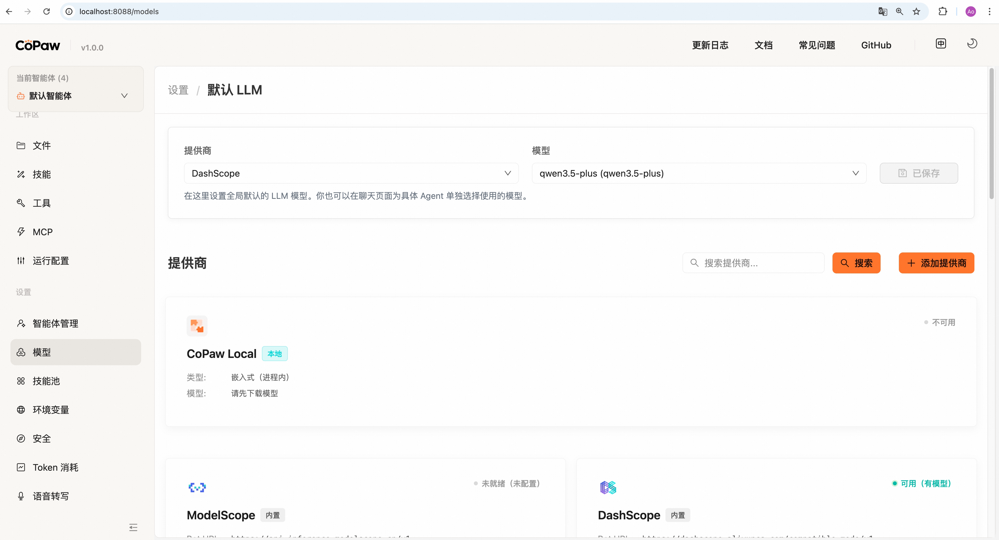

在本页面，你可以：

- 配置云端提供商（ModelScope、DashScope、OpenAI、Anthropic 等）
- 配置本地提供商（llama.cpp、Ollama、LM Studio）
- 通过填写 API 详情添加自定义提供商
- 选择智能体默认使用的模型

---

## 技能池

> 侧边栏：**设置 → 技能池**

在这里对技能做全局管理，更详细的内容请看 [Skills](#skills)。

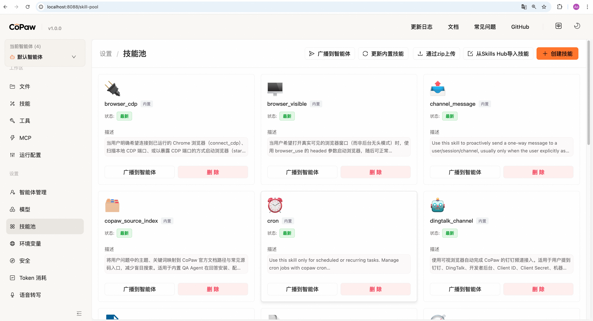

在当前页面，可对技能做以下操作：

- 广播技能到具体的智能体
- 更新内置技能到最新版本
- 通过 zip 文件上传技能
- 从 Skills Hub 中导入技能
- 创建技能
- 编辑技能
- 删除技能

---

## 环境变量

> 侧边栏：**设置 → 环境变量**

在这里管理 MiLu 的工具和技能在运行时需要的环境变量（如 `TAVILY_API_KEY`）。

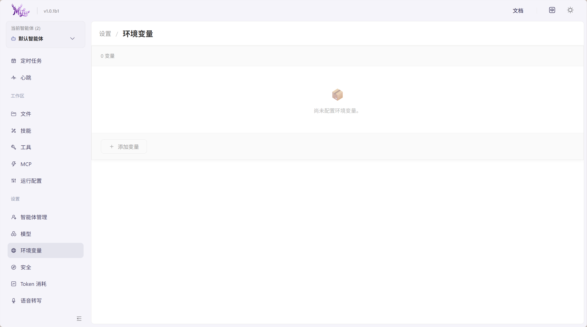

**添加变量：**

1. 点击底部的 **+ 添加变量**。
2. 输入变量名（如 `TAVILY_API_KEY`）和对应的值。
3. 点击 **保存**。

**编辑变量：**
修改已有行的 **Value** 字段，然后点 **保存**。
（变量名保存后为只读，如需改名请先删除再新建。）

**删除变量：**
点击行右侧的 **🗑** 图标 → 二次确认后删除。

**批量删除：**
勾选要删除的行 → 点工具栏的 **删除** → 二次确认后删除。

> **注意：** 环境变量值的有效性需要用户自行保证，MiLu 只负责存储和加载。
>
> 更多说明见 [配置 — 环境变量](#环境变量)。

---

## 安全

> 侧边栏：**设置 → 安全**

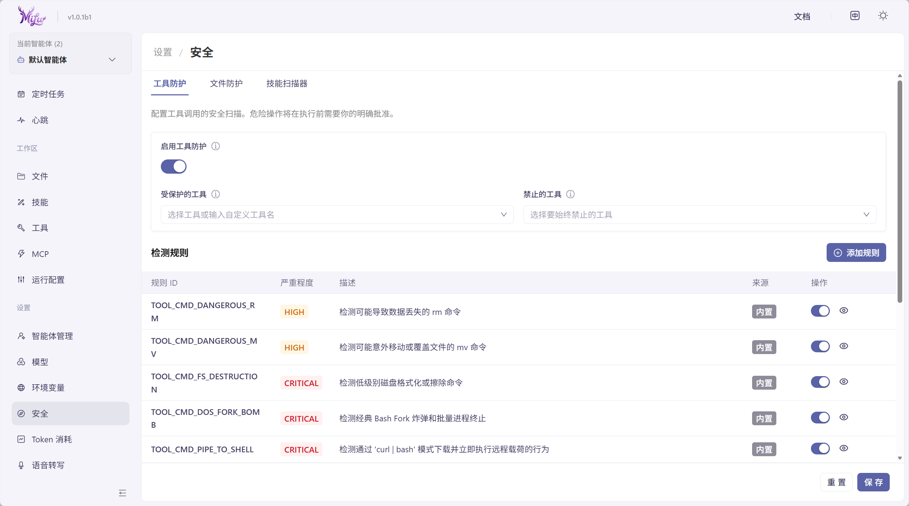

分 **工具防护**、**文件防护**、**技能扫描器** 等页签：分别控制危险工具参数拦截、敏感路径访问拦截、技能包安全扫描策略。

在页内开关、改规则后 **保存**。详情请见 [安全](#security)。

---

## Token 消耗

> 侧边栏：**设置 → Token 消耗**

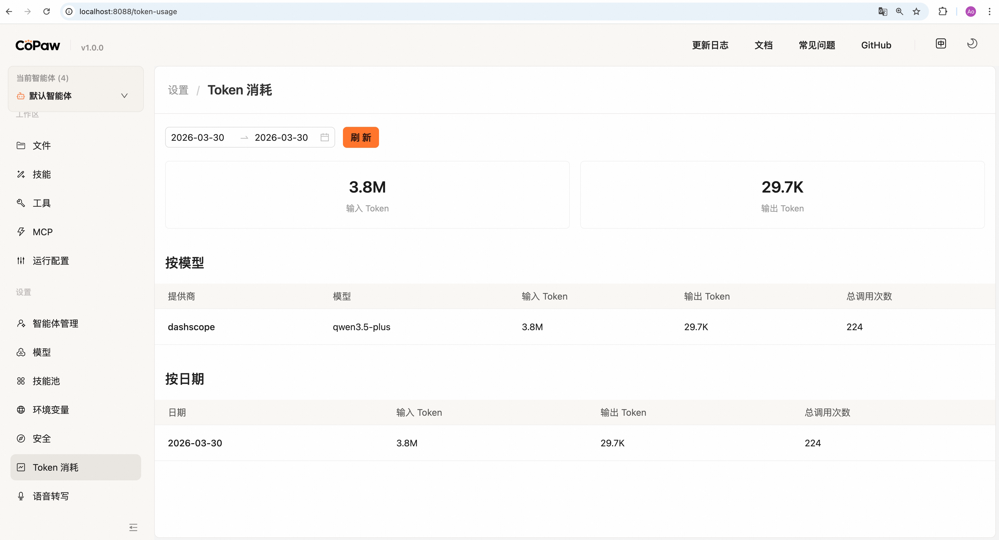

在这里查看一段时间内的 LLM Token 消耗，按日期和模型统计。

**查看消耗：**

1. 选择日期范围（默认最近 30 天）。
2. 点击 **刷新** 获取数据。
3. 页面展示总 Token 数、总调用次数、按模型和按日期的明细。

**通过对话查询：**

在聊天中直接问 MiLu「最近用了多少 token？」或「帮我看看 token 消耗」，Agent 会调用 `get_token_usage` 工具并返回统计结果。

> 数据存储在 `~/.MiLu/token_usage.json`，可通过 `MiLu_TOKEN_USAGE_FILE` 环境变量自定义文件名。详见 [配置 — 环境变量](#环境变量)。

---

## 语音转写

> 侧边栏：**设置 → 语音转写**

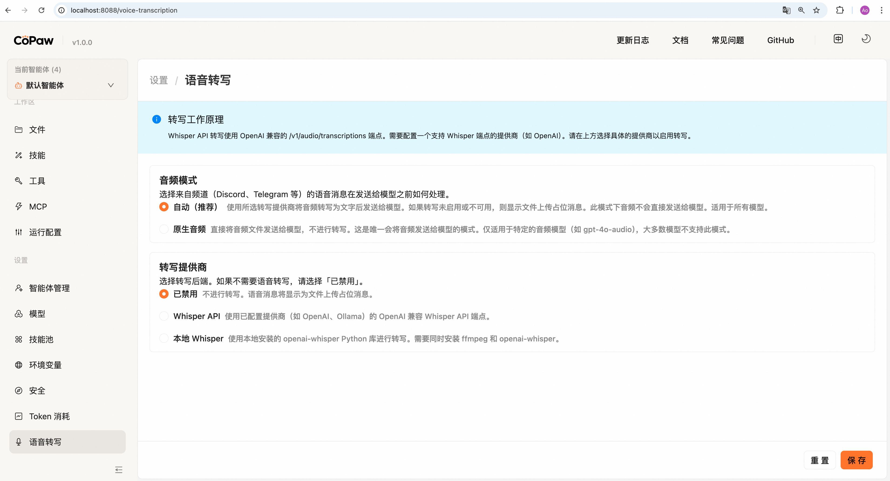

配置**各频道发来的语音/音频**在进入模型前的处理方式（与聊天里的语音输入、频道语音消息共用这套设置）。

- **音频模式**：**自动** — 先按下方转写设置转成文字再交给模型（多数模型适用）；**原生** — 直接把音频当附件交给模型（仅部分支持音频的模型可用）。
- **转写后端**：**关闭**；**Whisper API** — 使用兼容 OpenAI `audio/transcriptions` 的提供商，需在 [模型](#模型) 中配置好对应密钥并在此选中提供商；**本地 Whisper** — 本机运行，需安装 `ffmpeg` 与 `pip install 'MiLu[whisper]'`。

保存后对新收到的语音生效。详情以页面内说明为准。

---

## 快速索引

| 页面       | 侧边栏路径        | 你能做什么                         |
| ---------- | ----------------- | ---------------------------------- |
| 聊天       | 聊天 → 聊天       | 对话、语音输入、附件、管理会话     |
| 频道       | 控制 → 频道       | 启用/禁用频道、填写凭据            |
| 会话       | 控制 → 会话       | 筛选、重命名、删除会话             |
| 定时任务   | 控制 → 定时任务   | 创建/编辑/删除任务、立即执行       |
| 心跳       | 控制 → 心跳       | 间隔、投递目标、活跃时段           |
| 文件       | 工作区 → 文件     | 编辑人设文件、记忆、上传/下载      |
| 技能       | 工作区 → 技能     | 启用/禁用、Hub/上传/自定义技能     |
| 工具       | 工作区 → 工具     | 按名称开关内置工具                 |
| MCP        | 工作区 → MCP      | 管理 MCP 客户端                    |
| 运行配置   | 工作区 → 运行配置 | 迭代/上下文/重试/压缩/摘要/嵌入等  |
| 智能体管理 | 设置 → 智能体     | 增删改智能体、启用/禁用            |
| 模型       | 设置 → 模型       | 提供商、下载本地模型、选择活跃模型 |
| 技能池     | 设置 → 技能池     | 内置技能和可复用共享技能的来源仓库 |
| 环境变量   | 设置 → 环境变量   | 工具与技能用到的 Key 等            |
| 安全       | 设置 → 安全       | 工具守卫、技能扫描、文件防护       |
| Token 消耗 | 设置 → Token 消耗 | 按日期/模型查看用量                |
| 语音转写   | 设置 → 语音转写   | 音频模式、Whisper API/本地转写     |

---

## 相关页面

- [配置与工作目录](#config) —— 配置字段、提供商、环境变量
- [频道配置](#channels) —— 各频道的接入步骤和凭据获取
- [技能](#skills) —— 内置技能说明和自定义技能编写
- [心跳](#heartbeat) —— 心跳配置
- [上下文](#context) —— 压缩与上下文机制
- [安全](#security) —— Web 登录、工具守卫与文件防护详解
- [CLI](#cli) —— 命令行参考
- [多智能体](#multi-agent) —— 多智能体配置、管理与协作


[返回目录](#MiLu-中文文档总览)

---

<a id="channels"></a>

## 频道配置

**频道** = 你和 MiLu 在「哪里」对话：接钉钉就在钉钉里回，接 QQ 就在 QQ 里回。不熟悉这个词的话可以先看 [项目介绍](#intro)。

配置频道有两种方式：

- **控制台**（推荐）— 在 [控制台](#console) 的 **Control → Channels** 页面，点击频道卡片，在抽屉里启用并填写鉴权信息，保存即生效。
- **手动编辑 `agent.json`** — 在智能体工作区的 `agent.json` 中（如 `~/.MiLu/workspaces/default/agent.json`），将需要的频道设 `enabled: true` 并填好鉴权信息；保存后自动重载，无需重启。

下面按频道说明如何获取凭证并填写配置。

---

## 钉钉（推荐）

### 创建钉钉应用

视频操作流程：


图文操作流程：

1. 打开 [钉钉开发者后台](https://open-dev.dingtalk.com/)

2. 进入"应用开发→企业内部应用→钉钉应用→创建 **应用**"

   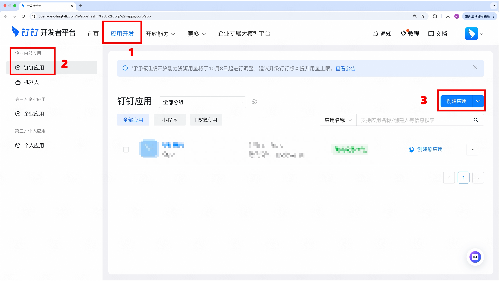

3. 在"应用能力→添加应用能力"中添加 **「机器人」**

   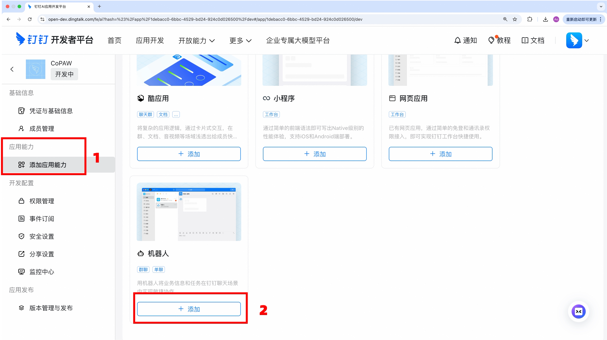

4. 配置机器人基础信息，设置消息接收模式为 **Stream 模式**（流式接收），点击发布

   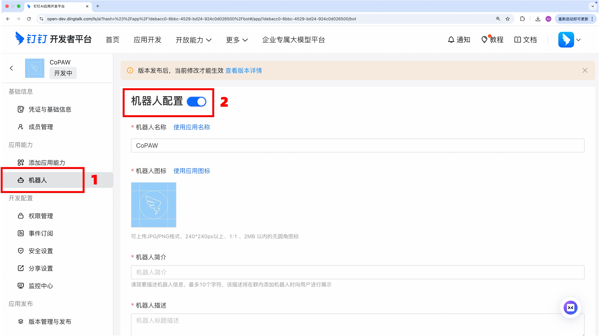

   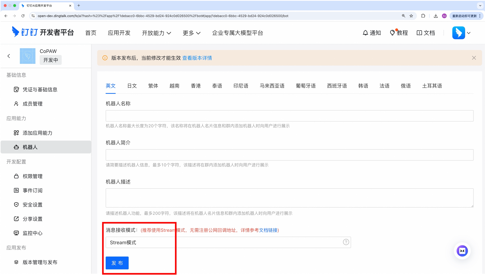

5. 在"应用发布→版本管理与发布"中创建新版本，填写基础信息后保存

   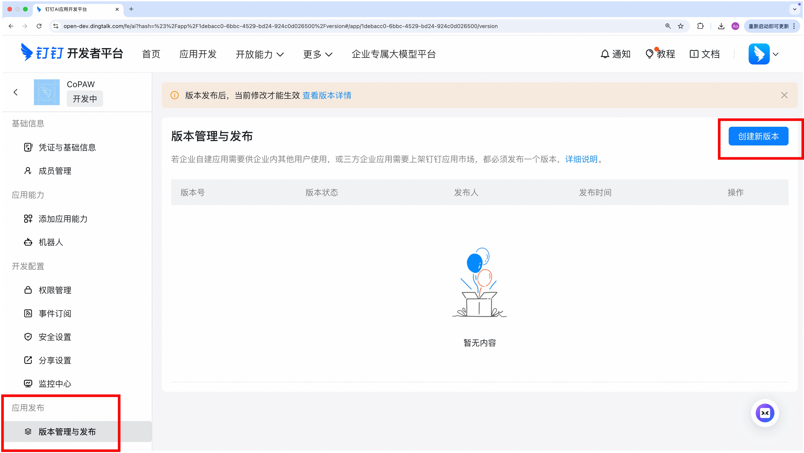

   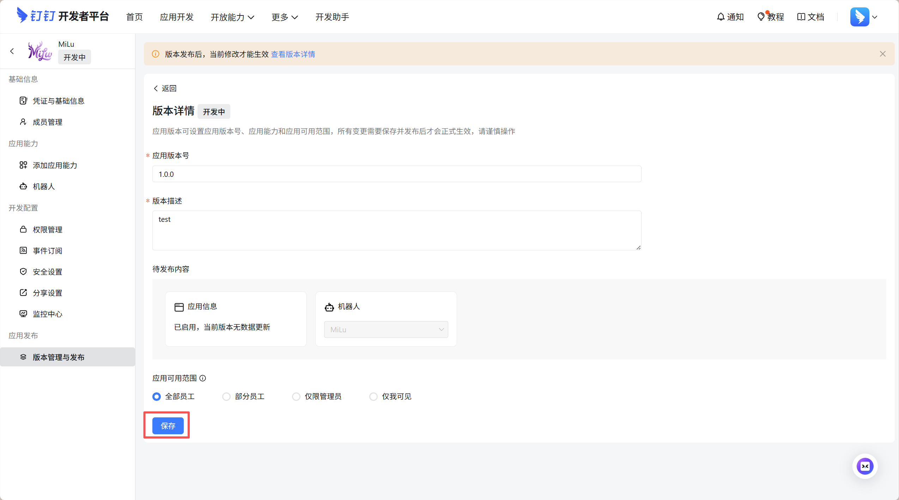

6. 在"基础信息→凭证与基础信息"中获取：

   - **Client ID**（即 AppKey）
   - **Client Secret**（即 AppSecret）

   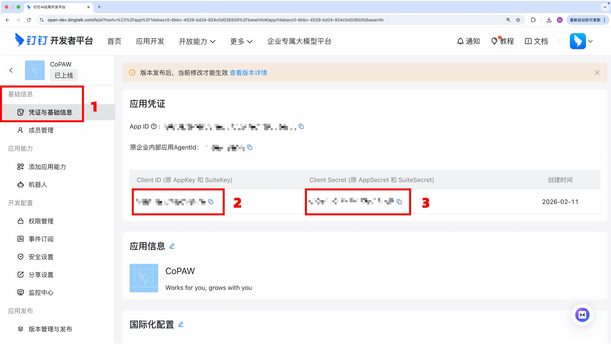

7. （可选） **将服务器 IP 加入白名单** — 调用钉钉开放平台 API（如下载用户发送的图片和文件）时需要此配置。在应用设置中进入 **"安全设置→服务器出口 IP"**，添加运行 MiLu 的机器的公网 IP。可在终端执行 `curl ifconfig.me` 查看公网 IP。若未配置白名单，图片和文件下载将报 `Forbidden.AccessDenied.IpNotInWhiteList` 错误。

### 绑定应用

可以在console前端配置，或者修改智能体工作区的 `agent.json`（如 `~/.MiLu/workspaces/default/agent.json`）。

**方法1**: 在console前端配置

从“控制→频道”找到**DingTalk**，点击后填入刚刚获取的**Client ID**和**Client Secret**

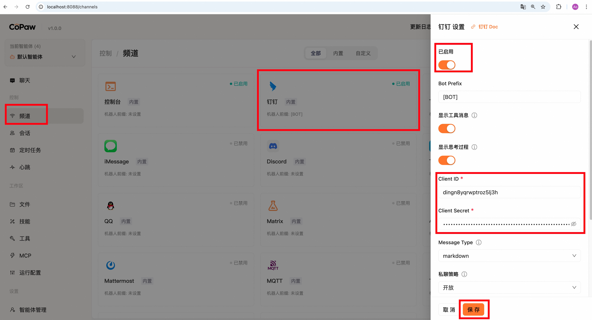

**方法2**: 修改 `agent.json`

在智能体工作区的 `agent.json`（如 `~/.MiLu/workspaces/default/agent.json`）里找到 `channels.dingtalk`，填入对应信息：

```json
"dingtalk": {
  "enabled": true,
  "bot_prefix": "[BOT]",
  "client_id": "你的 Client ID",
  "client_secret": "你的 Client Secret",
  "message_type": "markdown",
  "card_template_id": "",
  "card_template_key": "content",
  "robot_code": "",
  "filter_tool_messages": false
}
```

**钉钉专属字段说明：**

| 字段                | 类型   | 默认值       | 说明                                                           |
| ------------------- | ------ | ------------ | -------------------------------------------------------------- |
| `client_id`         | string | `""`（必填） | 钉钉应用 Client ID（即 AppKey）                                |
| `client_secret`     | string | `""`（必填） | 钉钉应用 Client Secret（即 AppSecret）                         |
| `message_type`      | string | `"markdown"` | 消息类型：`"markdown"` 或 `"card"`（AI 卡片）                  |
| `card_template_id`  | string | `""`         | AI 卡片模板 ID（当 `message_type` 为 `"card"` 时必填）         |
| `card_template_key` | string | `"content"`  | AI 卡片模板变量名（必须与钉钉模板中的变量名完全一致）          |
| `robot_code`        | string | `""`         | 机器人编码（群聊卡片场景建议配置，留空时回退使用 `client_id`） |
| `media_dir`         | string | `null`       | 媒体文件下载目录（留空则不保存）                               |

> **提示：**
>
> - 若希望隐藏工具执行详情，可设置 `filter_tool_messages: true`。
> - AI Card 模式：将 `message_type` 设为 `card`，并填写 `card_template_id`；`card_template_key` 必须与钉钉模板变量名完全一致。
> - 群聊场景建议显式配置 `robot_code`；留空时 MiLu 会回退使用 `client_id`。

保存后若服务已运行会自动重载；未运行则执行 `MiLu app` 启动。

### 找到创建的应用

视频操作流程：


图文操作流程：

1. 点击钉钉【消息】栏的“搜索框”

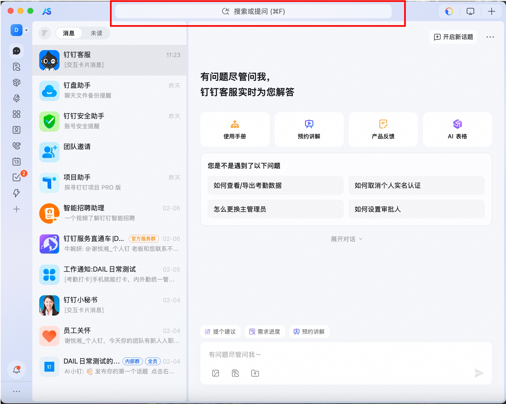

2. 搜索刚刚创建的 “机器人名称”，在【功能】下找到机器人

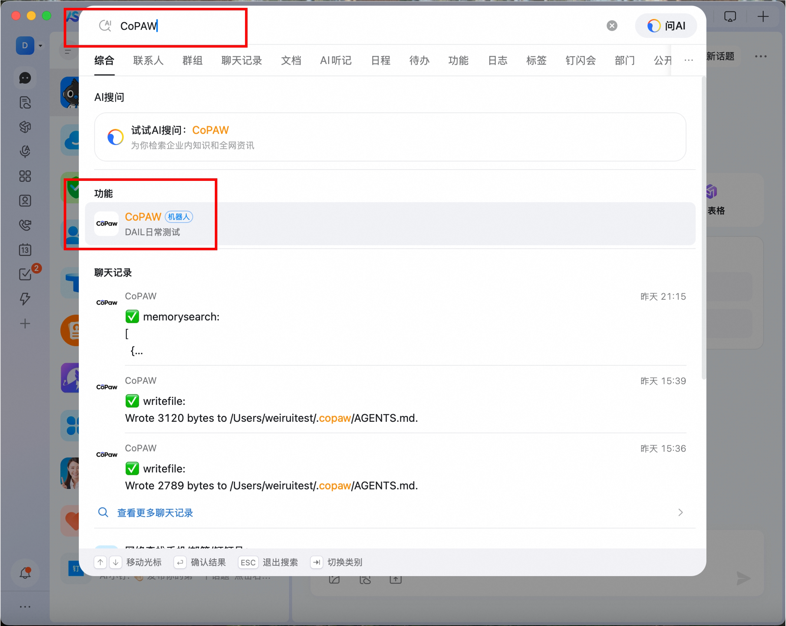

3. 点击后进入对话框


> 注：可以在钉钉群中通过**群设置→机器人→添加机器人**将机器人添加到群聊。需要注意的是，从与机器人的单聊界面中创建群聊，会无法触发机器人的回复。

---

## 飞书

飞书频道通过 **WebSocket 长连接** 接收消息，无需公网 IP 或 webhook；发送走飞书开放平台 Open API。支持文本、图片、文件收发；群聊场景下会将 `chat_id`、`message_id` 放入请求消息的 metadata，便于下游去重与群上下文识别。

### 创建飞书应用并获取凭证

1. 打开 [飞书开放平台](https://open.feishu.cn/app)，创建企业自建应用

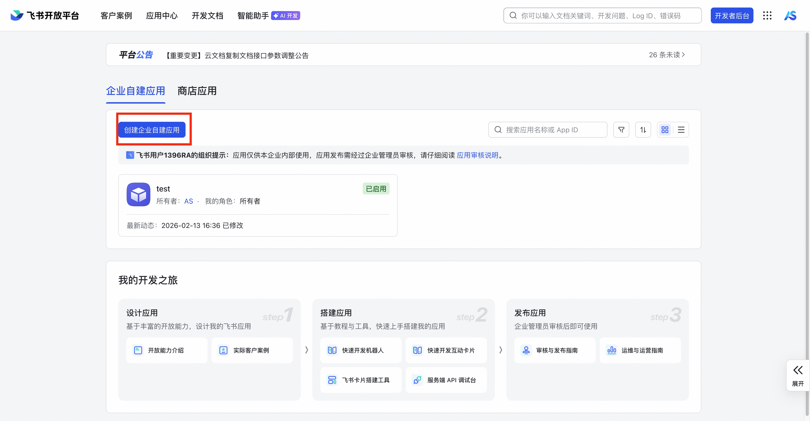

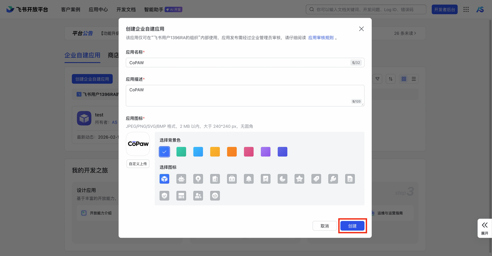

2. 在「凭证与基础信息」中获取 **App ID**、**App Secret**

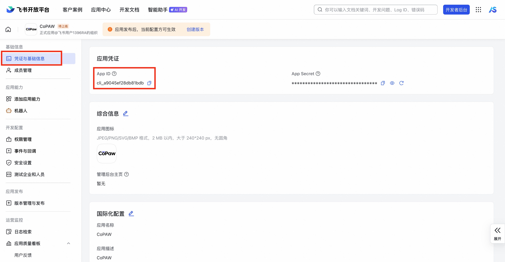

3. 在 `agent.json` 中填写上述 **App ID** 和 **App Secret**（见下方「填写 agent.json」），保存

4. 执行 **`MiLu app`** 启动 MiLu 服务

5. 回到飞书开放平台，在「能力」中启用 **机器人**


6. 选择「权限管理」中的「批量导入/导出权限」，将以下JSON代码复制进去

```json
{
  "scopes": {
    "tenant": [
      "aily:file:read",
      "aily:file:write",
      "aily:message:read",
      "aily:message:write",
      "corehr:file:download",
      "im:chat",
      "im:message",
      "im:message.group_msg",
      "im:message.p2p_msg:readonly",
      "im:message.reactions:read",
      "im:resource",
      "contact:user.base:readonly"
    ],
    "user": []
  }
}
```

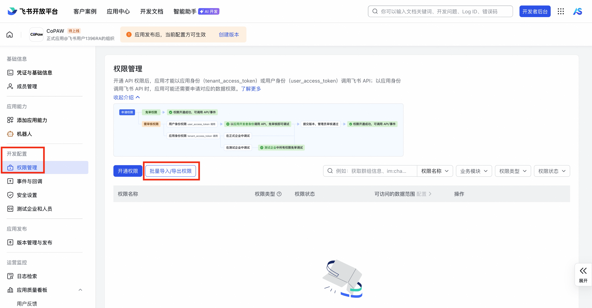

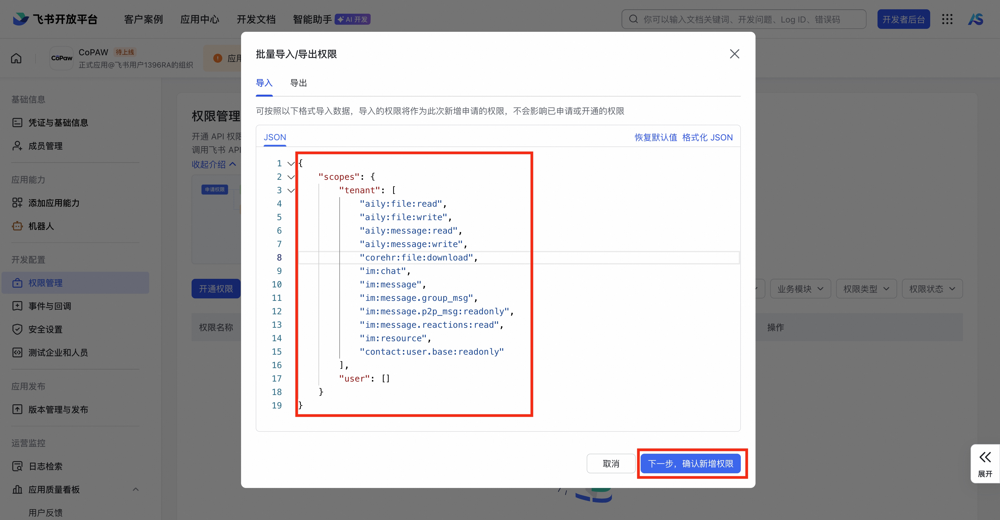

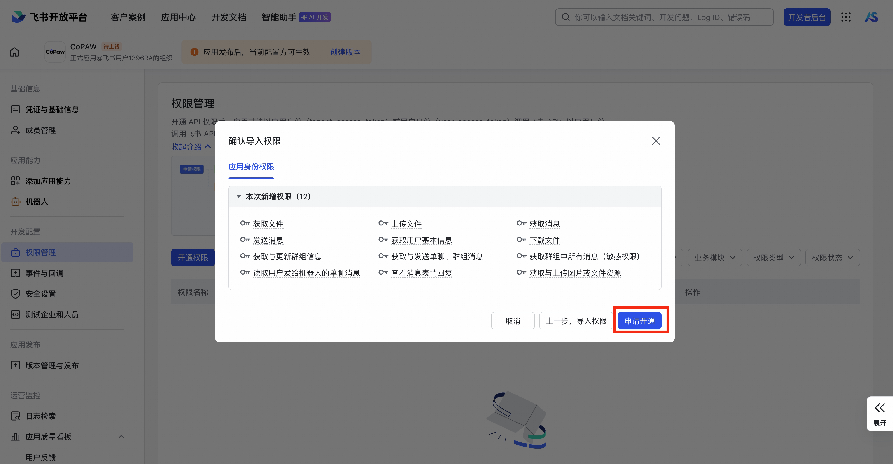

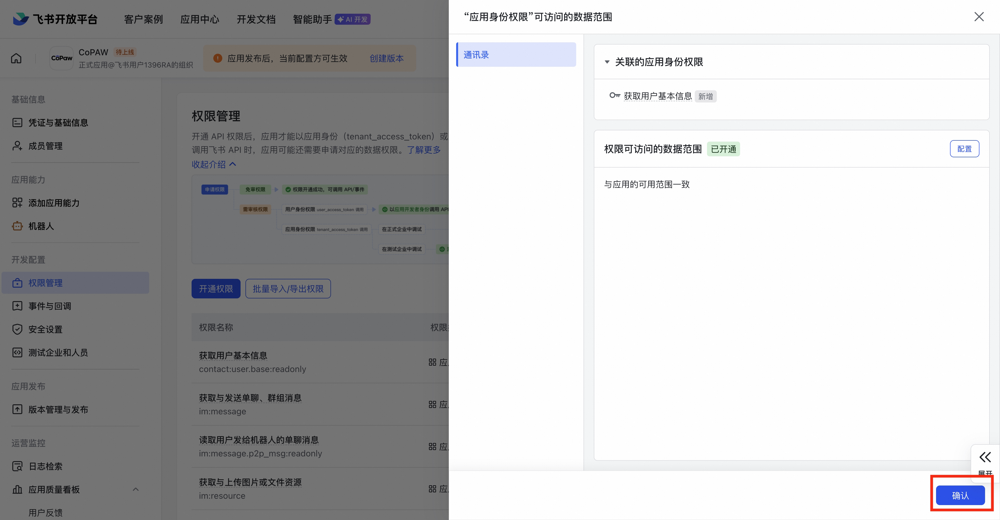

7. 在「事件与回调」中，点击「事件配置」，选择订阅方式为**长连接（WebSocket）** 模式（无需公网 IP）

> 注：**操作顺序**为先配置 App ID/Secret → 启动 `MiLu app` → 再在开放平台配置长连接，如果此处仍显示错误，尝试先暂停 MiLu 服务并重新启动 `MiLu app`。

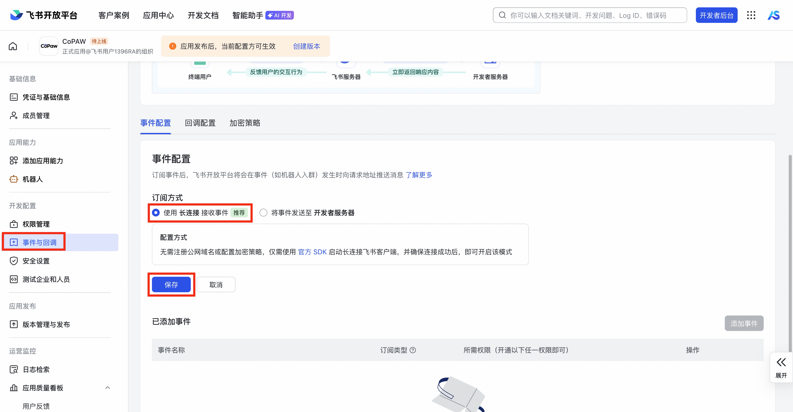

8. 选择「添加事件」，搜索**接收消息**，订阅**接收消息 v2.0**

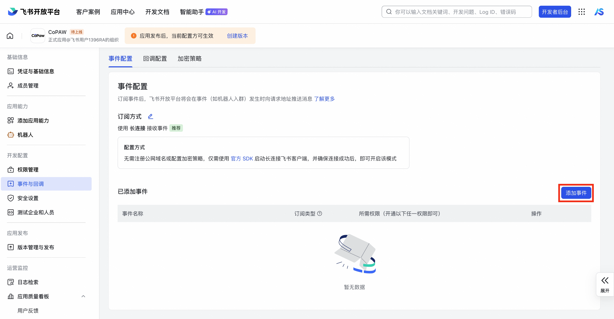

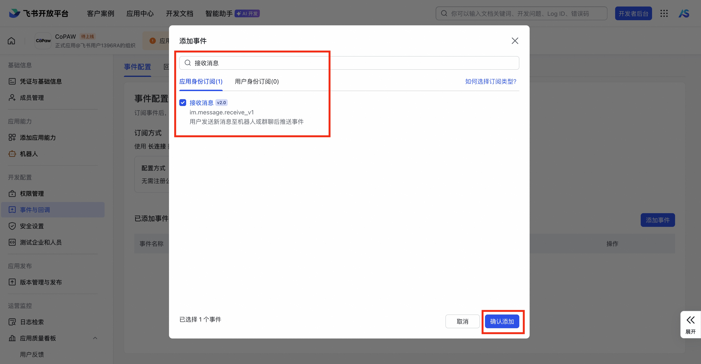

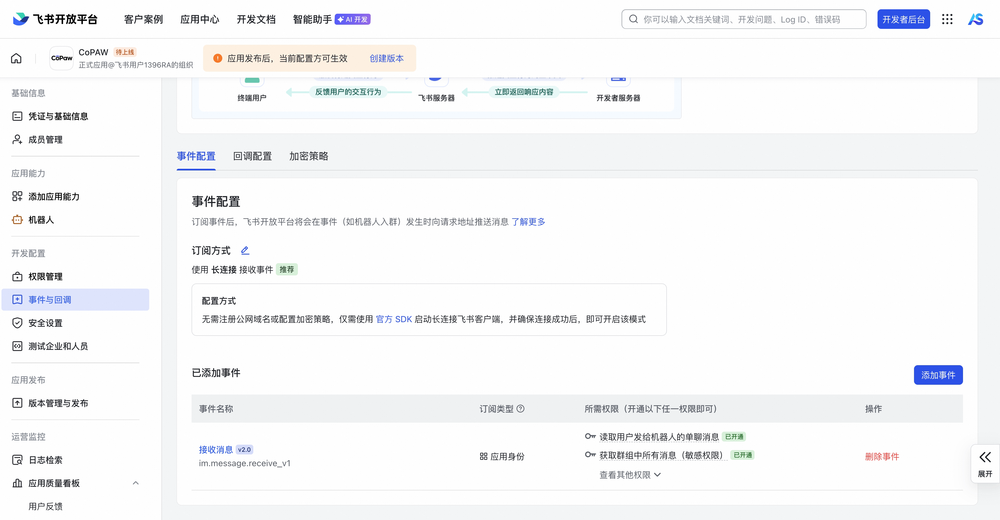

9. 在「应用发布」的「版本管理与发布」中，**创建版本**，填写基础信息，**保存**并**发布**

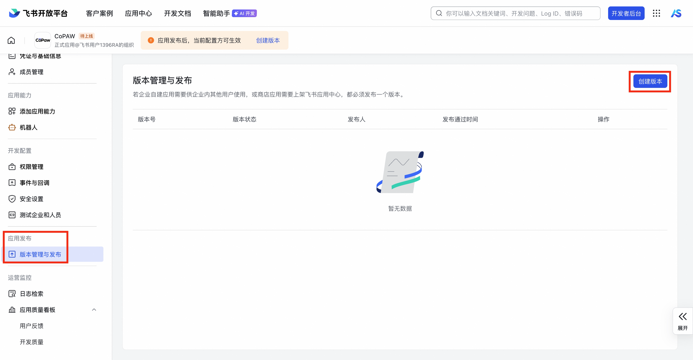

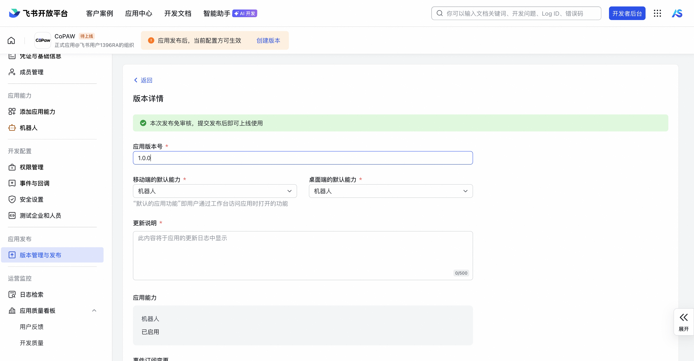

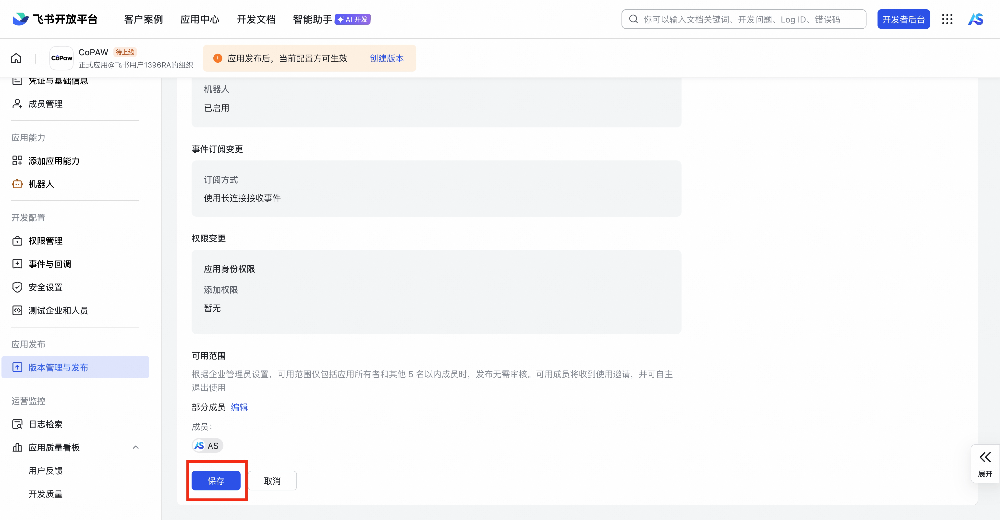

### 填写 agent.json

在智能体工作区的 `agent.json`（如 `~/.MiLu/workspaces/default/agent.json`）中找到`channels.feishu`，只需填 **App ID** 和 **App Secret**（在开放平台「凭证与基础信息」里复制）：

```json
"feishu": {
  "enabled": true,
  "bot_prefix": "[BOT]",
  "app_id": "cli_xxxxx",
  "app_secret": "你的 App Secret",
  "domain": "feishu"
}
```

**飞书专属字段说明：**

| 字段                 | 类型   | 默认值       | 说明                                       |
| -------------------- | ------ | ------------ | ------------------------------------------ |
| `app_id`             | string | `""`（必填） | 飞书应用 App ID                            |
| `app_secret`         | string | `""`（必填） | 飞书应用 App Secret                        |
| `domain`             | string | `"feishu"`   | `"feishu"`（国内）或 `"lark"`（国际版）    |
| `encrypt_key`        | string | `""`         | 消息加密密钥（可选，WebSocket 模式可不填） |
| `verification_token` | string | `""`         | 验证 Token（可选，WebSocket 模式可不填）   |
| `media_dir`          | string | `null`       | 媒体文件下载目录（留空则不保存）           |

> **提示：** 其他字段（encrypt_key、verification_token、media_dir）可选，WebSocket 模式可不填，有默认值。

**依赖：** `pip install lark-oapi`

如果你使用 SOCKS 代理联网，还需安装 `python-socks`（例如 `pip install python-socks`），否则可能报错：`python-socks is required to use a SOCKS proxy`。

> 注: **App ID** 和 **App Secret** 信息也可以在Console前端填写，但需重启 MiLu 服务，才能继续配置长链接的操作。
> 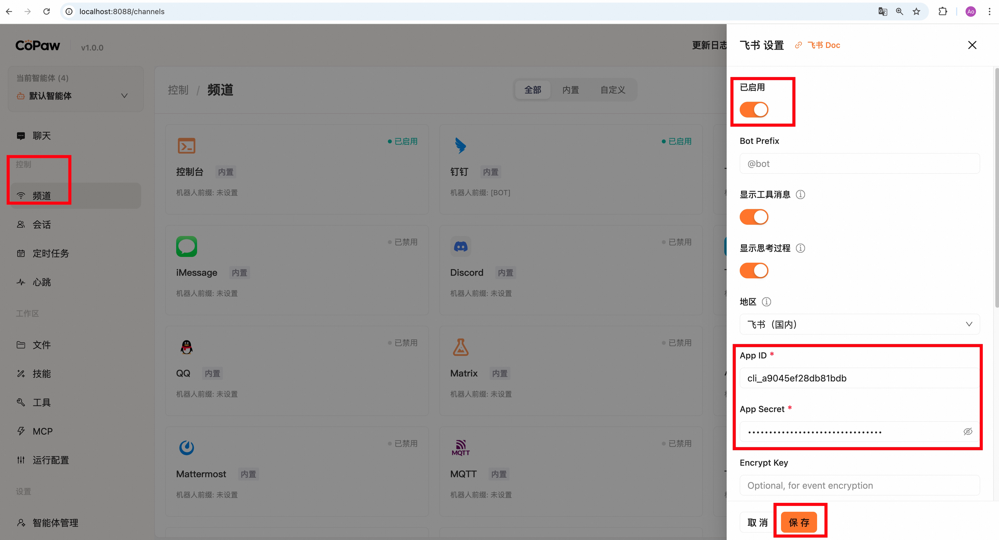

### 机器人权限建议

第6步中的json文件为应用配备了以下权限（应用身份、已开通），以保证收发消息与文件正常：

| 权限名称                       | 权限标识                       | 权限类型     | 说明           |
| ------------------------------ | ------------------------------ | ------------ | -------------- |
| 获取文件                       | aily:file:read                 | 应用身份     | -              |
| 上传文件                       | aily:file:write                | 应用身份     | -              |
| 获取消息                       | aily:message:read              | 应用身份     | -              |
| 发送消息                       | aily:message:write             | 应用身份     | -              |
| 下载文件                       | corehr:file:download           | 应用身份     | -              |
| 获取与更新群组信息             | im:chat                        | 应用身份     | -              |
| 获取与发送单聊、群组消息       | im:message                     | 应用身份     | -              |
| 获取群组中所有消息（敏感权限） | im:message.group_msg           | 应用身份     | -              |
| 读取用户发给机器人的单聊消息   | im:message.p2p_msg:readonly    | 应用身份     | -              |
| 查看消息表情回复               | im:message.reactions:read      | 应用身份     | -              |
| 获取与上传图片或文件资源       | im:resource                    | 应用身份     | -              |
| **以应用身份读取通讯录**       | **contact:user.base:readonly** | **应用身份** | **见下方说明** |

> **获取用户昵称（推荐）**：若希望会话和日志中显示**用户昵称**（如「张三#1d1a」）而非「unknown#1d1a」，需额外开通通讯录只读权限 **以应用身份读取通讯录**（`contact:user.base:readonly`）。未开通时，飞书仅返回 open_id 等身份字段，不返回姓名，MiLu 无法解析昵称。开通后需重新发布/更新应用版本，权限生效后即可正常显示用户名称。

### 将机器人添加到常用

1. 在**工作台**点击**添加常用**


2. 搜索刚刚创建的机器人名称并**添加**

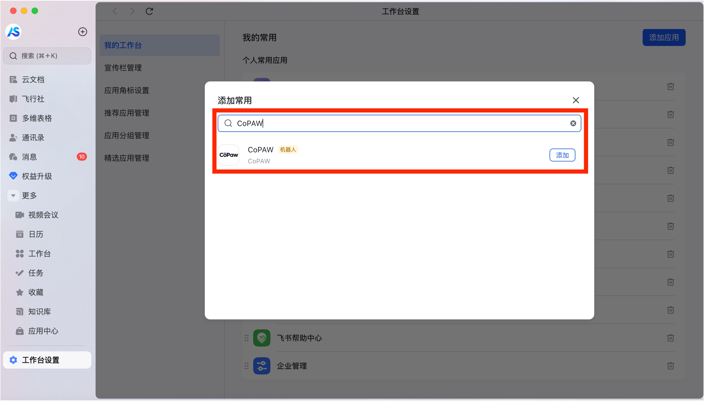

3. 可以看到机器人已添加到常用中，双击可进入对话界面


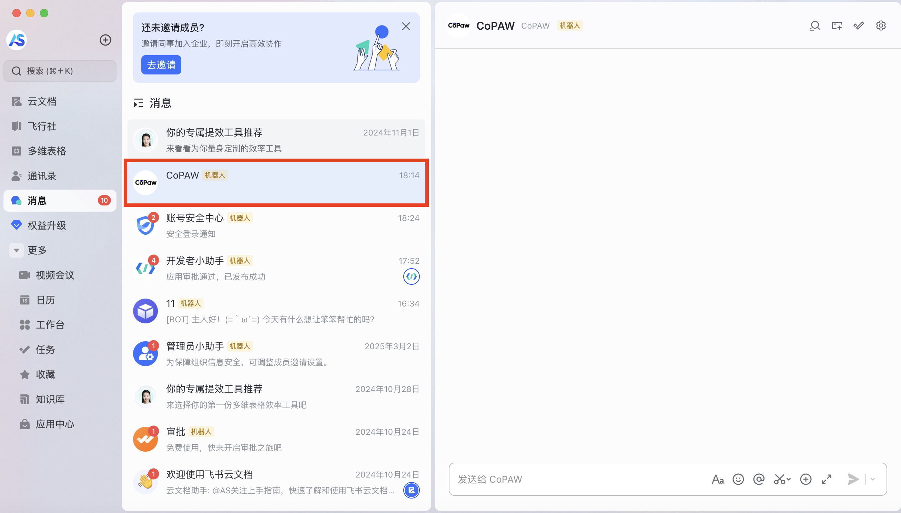

---

## iMessage（仅 macOS）

> ⚠️ iMessage 频道仅支持 **macOS**，依赖本地「信息」应用与 iMessage 数据库，无法在 Linux / Windows 上使用。

通过本地 iMessage 数据库轮询新消息并代为回复。

1. 确保本地 **「信息」(Messages)** 已登录 Apple ID（系统设置里打开「信息」并登录）。

2. 安装 **imsg**（用于访问 iMessage 数据库）：

   ```bash
   brew install steipete/tap/imsg
   ```

   > 如果 Intel 芯片 Mac 用户通过上述方式无法安装成功，需要先克隆源码再编译
   >
   > ```bash
   > git clone https://github.com/steipete/imsg.git
   > cd imsg
   > make build
   > sudo cp build/Release/imsg /usr/local/bin/
   > cp ./bin/imsg /usr/local/bin/
   > ```

3. 为了使 iMessage 中的信息能被获取，需要 **终端** （或你用来运行 MiLu 的 app） 和 **消息** 有 **完全磁盘访问权限**（系统设置 → 隐私与安全性 → 完全磁盘访问权限）。

   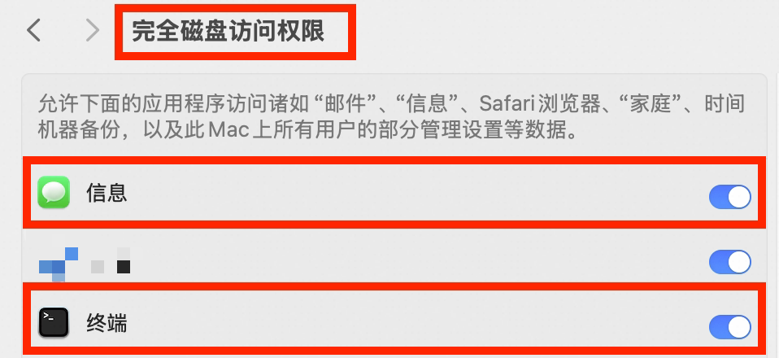

4. 填写 iMessage 数据库路径。默认路径为 `~/Library/Messages/chat.db`，若你改过系统路径，请填实际路径。有以下两种填写方案：

   - 进入 **控制台 → 频道**，点击 **iMessage** 卡片，将 **Enable** 开关打开，在 **DB Path**中填写上面的路径，点击 **保存**。

     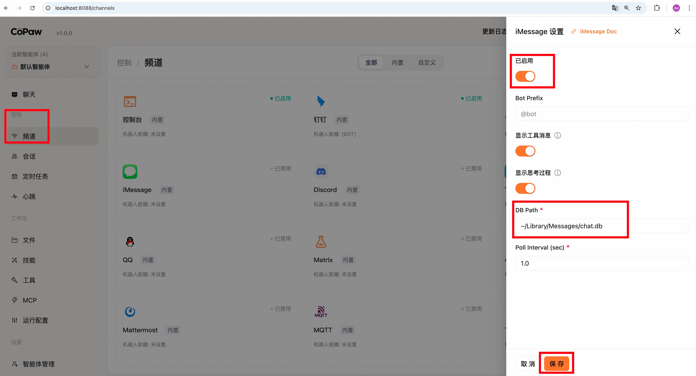

   - 填写智能体工作区的 `agent.json`（如 `~/.MiLu/workspaces/default/agent.json`）：

     ```json
     "imessage": {
       "enabled": true,
       "bot_prefix": "[BOT]",
       "db_path": "~/Library/Messages/chat.db",
       "poll_sec": 1.0
     }
     ```

**iMessage 专属字段说明：**

| 字段       | 类型   | 默认值                       | 说明                |
| ---------- | ------ | ---------------------------- | ------------------- |
| `db_path`  | string | `~/Library/Messages/chat.db` | iMessage 数据库路径 |
| `poll_sec` | float  | `1.0`                        | 轮询间隔（秒）      |

5. 填写完成后，使用你的手机，给当前电脑登录的 iMessage 账号（与电脑Apple ID一致）发送任意一条消息，可以看到回复。

   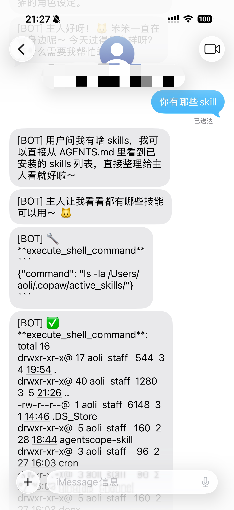

---

## Discord

### 获取 Bot Token

1. 打开 [Discord 开发者门户](https://discord.com/developers/applications)

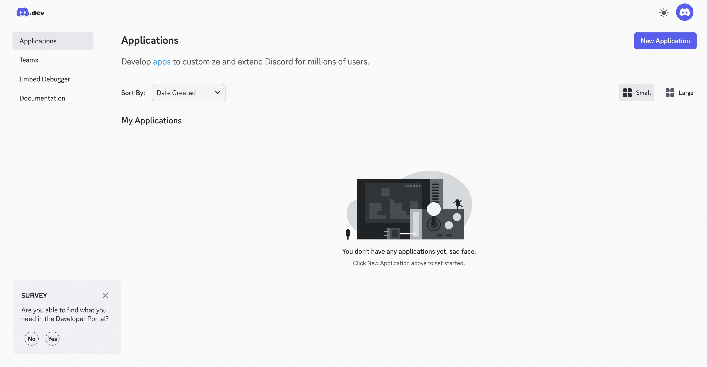

2. 新建应用（或选已有应用）

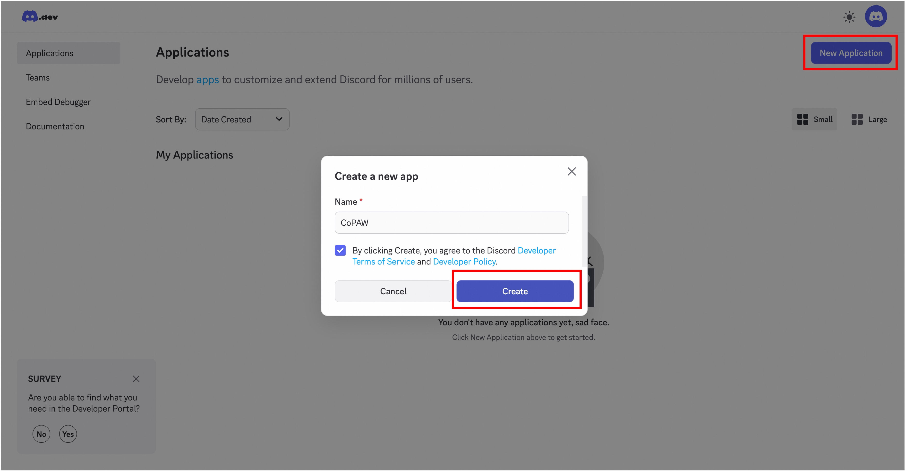

3. 左侧进入 **Bot**，新建 Bot，复制 **Token**

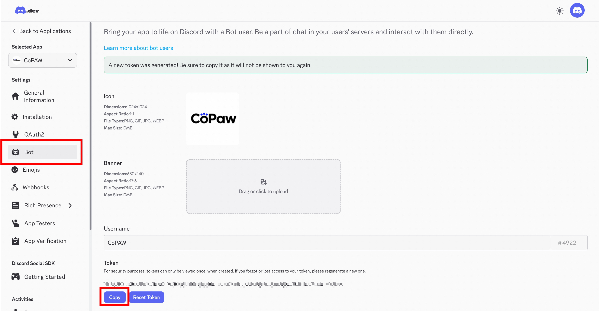

4. 下滑，给予 Bot “Message Content Intent” 和 “Send Messages” 的权限，并保存

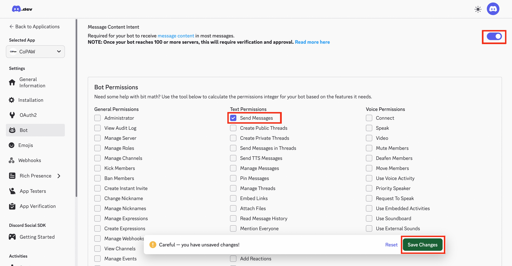

5. 在 **OAuth2 → URL 生成器** 里勾选 `bot` 权限，给予 Bot “Send Messages” 的权限，生成邀请链接

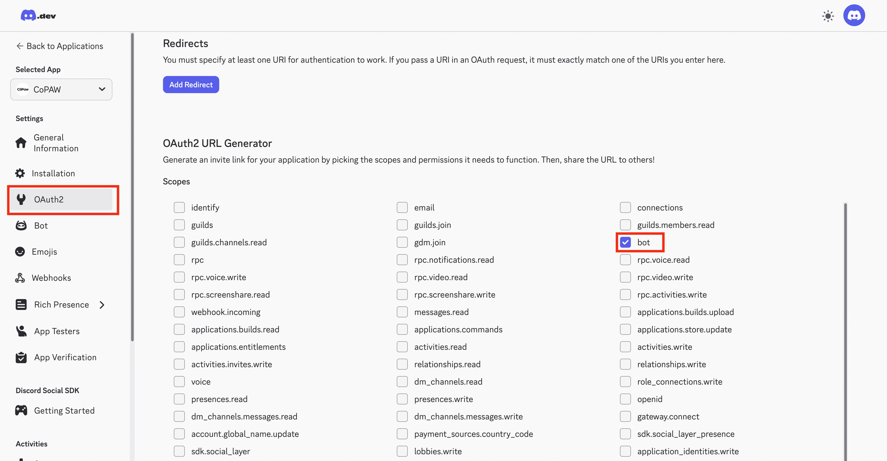

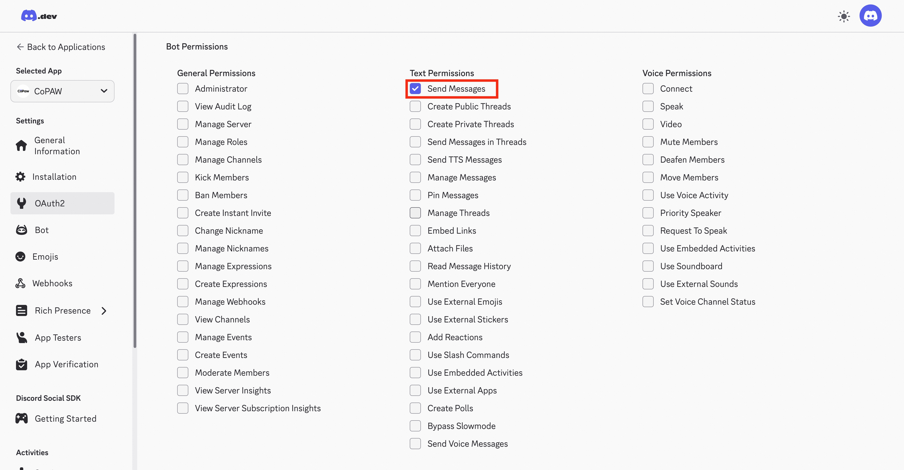


6. 在浏览器中访问该链接，会自动跳转到discord页面。将 Bot 拉进你的服务器


7. 在服务器中可以看到 Bot已被拉入


### 绑定 Bot

可以在console前端配置，或者修改智能体工作区的 `agent.json`（如 `~/.MiLu/workspaces/default/agent.json`）。

**方法1**: 在console前端配置

从“控制→频道”找到**Discord**，点击后填入刚刚获取的**Bot Token**


**方法2**: 修改 `agent.json`

在智能体工作区的 `agent.json`（如 `~/.MiLu/workspaces/default/agent.json`）里找到 `channels.discord`，填入对应信息：

```json
"discord": {
  "enabled": true,
  "bot_prefix": "[BOT]",
  "bot_token": "你的 Bot Token",
  "http_proxy": "",
  "http_proxy_auth": ""
}
```

**Discord 专属字段说明：**

| 字段              | 类型   | 默认值       | 说明                                        |
| ----------------- | ------ | ------------ | ------------------------------------------- |
| `bot_token`       | string | `""`（必填） | Discord Bot Token                           |
| `http_proxy`      | string | `""`         | 代理地址（如 `http://127.0.0.1:7890`）      |
| `http_proxy_auth` | string | `""`         | 代理认证（格式：`用户名:密码`，无需则留空） |

> **提示：** 国内网络访问 Discord API 可能需代理。

---

## QQ

### 获取 QQ 机器人凭证

1. 打开 [QQ 开放平台](https://q.qq.com/)


2. 创建 **机器人应用**，点击进入编辑页面


3. 选择**回调配置**，首先在**单聊事件**中勾选**C2C消息事件**，再在**群事件**中勾选**群消息事件AT事件**，确认配置


4. 选择**沙箱配置**中的**消息列表配置项**，点击**添加成员**，选择添加**自己**


5. 在**开发管理**中获取**AppID**和**AppSecret**（即 ClientSecret），填入 `agent.json`，方式见下方填写 agent.json。在**IP白名单**中添加一个IP。

   > **提示：** 如果使用魔搭创空间部署MiLu，QQ频道的IP白名单应填写：`47.92.200.108`


6. 在沙箱配置中，使用QQ扫码，将机器人添加到消息列表


### 填写 agent.json

在智能体工作区的 `agent.json`（如 `~/.MiLu/workspaces/default/agent.json`）里找到 `channels.qq`，把上面两个值分别填进 `app_id` 和 `client_secret`：

```json
"qq": {
  "enabled": true,
  "bot_prefix": "[BOT]",
  "app_id": "你的 AppID",
  "client_secret": "你的 AppSecret",
  "markdown_enabled": false,
  "max_reconnect_attempts": -1
}
```

**QQ 专属字段说明：**

| 字段                     | 类型   | 默认值       | 说明                                      |
| ------------------------ | ------ | ------------ | ----------------------------------------- |
| `app_id`                 | string | `""`（必填） | QQ 机器人 App ID                          |
| `client_secret`          | string | `""`（必填） | QQ 机器人 Client Secret（即 AppSecret）   |
| `markdown_enabled`       | bool   | `false`      | 是否启用 Markdown 消息（需 QQ 平台授权）  |
| `max_reconnect_attempts` | int    | `-1`         | WebSocket 最大重连次数（`-1` = 无限重连） |

> **注意：** 这里填的是 **AppID** 和 **AppSecret** 两个字段，不是拼成一条 Token。

或者也可以在console前端填写：


---

## OneBot v11（NapCat / QQ 完整协议）

**OneBot** 渠道通过**反向 WebSocket** 将 MiLu 连接到 [NapCat](https://github.com/NapNeko/NapCatQQ)、[go-cqhttp](https://github.com/Mrs4s/go-cqhttp)、[Lagrange](https://github.com/LagrangeDev/Lagrange.Core) 或其他任何兼容 [OneBot v11](https://github.com/botuniverse/onebot-11) 的实现。

与内置 QQ 渠道（使用官方 QQ Bot API，功能受限）不同，OneBot v11 提供**完整 QQ 协议**支持：个人号、群聊无需 @、富媒体消息等。

### 工作原理

MiLu 启动一个 WebSocket 服务器，OneBot 实现（如 NapCat）作为客户端连接过来：

```
NapCat  ──反向 WS──▶  MiLu (:6199/ws)
```

### 配置 NapCat

1. 通过 Docker 运行 NapCat：

   ```bash
   docker run -d \
     --name napcat \
     -e ACCOUNT=<你的QQ号> \
     -p 6099:6099 \
     mlikiowa/napcat-docker:latest
   ```

2. 打开 NapCat WebUI `http://localhost:6099`，用 QQ 扫码登录。

3. 进入 **网络配置** → **新建** → **WebSocket 客户端**（反向 WS）：
   - URL：`ws://<MiLu地址>:6199/ws`
   - Access Token：与 MiLu 配置中的 `access_token` 保持一致（可选）

### 填写 agent.json

```json
"onebot": {
  "enabled": true,
  "ws_host": "0.0.0.0",
  "ws_port": 6199,
  "access_token": "",
  "share_session_in_group": false
}
```

**OneBot 专属字段说明：**

| 字段                     | 类型   | 默认值    | 说明                                                          |
| ------------------------ | ------ | --------- | ------------------------------------------------------------- |
| `ws_host`                | string | `0.0.0.0` | WebSocket 服务器监听地址                                      |
| `ws_port`                | int    | `6199`    | WebSocket 服务器监听端口                                      |
| `access_token`           | string | `""`      | 可选的认证 Token（需与 NapCat 配置一致）                      |
| `share_session_in_group` | bool   | `false`   | 为 `true` 时群成员共享一个会话；为 `false` 时每个成员独立会话 |

> **Docker Compose 提示：** MiLu 和 NapCat 一起用 Docker Compose 部署时，NapCat 的反向 WS 地址填 `ws://MiLu:6199/ws`（使用服务名）。

**多模态支持：**

| 类型 | 接收 | 发送 |
| ---- | ---- | ---- |
| 文本 | ✓    | ✓    |
| 图片 | ✓    | ✓    |
| 语音 | 🚧   | ✓    |
| 视频 | 🚧   | ✓    |
| 文件 | ✓    | ✓    |

> **提示：** 语音和视频在渠道层已正确接收，但需要配置 MiLu 的转写服务（`transcription_provider_type`）才能让 LLM 理解内容。未配置时语音消息显示为占位符。

---

## 企业微信

### 创建新企业

个人使用者可以访问[企业微信官网](https://work.weixin.qq.com)注册账号，创建新企业，成为企业管理员。


填写企业信息与管理员信息，并绑定微信账号


注册成功之后即可登陆企业微信开始使用。

若已经有企业微信账号或是企业普通员工，可以直接在当前企业创建API模式机器人。

### 创建机器人

可在工作台点击智能机器人-创建机器人，选择API模式创建-通过长链接配置


获取`Bot ID`和`Secret`


### 绑定bot

可以在Console或是智能体工作区的 `agent.json` 填写Bot ID和Secret绑定bot

**方法一**在console填写


**方法二**在 `agent.json` 填写（如 `~/.MiLu/workspaces/default/agent.json`）

找到`wecom`，填写对应信息：

```json
"wecom": {
  "enabled": true,
  "bot_prefix": "[BOT]",
  "dm_policy": "open",
  "group_policy": "open",
  "bot_id": "your bot_id",
  "secret": "your secret",
  "media_dir": "~/.MiLu/media",
  "max_reconnect_attempts": -1
}
```

**企业微信专属字段说明：**

| 字段                     | 类型   | 默认值           | 说明                                      |
| ------------------------ | ------ | ---------------- | ----------------------------------------- |
| `bot_id`                 | string | `""`（必填）     | 企业微信机器人 Bot ID                     |
| `secret`                 | string | `""`（必填）     | 企业微信机器人 Secret                     |
| `media_dir`              | string | `~/.MiLu/media` | 媒体文件（图片、文件等）下载目录          |
| `max_reconnect_attempts` | int    | `-1`             | WebSocket 最大重连次数（`-1` = 无限重连） |

### 在企业微信开始与机器人聊天


---

## 微信个人（iLink）

微信 iLink Bot 频道允许通过**个人微信账号**运行 AI 机器人，无需企业资质，使用官方 [iLink Bot HTTP API](https://weixin.qq.com/cgi-bin/readtemplate?t=ilink/chatbot) 协议。

> **注意**：微信个人 Bot（iLink 协议）目前仍处于内测阶段，需申请接入资格后方可使用。

### 工作原理

- **登录方式**：首次使用时扫描二维码授权，Token 自动持久化到本地文件（默认 `~/.MiLu/weixin_bot_token`），后续启动无需重复扫码。
- **消息接收**：通过 HTTP 长轮询（`getupdates`）持续拉取新消息，支持文本、图片、语音（ASR 转录）和文件。
- **消息发送**：通过 `sendmessage` 接口回复用户，当前仅支持文本（iLink API 限制）。

### 扫码登录（推荐通过 Console）

1. 在 MiLu Web Console 中进入 **设置 → 通道 → 微信个人（iLink）**。
2. 点击 **获取登录二维码**，等待二维码显示。
3. 用手机微信扫描二维码并确认授权。
4. 扫码成功后，Bot Token 会自动填入表单，点击 **保存** 即可。

### 在配置文件中填写

也可直接在智能体工作区的 `agent.json`（如 `~/.MiLu/workspaces/default/agent.json`）中配置：

```json
"weixin": {
  "enabled": true,
  "bot_prefix": "[BOT]",
  "bot_token": "your_bot_token",
  "bot_token_file": "~/.MiLu/weixin_bot_token",
  "base_url": "",
  "media_dir": "~/.MiLu/media",
  "dm_policy": "open",
  "group_policy": "open"
}
```

**微信个人专属字段说明：**

| 字段             | 类型   | 默认值                      | 说明                                                |
| ---------------- | ------ | --------------------------- | --------------------------------------------------- |
| `bot_token`      | string | `""`                        | 扫码登录后获取的 Bearer Token；留空则启动时引导扫码 |
| `bot_token_file` | string | `~/.MiLu/weixin_bot_token` | Token 持久化路径，下次启动自动读取                  |
| `base_url`       | string | 官方默认地址                | iLink API 地址，一般留空使用默认值                  |
| `media_dir`      | string | `~/.MiLu/media`            | 接收到的图片、文件保存目录                          |

### 环境变量方式

也可通过环境变量配置：

```bash
WEIXIN_CHANNEL_ENABLED=1
WEIXIN_BOT_TOKEN=your_bot_token
WEIXIN_BOT_TOKEN_FILE=~/.MiLu/weixin_bot_token
WEIXIN_MEDIA_DIR=~/.MiLu/media
WEIXIN_DM_POLICY=open
WEIXIN_GROUP_POLICY=open
```

---

## Telegram

### 获取 Telegram 机器人凭证

1. 打开 Telegram 并搜索 `@BotFather` 添加 Bot（注意需要是官方 @BotFather，有蓝色认证标识）。
2. 打开与 @BotFather 的聊天，根据对话中的指引创建新机器人

   

3. 在对话框中创建 bot_name，复制 bot_token

   

### 绑定 Bot

可以在console前端配置，或者修改智能体的 `agent.json`。

**方法1**: 在console前端配置

从"控制→频道"找到**Telegram**，点击后填入刚刚获取的**Bot Token**


**方法2**: 修改 `agent.json`

在智能体工作区的 `agent.json`（如 `~/.MiLu/workspaces/default/agent.json`）里找到 `channels.telegram`，填入对应信息：

```json
"telegram": {
  "enabled": true,
  "bot_prefix": "[BOT]",
  "bot_token": "你的 Bot Token",
  "http_proxy": "",
  "http_proxy_auth": ""
}
```

**Telegram 专属字段说明：**

| 字段              | 类型   | 默认值       | 说明                                        |
| ----------------- | ------ | ------------ | ------------------------------------------- |
| `bot_token`       | string | `""`（必填） | Telegram Bot Token                          |
| `http_proxy`      | string | `""`         | 代理地址（如 `http://127.0.0.1:7890`）      |
| `http_proxy_auth` | string | `""`         | 代理认证（格式：`用户名:密码`，无需则留空） |

> **提示：** 国内网络访问 Telegram API 可能需代理。

### 备注

可使用本页顶部介绍的通用访问控制字段（`dm_policy`、`group_policy`、`allow_from`、`deny_message`、`require_mention`）控制谁可以与机器人交互。仍建议不要将 bot username 暴露到公共环境中。

建议在 `@BotFather` 设置：

```
/setprivacy -> ENABLED # 设置bot回复权限
/setjoingroups -> DISABLED # 拦截Group邀请
```

---

## Mattermost

Mattermost 频道通过 WebSocket 实时监听事件，并使用 REST API 发送回复。支持私聊和群聊场景，在群聊中基于 **Thread（盖楼）** 划分会话上下文。

### 获取凭证并配置

1. 在 Mattermost 中创建 **Bot 账号** (System Console → Integrations → Bot Accounts)。
2. 给予机器人必要的权限（如 `Post all`），并获取 **Access Token**。
3. 在控制台或智能体工作区的 `agent.json`（如 `~/.MiLu/workspaces/default/agent.json`）中配置 **URL** 和 **Token**。

**配置示例：**

```json
"mattermost": {
  "enabled": true,
  "bot_prefix": "[BOT]",
  "url": "https://mattermost.example.com",
  "bot_token": "your_access_token",
  "show_typing": true,
  "thread_follow_without_mention": false,
  "dm_policy": "open",
  "group_policy": "open"
}
```

**Mattermost 专属字段说明：**

| 字段                            | 类型   | 默认值       | 说明                                                      |
| ------------------------------- | ------ | ------------ | --------------------------------------------------------- |
| `url`                           | string | `""`（必填） | Mattermost 实例的完整地址                                 |
| `bot_token`                     | string | `""`（必填） | 机器人的 Access Token                                     |
| `show_typing`                   | bool   | `true`       | 是否开启「正在输入...」状态指示                           |
| `thread_follow_without_mention` | bool   | `false`      | 在群聊已参与的 Thread 中，是否在后续无 @ 消息时也触发回复 |

> **提示**：Mattermost 的 `session_id` 在私聊中固定为 `mattermost_dm:{mm_channel_id}`，在群聊中按 Thread ID 隔离回话。仅在 Session 首次触发时会自动拉取最近的历史记录作为上下文补全。

---

## MQTT

### 介绍

当前仅支持了文本和JSON格式消息。

JSON消息格式

```
{
  "text": "...",
  "redirect_client_id": "..."
}
```

### 基础配置

| 描述                    | 属性            | 必须项 | 举例                    |
| ----------------------- | --------------- | ------ | ----------------------- |
| 连接地址                | host            | Y      | 127.0.0.1               |
| 连接端口                | port            | Y      | 1883                    |
| 协议                    | transport       | Y      | tcp                     |
| 清除会话                | clean_session   | Y      | true                    |
| 服务质量 / 消息投递等级 | qos             | Y      | 2                       |
| 用户名                  | username        | N      |                         |
| 密码                    | password        | N      |                         |
| 订阅主题                | subscribe_topic | Y      | server/+/up             |
| 推送主题                | publish_topic   | Y      | client/{client_id}/down |
| 开启加密                | tls_enabled     | N      | false                   |
| CA 根证书               | tls_ca_certs    | N      | /tsl/ca.pem             |
| 客户端 证书文件         | tls_certfile    | N      | /tsl/client.pem         |
| 客户端私钥文件          | tls_keyfile     | N      | /tsl/client.key         |

### 主题

1. 简单订阅和推送

   | subscribe_topic | publish_topic |
   | --------------- | ------------- |
   | server          | client        |

2. 模糊匹配订阅和自动推送

   模糊订阅全server/+/up主题，根据客户端的client_id自动推送到对应的主题，例如客户端向`/server/client_a/up`推送MiLu处理完后，将会向`/client/client_b/down`推送消息。

   | subscribe_topic | publish_topic           |
   | --------------- | ----------------------- |
   | server/+/up     | client/{client_id}/down |

3. 重定向主题推送

   发送消息为JSON格式，订阅主题为`server/client_a/up`，推送主题为`client/client_a/down`

   ```json
   {
     "text": "讲个笑话，直接回复文本即可。",
     "redirect_client_id": "client_b"
   }
   ```

   消息会根据redirect_client_id属性，推送至 `client/client_b/down`，从而实现跨主题推送。在物联网场景，可以做到以MiLu为核心，根据个人需求，多设备间自主推送消息。

---

## Matrix

Matrix 频道通过 [matrix-nio](https://github.com/poljar/matrix-nio) 库将 MiLu 接入任意 Matrix 服务器，支持私聊和群聊房间中的文本消息收发。

### 创建机器人账号并获取 Access Token

1. 在任意 Matrix 服务器上注册机器人账号（例如 [matrix.org](https://matrix.org)，可在 [app.element.io](https://app.element.io/#/register) 注册）。

2. 获取机器人的 **Access Token**，最简便的方式是通过 Element：

   - 以机器人账号登录 [app.element.io](https://app.element.io)
   - 前往 **设置 → 帮助与关于 → 高级 → Access Token**
   - 复制 Token（以 `syt_...` 开头）

   也可以直接调用 Matrix Client-Server API：

   ```bash
   curl -X POST "https://matrix.org/_matrix/client/v3/login" \
     -H "Content-Type: application/json" \
     -d '{"type":"m.login.password","user":"@yourbot:matrix.org","password":"yourpassword"}'
   ```

   响应中的 `access_token` 即为所需 Token。

3. 记录机器人的 **User ID**（格式：`@用户名:服务器`，例如 `@mybot:matrix.org`）和 **Homeserver URL**（例如 `https://matrix.org`）。

### 配置频道

**方式一：** 在 Console 中配置

前往 **控制 → 频道**，点击 **Matrix**，启用后填写：

- **Homeserver URL** — 例如 `https://matrix.org`
- **User ID** — 例如 `@mybot:matrix.org`
- **Access Token** — 上面复制的 Token（以密码框形式显示）

**方式二：** 编辑智能体工作区的 `agent.json`

在 `agent.json`（如 `~/.MiLu/workspaces/default/agent.json`）中找到 `channels.matrix`：

```json
"matrix": {
  "enabled": true,
  "bot_prefix": "[BOT]",
  "homeserver": "https://matrix.org",
  "user_id": "@mybot:matrix.org",
  "access_token": "syt_..."
}
```

**Matrix 专属字段说明：**

| 字段           | 类型   | 默认值       | 说明                                         |
| -------------- | ------ | ------------ | -------------------------------------------- |
| `homeserver`   | string | `""`（必填） | Matrix 服务器地址（如 `https://matrix.org`） |
| `user_id`      | string | `""`（必填） | 机器人 User ID（如 `@mybot:matrix.org`）     |
| `access_token` | string | `""`（必填） | 机器人的 Access Token（以 `syt_` 开头）      |

保存后，若 MiLu 已在运行，频道会自动重载。

### 开始聊天

从任意 Matrix 客户端（如 Element）邀请机器人进入房间或发起私聊。机器人会监听其已加入的所有房间中的消息。

### 注意事项

- Matrix 频道当前**仅支持文本消息**（不支持图片/文件附件）。
- 机器人只能接收已加入房间的消息，发消息前请先邀请机器人进入对应房间。
- 如使用自建服务器，将 `homeserver` 设置为你的服务器地址（例如 `https://matrix.example.com`）。

---

## 小艺（XiaoYi）

小艺通道通过 **A2A (Agent-to-Agent) 协议** 基于 WebSocket 连接华为小艺平台。

### 获取凭证并配置

1. 在小艺开放平台创建Agent。
2. 获取 **AK** (Access Key)、**SK** (Secret Key) 和 **Agent ID**。
3. 在控制台或智能体工作区的 `agent.json` 中配置。

**配置示例：**

```json
"xiaoyi": {
  "enabled": true,
  "bot_prefix": "[BOT]",
  "ak": "your_access_key",
  "sk": "your_secret_key",
  "agent_id": "your_agent_id",
  "ws_url": "wss://hag.cloud.huawei.com/openclaw/v1/ws/link"
}
```

**小艺专属字段说明：**

| 字段       | 类型   | 默认值                                           | 说明                |
| ---------- | ------ | ------------------------------------------------ | ------------------- |
| `ak`       | string | `""`（必填）                                     | 访问密钥 Access Key |
| `sk`       | string | `""`（必填）                                     | 密钥 Secret Key     |
| `agent_id` | string | `""`（必填）                                     | 代理唯一标识        |
| `ws_url`   | string | `wss://hag.cloud.huawei.com/openclaw/v1/ws/link` | WebSocket 地址      |

### 支持的文件类型

**图片**：JPEG, JPG, PNG, BMP, WEBP

**文件**：PDF, DOC, DOCX, PPT, PPTX, XLS, XLSX, TXT

> 注：小艺平台限制，不支持视频和音频文件。

---

## Voice

Voice 频道通过 Twilio ConversationRelay 实现电话语音交互，支持语音转文本（STT）、文本转语音（TTS），让用户可以直接拨打电话与 MiLu 对话。

### 前置要求

1. **Twilio 账号**：从 [Twilio 官网](https://www.twilio.com/) 注册账号并获取凭证
2. **Cloudflare Tunnel**（或其他内网穿透方案）：将本地 MiLu 服务暴露到公网，供 Twilio 回调使用

### 创建 Twilio 账号并获取凭证

1. 访问 [Twilio Console](https://console.twilio.com/)，注册账号
2. 在 Dashboard 中获取：
   - **Account SID**（账号标识）
   - **Auth Token**（认证令牌）
3. 购买电话号码：
   - 前往 **Phone Numbers → Buy a Number**
   - 选择支持语音通话的号码
   - 记录 **Phone Number**（如 `+1234567890`）和 **Phone Number SID**

### 配置 Cloudflare Tunnel

Twilio 需要通过公网回调 MiLu 的 Webhook 接口，因此需要将本地服务暴露到公网。

1. 安装 Cloudflare Tunnel 客户端：

```bash
## macOS
brew install cloudflare/cloudflare/cloudflared

## Linux
wget https://github.com/cloudflare/cloudflared/releases/latest/download/cloudflared-linux-amd64
sudo mv cloudflared-linux-amd64 /usr/local/bin/cloudflared
sudo chmod +x /usr/local/bin/cloudflared
```

2. 启动隧道，将本地 8088 端口暴露到公网：

```bash
cloudflared tunnel --url http://localhost:8088
```

3. 终端会输出一个公网 URL，例如：`https://abc-def-ghi.trycloudflare.com`

### 配置 Voice 频道

**方式一：** 在 Console 中配置

前往 **控制 → 频道**，点击 **Voice**，启用后填写：

- **Twilio Account SID**：从 Twilio Dashboard 获取
- **Twilio Auth Token**：从 Twilio Dashboard 获取
- **Phone Number**：购买的电话号码（如 `+1234567890`）
- **Phone Number SID**：电话号码的 SID

高级选项：

- **TTS Provider**：文本转语音提供商（默认 `google`）
- **TTS Voice**：语音模型（默认 `en-US-Journey-D`）
- **STT Provider**：语音转文本提供商（默认 `deepgram`）
- **Language**：语言代码（默认 `en-US`）
- **Welcome Greeting**：欢迎语（用户接通电话后的第一句话）

**方式二：** 手动编辑 `agent.json`

```json
{
  "channels": {
    "voice": {
      "enabled": true,
      "twilio_account_sid": "ACxxxxxxxxxxxxxxxxxxxxxxxxxx",
      "twilio_auth_token": "your_auth_token",
      "phone_number": "+1234567890",
      "phone_number_sid": "PNxxxxxxxxxxxxxxxxxxxxxxxxxx",
      "tts_provider": "google",
      "tts_voice": "en-US-Journey-D",
      "stt_provider": "deepgram",
      "language": "en-US",
      "welcome_greeting": "Hi! This is MiLu. How can I help you?"
    }
  }
}
```

### 配置 Twilio Webhook

在 Twilio Console 中配置电话号码的 Webhook：

1. 前往 **Phone Numbers → Manage → Active Numbers**
2. 点击你的电话号码
3. 在 **Voice Configuration** 部分：
   - **A Call Comes In**：选择 **Webhook**
   - **URL**：填入 `https://your-cloudflare-url.trycloudflare.com/api/voice/callback`
   - **HTTP Method**：选择 **POST**
4. 保存配置

### 使用方式

配置完成后，直接拨打你购买的 Twilio 电话号码，即可与 MiLu 进行语音对话：

1. 拨打电话
2. 听到欢迎语后开始说话
3. MiLu 将语音转文本，调用 Agent 处理
4. 将 Agent 的回复转为语音播放给用户

**Voice 频道专属字段说明：**

| 字段                 | 类型   | 默认值                                     | 说明                               |
| -------------------- | ------ | ------------------------------------------ | ---------------------------------- |
| `twilio_account_sid` | string | `""`（必填）                               | Twilio Account SID                 |
| `twilio_auth_token`  | string | `""`（必填）                               | Twilio Auth Token                  |
| `phone_number`       | string | `""`（必填）                               | 购买的电话号码（如 `+1234567890`） |
| `phone_number_sid`   | string | `""`（必填）                               | 电话号码的 SID                     |
| `tts_provider`       | string | `"google"`                                 | 文本转语音提供商                   |
| `tts_voice`          | string | `"en-US-Journey-D"`                        | TTS 语音模型                       |
| `stt_provider`       | string | `"deepgram"`                               | 语音转文本提供商                   |
| `language`           | string | `"en-US"`                                  | 语言代码                           |
| `welcome_greeting`   | string | `"Hi! This is MiLu. How can I help you?"` | 欢迎语（接通电话后的第一句话）     |

> **注意**：Voice 频道需要持续的网络连接和内网穿透工具运行。建议在生产环境使用稳定的内网穿透方案（如 Cloudflare Tunnel、ngrok 付费版等）。

---

## 附录

### 配置总览

| 频道       | 配置键     | 必填/主要字段                                                                                          |
| ---------- | ---------- | ------------------------------------------------------------------------------------------------------ |
| 钉钉       | dingtalk   | client_id, client_secret, message_type, card_template_id, card_template_key, robot_code                |
| 飞书       | feishu     | app_id, app_secret；可选 encrypt_key, verification_token, media_dir                                    |
| iMessage   | imessage   | db_path, poll_sec（仅 macOS）                                                                          |
| Discord    | discord    | bot_token；可选 http_proxy, http_proxy_auth                                                            |
| QQ         | qq         | app_id, client_secret                                                                                  |
| Telegram   | telegram   | bot_token；可选 http_proxy, http_proxy_auth                                                            |
| Mattermost | mattermost | url, bot_token; 可选 show_typing, dm_policy, allow_from                                                |
| Matrix     | matrix     | homeserver, user_id, access_token                                                                      |
| 企业微信   | wecom      | bot_id, secret；可选 media_dir                                                                         |
| 微信个人   | weixin     | bot_token（或扫码登录）；可选 bot_token_file, base_url, media_dir                                      |
| 小艺       | xiaoyi     | ak, sk, agent_id；可选 ws_url                                                                          |
| Voice      | voice      | twilio_account_sid, twilio_auth_token, phone_number, phone_number_sid；可选 tts_provider, stt_provider |

所有频道均支持本页顶部「通用字段」中介绍的访问控制字段（`dm_policy`、`group_policy`、`allow_from`、`deny_message`、`require_mention`）。

各频道字段与完整结构见上文表格及 [配置与工作目录](#config)。

### 通用字段说明

所有频道都支持以下通用字段：

| 字段                   | 类型     | 默认值   | 说明                                                    |
| ---------------------- | -------- | -------- | ------------------------------------------------------- |
| `enabled`              | bool     | `false`  | 是否启用该频道                                          |
| `bot_prefix`           | string   | `""`     | 机器人回复前缀（如 `[BOT]`）                            |
| `filter_tool_messages` | bool     | `false`  | 是否过滤工具调用/输出消息                               |
| `filter_thinking`      | bool     | `false`  | 是否过滤思考/推理内容                                   |
| `dm_policy`            | string   | `"open"` | 私聊访问策略：`"open"`（开放）/ `"allowlist"`（白名单） |
| `group_policy`         | string   | `"open"` | 群聊访问策略：`"open"`（开放）/ `"allowlist"`（白名单） |
| `allow_from`           | string[] | `[]`     | 白名单列表（当 policy 为 `"allowlist"` 时生效）         |
| `deny_message`         | string   | `""`     | 拒绝访问时的提示消息                                    |
| `require_mention`      | bool     | `false`  | 是否需要 @机器人 才响应                                 |

### 多模态消息支持

不同频道对「文本 / 图片 / 视频 / 音频 / 文件」的**接收**（用户发给机器人）与**发送**（机器人回复用户）支持程度如下。
「✓」= 已支持；「🚧」= 施工中（可实现但尚未实现）；「✗」= 不支持（该频道本身无法支持）。

| 频道       | 接收文本 | 接收图片 | 接收视频 | 接收音频 | 接收文件 | 发送文本 | 发送图片 | 发送视频 | 发送音频 | 发送文件 |
| ---------- | -------- | -------- | -------- | -------- | -------- | -------- | -------- | -------- | -------- | -------- |
| 钉钉       | ✓        | ✓        | ✓        | ✓        | ✓        | ✓        | ✓        | ✓        | ✓        | ✓        |
| 飞书       | ✓        | ✓        | ✓        | ✓        | ✓        | ✓        | ✓        | ✓        | ✓        | ✓        |
| Discord    | ✓        | ✓        | ✓        | ✓        | ✓        | ✓        | 🚧       | 🚧       | 🚧       | 🚧       |
| iMessage   | ✓        | ✗        | ✗        | ✗        | ✗        | ✓        | ✗        | ✗        | ✗        | ✗        |
| QQ         | ✓        | 🚧       | 🚧       | 🚧       | 🚧       | ✓        | 🚧       | 🚧       | 🚧       | 🚧       |
| 企业微信   | ✓        | ✓        | ✓        | ✓        | ✓        | ✓        | ✓        | ✓        | ✓        | ✓        |
| 微信个人   | ✓        | ✓        | ✓        | ✓        | ✓        | ✓        | 🚧       | 🚧       | 🚧       | 🚧       |
| Telegram   | ✓        | ✓        | ✓        | ✓        | ✓        | ✓        | ✓        | ✓        | ✓        | ✓        |
| Mattermost | ✓        | ✓        | 🚧       | 🚧       | ✓        | ✓        | ✓        | 🚧       | 🚧       | ✓        |
| Matrix     | ✓        | ✓        | ✓        | ✓        | ✓        | ✓        | ✓        | ✓        | ✓        | ✓        |
| 小艺       | ✓        | ✓        | ✗        | ✗        | ✓        | ✓        | 🚧       | 🚧       | 🚧       | 🚧       |
| Voice      | ✗        | ✗        | ✗        | ✓        | ✗        | ✗        | ✗        | ✗        | ✓        | ✗        |

说明：

- **钉钉**：接收支持富文本与单文件（downloadCode），发送通过会话 webhook 支持图片 / 语音 / 视频 / 文件。
- **飞书**：WebSocket 长连接收消息，Open API 发送；支持文本 / 图片 / 文件收发；群聊时在消息 metadata 中带 `feishu_chat_id`、`feishu_message_id` 便于下游去重与群上下文。
- **Discord**：接收时附件会解析为图片 / 视频 / 音频 / 文件并传入 Agent；回复时真实附件发送为 🚧 施工中，当前仅以链接形式附在文本中。
- **iMessage**：基于本地 imsg + 数据库轮询，仅支持文本收发；平台/实现限制，无法支持附件（✗）。
- **QQ**：接收侧附件解析为多模态、发送侧真实媒体均为 🚧 施工中，当前仅文本 + 链接形式。
- **Telegram**：接收时附件会解析为文件并传入，可在telegram对话界面以对应格式打开（图片 / 语音 / 视频 / 文件）
- **企业微信**：WebSocket 长连接接收，markdown/template_card 发送；支持接收和发送文本、图片、语音、视频和文件。
- **微信个人（iLink）**：HTTP 长轮询接收，支持文本、图片（AES-128-ECB 解密）、语音（ASR 转录文字）、文件和视频；发送支持文本、图片、文件和视频；音频文件（如 MP3）因 iLink API 限制暂不支持。
- **Matrix**：接收图片 / 视频 / 音频 / 文件（通过 `mxc://` 媒体 URL）；发送时将文件上传至服务器后以原生 Matrix 媒体消息（`m.image`、`m.video`、`m.audio`、`m.file`）发出。
- **小艺**：支持接收文本、图片（JPEG/PNG/BMP/WEBP）和文件（PDF/DOC/DOCX/PPT/PPTX/XLS/XLSX/TXT）；平台限制不支持视频和音频。
- **Voice**：纯语音通话频道，接收用户语音并转为文本，Agent 回复转为语音播放；不支持其他格式。

### 通过 HTTP 修改配置

服务运行时可读写频道配置，修改会写回 `agent.json` 并自动生效：

- `GET /config/channels` — 获取全部频道
- `PUT /config/channels` — 整体覆盖
- `GET /config/channels/{channel_name}` — 获取单个（如 `dingtalk`、`imessage`）
- `PUT /config/channels/{channel_name}` — 更新单个

---

## 扩展渠道

如需接入新平台（如企业微信、Slack 等），可基于 **BaseChannel** 实现子类，无需改核心源码。

### 数据流与队列

- **ChannelManager** 为每个启用队列的 channel 维护一个队列；收到消息时 channel 调用 **`self._enqueue(payload)`**（由 manager 启动时注入），manager 在消费循环中再调用 **`channel.consume_one(payload)`**。
- 基类已实现 **默认 `consume_one`**：把 payload 转成 `AgentRequest`、跑 `_process`、对每条完成消息调用 `send_message_content`、错误时调用 `_on_consume_error`。多数渠道只需实现「入口→请求」和「回复→出口」，不必重写 `consume_one`。

### 子类必须实现

| 方法                                                    | 说明                                                                                                                                       |
| ------------------------------------------------------- | ------------------------------------------------------------------------------------------------------------------------------------------ |
| `build_agent_request_from_native(self, native_payload)` | 将渠道原生消息转为 `AgentRequest`（使用 runtime 的 `Message`/`TextContent`/`ImageContent` 等），并设置 `request.channel_meta` 供发送使用。 |
| `from_env` / `from_config`                              | 从环境变量或配置构建实例。                                                                                                                 |
| `async start()` / `async stop()`                        | 生命周期（建连、订阅、清理等）。                                                                                                           |
| `async send(self, to_handle, text, meta=None)`          | 发送一条文本（及可选附件）。                                                                                                               |

### 基类提供的通用能力

- **消费流程**：`_payload_to_request`（payload→AgentRequest）、`get_to_handle_from_request`（解析发送目标，默认 `user_id`）、`get_on_reply_sent_args`（回调参数）、`_before_consume_process`（处理前钩子，如保存 receive_id）、`_on_consume_error`（错误时发送，默认 `send_content_parts`）、可选 **`refresh_webhook_or_token`**（空实现，子类需刷新 token 时覆盖）。
- **辅助**：`resolve_session_id`、`build_agent_request_from_user_content`、`_message_to_content_parts`、`send_message_content`、`send_content_parts`、`to_handle_from_target`。

需要不同消费逻辑时（如控制台打印、钉钉合并去抖）再覆盖 **`consume_one`**；需要不同发送目标或回调参数时覆盖 **`get_to_handle_from_request`** / **`get_on_reply_sent_args`**。

### 示例：最简渠道（仅文本）

只处理文本、使用 manager 队列时，不必实现 `consume_one`，基类默认即可：

```python
my_channel.py
from agentscope_runtime.engine.schemas.agent_schemas import TextContent, ContentType
from MiLu.app.channels.base import BaseChannel
from MiLu.app.channels.schema import ChannelType

class MyChannel(BaseChannel):
    channel: ChannelType = "my_channel"

    def __init__(self, process, enabled=True, bot_prefix="", **kwargs):
        super().__init__(process, on_reply_sent=kwargs.get("on_reply_sent"))
        self.enabled = enabled
        self.bot_prefix = bot_prefix

    @classmethod
    def from_config(cls, process, config, on_reply_sent=None, show_tool_details=True):
        return cls(process=process, enabled=getattr(config, "enabled", True),
                   bot_prefix=getattr(config, "bot_prefix", ""), on_reply_sent=on_reply_sent)

    @classmethod
    def from_env(cls, process, on_reply_sent=None):
        return cls(process=process, on_reply_sent=on_reply_sent)

    def build_agent_request_from_native(self, native_payload):
        payload = native_payload if isinstance(native_payload, dict) else {}
        channel_id = payload.get("channel_id") or self.channel
        sender_id = payload.get("sender_id") or ""
        meta = payload.get("meta") or {}
        session_id = self.resolve_session_id(sender_id, meta)
        text = payload.get("text", "")
        content_parts = [TextContent(type=ContentType.TEXT, text=text)]
        request = self.build_agent_request_from_user_content(
            channel_id=channel_id, sender_id=sender_id, session_id=session_id,
            content_parts=content_parts, channel_meta=meta,
        )
        request.channel_meta = meta
        return request

    async def start(self):
        pass

    async def stop(self):
        pass

    async def send(self, to_handle, text, meta=None):
        # 调用你的 HTTP API 等发送
        pass
```

收到消息时组一个 native 字典并入队（`_enqueue` 由 manager 注入）：

```python
native = {
    "channel_id": "my_channel",
    "sender_id": "user_123",
    "text": "你好",
    "meta": {},
}
self._enqueue(native)
```

### 示例：多模态（文本 + 图片/视频/音频/文件）

在 `build_agent_request_from_native` 里把附件解析成 runtime 的 content，再调用 `build_agent_request_from_user_content`：

```python
from agentscope_runtime.engine.schemas.agent_schemas import (
    TextContent, ImageContent, VideoContent, AudioContent, FileContent, ContentType,
)

def build_agent_request_from_native(self, native_payload):
    payload = native_payload if isinstance(native_payload, dict) else {}
    channel_id = payload.get("channel_id") or self.channel
    sender_id = payload.get("sender_id") or ""
    meta = payload.get("meta") or {}
    session_id = self.resolve_session_id(sender_id, meta)
    content_parts = []
    if payload.get("text"):
        content_parts.append(TextContent(type=ContentType.TEXT, text=payload["text"]))
    for att in payload.get("attachments") or []:
        t = (att.get("type") or "file").lower()
        url = att.get("url") or ""
        if not url:
            continue
        if t == "image":
            content_parts.append(ImageContent(type=ContentType.IMAGE, image_url=url))
        elif t == "video":
            content_parts.append(VideoContent(type=ContentType.VIDEO, video_url=url))
        elif t == "audio":
            content_parts.append(AudioContent(type=ContentType.AUDIO, data=url))
        else:
            content_parts.append(FileContent(type=ContentType.FILE, file_url=url))
    if not content_parts:
        content_parts = [TextContent(type=ContentType.TEXT, text="")]
    request = self.build_agent_request_from_user_content(
        channel_id=channel_id, sender_id=sender_id, session_id=session_id,
        content_parts=content_parts, channel_meta=meta,
    )
    request.channel_meta = meta
    return request
```

### 自定义渠道目录与 CLI

- **目录**：工作目录下的 `custom_channels/`（默认 `~/.MiLu/custom_channels/`）用于存放自定义渠道模块。Manager 启动时会扫描该目录下的 `.py` 文件与包（含 `__init__.py` 的子目录），加载其中的 `BaseChannel` 子类，并按类的 `channel` 属性注册。
- **安装**：`MiLu channels install <key>` 会在 `custom_channels/` 下生成名为 `<key>.py` 的模板文件，可直接编辑实现；也可用 `--path <本地路径>` 或 `--url <URL>` 从本地/网络复制渠道模块。`MiLu channels add <key>` 等价于安装后并写入 config 默认项，且可加 `--path`/`--url`。
- **删除**：`MiLu channels remove <key>` 会从 `custom_channels/` 中删除该渠道模块（仅支持自定义渠道，内置渠道不可删）；加 `--no-keep-config`（默认）会同时从 `config.json` 的 `channels` 中移除对应 key。
- **Config**：`ChannelConfig` 使用 `extra="allow"`，`config.json` 的 `channels` 下可写任意 key；自定义渠道的配置会保存在 extra 中。配置方式与内置一致：`MiLu channels config` 交互式配置，或直接编辑 config。

### HTTP 路由注册

对于需要 Webhook 回调的渠道（如微信、Slack、LINE 等），可以通过在模块中导出 `register_app_routes` 可调用对象来注册自定义 HTTP 路由，无需修改 MiLu 核心源码。

MiLu 启动时会扫描 `custom_channels/` 下的模块，发现 `register_app_routes` 后将其与 FastAPI `app` 实例一起调用，渠道即可注册所需的任何路由。

**路由前缀规则**：

| 路由前缀 | 行为                     |
| -------- | ------------------------ |
| `/api/`  | 静默注册                 |
| 其他路径 | 启动时打印警告（不阻断） |

**接口说明 — `register_app_routes(app)`**

- **参数**：`app` — FastAPI 应用实例
- **返回**：None
- **作用域**：注册路由、中间件、或 startup/shutdown 事件
- **错误隔离**：单个渠道注册失败不影响其他渠道

**最简示例 — Echo 频道**：

```
<workspace>/
└── custom_channels/
    └── my_echo/
        └── __init__.py
```

```python
custom_channels/my_echo/__init__.py
from MiLu.app.channels.base import BaseChannel

class MyEchoChannel(BaseChannel):
    """最简单的回声频道。"""

    def __init__(self, **kwargs):
        super().__init__(**kwargs)

    async def _listen(self):
        pass  # 通过 HTTP 回调接收消息

    async def _send(self, target, content, **kwargs):
        self.logger.info(f"Would send to {target}: {content}")


def register_app_routes(app):
    """注册该频道的 HTTP 路由。"""

    @app.post("/api/my-echo/callback")
    async def echo_callback(request):
        """Webhook 入口。"""
        body = await request.json()

        from MiLu.app.channels.base import TextContent
        channel = MyEchoChannel()
        channel.enqueue_user_message(
            user_id=body.get("user_id", "anonymous"),
            session_id=body.get("session_id", "default"),
            content=[TextContent(type="text", text=body.get("text", ""))],
        )

        return {"status": "ok"}
```

配置 `agent.json`：

```json
{
  "channels": {
    "my_echo": {
      "enabled": true
    }
  }
}
```

启动后测试：

```bash
curl -X POST http://localhost:8088/api/my-echo/callback \
  -H "Content-Type: application/json" \
  -d '{"user_id": "test", "session_id": "test", "text": "Hello!"}'
```

**实际案例**：微信 ClawBot 集成（[PR #2140](https://github.com/agentscope-ai/MiLu/pull/2140)、[Issue #2043](https://github.com/agentscope-ai/MiLu/issues/2043)）通过此机制注册 `/api/wechat/callback` 路由，使用腾讯官方 SDK 处理消息投递。

---

## 相关页面

- [项目介绍](#intro) — 这个项目可以做什么
- [快速开始](#quickstart) — 安装与首次启动
- [心跳](#heartbeat) — 定时自检/摘要
- [CLI](#cli) — init、app、cron、clean
- [配置与工作目录](#config) — 配置文件与工作目录


[返回目录](#MiLu-中文文档总览)

---

<a id="commands"></a>

## 魔法命令

魔法命令是一组以 `/` 开头的特殊指令，让你可以**直接控制对话状态**，而不需要等 AI 理解你的意图。

---

## 对话管理命令

控制对话上下文的命令。

| 命令       | 需要等待 | 压缩摘要      | 长期记忆    | 返回内容             |
| ---------- | -------- | ------------- | ----------- | -------------------- |
| `/compact` | ⏳ 是    | 📦 生成新摘要 | ✅ 后台保存 | ✅ 压缩完成 + 新摘要 |
| `/new`     | ⚡ 否    | 🗑️ 清空       | ✅ 后台保存 | ✅ 新对话开始提示    |
| `/clear`   | ⚡ 否    | 🗑️ 清空       | ❌ 不保存   | ✅ 历史清空提示      |

---

### /compact - 压缩当前对话

手动触发对话压缩，将当前对话消息浓缩成摘要（**需要等待**），同时后台保存到长期记忆。

```
/compact
```

也可以额外补一句说明，指导摘要保留或删除哪些信息：

```
/compact 保留需求、决策和待办，去掉调试日志和工具调用细节
```

**返回示例：**

```
**Compact Complete!**

- Messages compacted: 12
**Compressed Summary:**
用户请求帮助构建用户认证系统，已完成登录接口的实现...
- Summary task started in background
```

> 💡 与自动压缩不同，`/compact` 会压缩**所有**当前消息，而不是只压缩超出阈值的部分。
> 💡 额外说明只作用于这一次手动 `/compact`，不会改变自动压缩行为。

---

### /new - 清空上下文并保存记忆

**立即清空当前上下文**，开始全新对话。后台同时保存历史到长期记忆。

```
/new
```

**返回示例：**

```
**New Conversation Started!**

- Summary task started in background
- Ready for new conversation
```

---

### /clear - 清空上下文（不保存记忆）

**立即清空当前上下文**，包括消息历史和压缩摘要。**不会**保存到长期记忆。

```
/clear
```

**返回示例：**

```
**History Cleared!**

- Compressed summary reset
- Memory is now empty
```

> ⚠️ **警告**：`/clear` 是**不可逆**的！与 `/new` 不同，清除的内容不会被保存。

---

## 对话调试命令

查看和管理对话历史的命令。

| 命令            | 返回内容                 |
| --------------- | ------------------------ |
| `/history`      | 📋 消息列表 + Token 统计 |
| `/message`      | 📄 指定消息详情          |
| `/compact_str`  | 📝 压缩摘要内容          |
| `/dump_history` | 📁 历史导出文件路径      |
| `/load_history` | ✅ 历史加载结果          |

---

### /history - 查看当前对话历史

显示当前对话中所有未压缩的消息列表，以及详细的**上下文占用情况**。

```
/history
```

**返回示例：**

```
**Conversation History**

- Total messages: 3
- Estimated tokens: 1256
- Max input length: 128000
- Context usage: 0.98%
- Compressed summary tokens: 128

[1] **user** (text_tokens=42)
    content: [text(tokens=42)]
    preview: 帮我写一个 Python 函数...

[2] **assistant** (text_tokens=256)
    content: [text(tokens=256)]
    preview: 好的，我来帮你写一个函数...

[3] **user** (text_tokens=28)
    content: [text(tokens=28)]
    preview: 能不能加上错误处理？

---

- Use /message <index> to view full message content
- Use /compact_str to view full compact summary
```

> 💡 **提示**：建议多使用 `/history` 命令了解当前上下文占用情况。
>
> 当 `Context usage` 接近 75% 时，对话即将触发自动 `compact`。
>
> 如果出现上下文超过最大上限的情况，请向社区反馈对应的模型和 `/history` 日志，然后主动使用 `/compact` 或 `/new` 来管理上下文。
>
> Token计算逻辑详见 [ReMeInMemoryMemory 实现](https://github.com/agentscope-ai/ReMe/blob/v0.3.0.6b2/reme/memory/file_based/reme_in_memory_memory.py#L122)。

---

### /message - 查看单条消息

查看当前对话中指定索引的消息详细内容。

```
/message <index>
```

**参数：**

- `index` - 消息索引号（从 1 开始）

**示例：**

```
/message 1
```

**输出：**

```
**Message 1/3**

- **Timestamp:** 2024-01-15 10:30:00
- **Name:** user
- **Role:** user
- **Content:**
帮我写一个 Python 函数，实现快速排序算法
```

---

### /compact_str - 查看压缩摘要

显示当前的压缩摘要内容。

```
/compact_str
```

**返回示例（有摘要时）：**

```
**Compressed Summary**

用户请求帮助构建用户认证系统，已完成登录接口的实现...
```

**返回示例（无摘要时）：**

```
**No Compressed Summary**

- No summary has been generated yet
- Use /compact or wait for auto-compaction
```

---

### /dump_history - 导出对话历史

将当前对话历史（包括压缩摘要）保存到 JSONL 文件，便于调试和备份。

```
/dump_history
```

**返回示例：**

```
**History Dumped!**

- Messages saved: 15
- Has summary: True
- File: `/path/to/workspace/debug_history.jsonl`
```

> 💡 **提示**：导出的文件可用于 `/load_history` 恢复对话历史，也可用于调试分析。

---

### /load_history - 加载对话历史

从 JSONL 文件加载对话历史到当前内存，**会先清空现有内存**。

```
/load_history
```

**返回示例：**

```
**History Loaded!**

- Messages loaded: 15
- Has summary: True
- File: `/path/to/workspace/debug_history.jsonl`
- Memory cleared before loading
```

**注意事项：**

- 文件来源：从工作目录下的 `debug_history.jsonl` 加载
- 最大加载：10000 条消息
- 如果文件第一条消息包含压缩摘要标记，会自动恢复压缩摘要
- 加载前会**清空当前内存**，请确保已备份重要内容

> ⚠️ **警告**：`/load_history` 会清空当前内存后再加载，现有对话将丢失！

---

## 系统控制命令

控制和监控 MiLu 运行状态的命令，无需通过 Agent 理解意图，直接执行。

可在对话中发送 `/daemon <子命令>` 或短名（如 `/status`），也可在终端执行 `MiLu daemon <子命令>`。

| 命令                                | 说明                                                                       | 对话 | 终端 |
| ----------------------------------- | -------------------------------------------------------------------------- | ---- | ---- |
| `/stop`                             | 立即终止当前会话的运行中任务                                               | ✅   | ❌   |
| `/stop session=<session_id>`        | 终止指定会话的任务                                                         | ✅   | ❌   |
| `/daemon status` 或 `/status`       | 查看运行状态（配置、工作目录、记忆服务）                                   | ✅   | ✅   |
| `/daemon restart` 或 `/restart`     | 零停机重载（对话中）；终端中打印说明                                       | ✅   | ✅   |
| `/daemon reload-config`             | 重新读取并校验配置文件                                                     | ✅   | ✅   |
| `/daemon version`                   | 版本号、工作目录与日志路径                                                 | ✅   | ✅   |
| `/daemon logs` 或 `/daemon logs 50` | 查看最近 N 行日志（默认 100 行，最大 2000 行，来自工作目录下 `MiLu.log`） | ✅   | ✅   |
| `/daemon approve`                   | 批准待审的工具调用（工具审批场景）                                         | ✅   | ❌   |

---

### `/stop` - 停止任务

立即终止当前会话中正在执行的任务。优先级最高，即使有任务正在执行也能并发处理。

**用法：**

```
/stop                       # 停止当前会话的任务
/stop session=<session_id>  # 停止指定会话的任务
```

> ⚠️ **警告**：`/stop` 会立即终止任务，可能导致部分结果丢失。

---

### `/daemon status` 或 `/status` - 查看运行状态

显示当前运行状态，包括配置加载情况、工作目录、记忆服务状态等。

**用法：**

```
/status                    # 在对话中
MiLu daemon status        # 在终端
```

---

### `/daemon restart` 或 `/restart` - 零停机重载

在对话中使用时，执行零停机重载：重新加载 channels、cron、MCP 配置，但不中断进程。适用于修改频道、MCP 配置后使其生效。

**用法：**

```
/restart                   # 在对话中
MiLu daemon restart       # 在终端（仅打印说明）
```

> 💡 **提示**：修改频道或 MCP 配置后，先用 `/daemon reload-config` 验证配置正确性，再用 `/daemon restart` 使其生效。

---

### `/daemon reload-config` - 重载配置文件

重新读取配置文件并校验语法，但不重载运行时组件（channels、cron、MCP）。适用于验证配置文件修改是否正确。

**用法：**

```
/daemon reload-config           # 在对话中
MiLu daemon reload-config      # 在终端
```

---

### `/daemon version` - 版本信息

显示 MiLu 版本号、工作目录路径、日志文件路径。

**用法：**

```
/daemon version            # 在对话中
MiLu daemon version       # 在终端
```

---

### `/daemon logs` - 查看日志

查看工作目录下 `MiLu.log` 的最近 N 行日志。默认 100 行，最大 2000 行。

**用法：**

```
/daemon logs               # 默认 100 行
/daemon logs 50            # 指定 50 行
MiLu daemon logs -n 200   # 在终端指定 200 行
```

> 💡 **提示**：日志文件较大时，此命令只读取文件末尾最多 512KB 内容，确保响应速度。

---

### `/daemon approve` - 批准工具调用

快速批准待审的工具调用。当工具调用需要人工审批时（tool-guard 场景），使用此命令批准执行。

**用法：**

```
/daemon approve            # 在对话中
```

> 💡 **提示**：此命令仅在对话中有效。当 Agent 提示需要批准工具调用时，发送此命令即可快速批准。

---

### 终端使用

所有 daemon 命令都支持在终端中使用（除 `/stop` 和 `/daemon approve` 仅在对话中有效）：

```bash
MiLu daemon status
MiLu daemon restart
MiLu daemon reload-config
MiLu daemon version
MiLu daemon logs -n 50
```

**多智能体支持：** 所有终端命令都支持 `--agent-id` 参数（默认为 `default`）。

```bash
MiLu daemon status --agent-id abc123
MiLu daemon version --agent-id abc123
```


[返回目录](#MiLu-中文文档总览)

---

<a id="heartbeat"></a>

## 心跳

「心跳」在 MiLu 里指的是：**按固定间隔，用你写好的一段「问题」去问 MiLu，并可选择把 MiLu 的回复发到你上次对话的频道**。适合做「定期自检、每日摘要、定时提醒」——不用你主动发消息，MiLu 到点就干活。

多智能体模式下，**每个智能体**各自有一份 **HEARTBEAT.md** 和 **heartbeat** 配置（在该智能体的 workspace 目录里）。在 [控制台](#console) 里也可以打开或关闭心跳、改间隔等（**控制 → 心跳**）。

如果你还没看过 [项目介绍](#intro)，建议先看一眼那里对「心跳」和「频道」的说明。

---

## 心跳是怎么工作的？

1. 在当前智能体的 workspace 里有一个**心跳查询文件**（默认文件名为 **HEARTBEAT.md**，可用环境变量 `MiLu_HEARTBEAT_FILE` 改名）。里面写的是**每次心跳要问 MiLu 的内容**（一段或几段话都行，MiLu 会当成一条用户消息）。
2. 当配置里 **`enabled` 为 true** 时，系统按你配置的 **every**（间隔字符串或五段 Cron）执行一次：读取该文件 → 用这段内容去问 MiLu → MiLu 回复。
3. **发不发到频道** 由配置里的 **target** 决定：
   - **main**：只跑 MiLu，不把回复发到任何频道（适合只做「自检」、结果自己看日志或别处）。
   - **last**：把 MiLu 的回复发到你**上次和 MiLu 对话的那个频道/会话**（例如上次你在钉钉和它聊，这次心跳的回复就发到钉钉）。

还可以设置 **active hours**（活跃时段）：只在每天的某段时间内跑心跳（例如 08:00–22:00），其余时间不跑。

---

### 第一步：写 HEARTBEAT.md

**路径（多智能体，常见情况）**：`<MiLu_WORKING_DIR>/workspaces/<agent_id>/HEARTBEAT.md`。
`<MiLu_WORKING_DIR>` 默认是 `~/.MiLu`，也可用环境变量 `MiLu_WORKING_DIR` 覆盖；`<agent_id>` 与当前智能体一致（例如 `default`）。

文件名默认 `HEARTBEAT.md`，可通过 **`MiLu_HEARTBEAT_FILE`** 改成别的名字；路径始终是「该智能体 workspace 根目录 + 该文件名」。

内容就是「每次要问 MiLu 什么」，纯文本或 Markdown 都行，MiLu 会整体当作一条用户消息。

示例（你可以按自己需求改）：

```markdown
Heartbeat checklist

- 扫描收件箱紧急邮件
- 查看未来 2h 的日历
- 检查待办是否卡住
- 若安静超过 8h，轻量 check-in
```

初始化时如果执行过 `MiLu init`（没加 `--defaults`），会提示你是否编辑 HEARTBEAT.md；选是会用系统默认编辑器打开。你也可以之后随时用任何编辑器改这个文件，保存即可，下次心跳会用到新内容。

---

### 第二步：配置心跳


推荐在 console 的 **心跳**页面进行配置。如果想通过修改agent.json实现，参考以下内容。

**间隔、开关、发到哪、活跃时段** 读自当前智能体的 **`workspaces/<agent_id>/agent.json`** 里的 **`heartbeat`** 字段（与控制台保存的配置一致）。
从旧版迁移时，历史上写在根目录 **`config.json`** 的 `agents.defaults.heartbeat` 会合并进默认智能体的 `agent.json`；新配置请以 **`agent.json` 为准**。

| 字段            | 含义                                                                                                                                                                                                                  |
| --------------- | --------------------------------------------------------------------------------------------------------------------------------------------------------------------------------------------------------------------- |
| **enabled**     | 是否开启心跳。**默认 false**；只有为 **true** 时才会按计划执行。                                                                                                                                                      |
| **every**       | 多久跑一次：间隔字符串（如 `"30m"`、`"1h"`、`"2h30m"`、`"90s"`），**或** 空格分隔的 **五段 Cron**（分 时 日 月 周几，与定时任务相同的五段写法，例如每天 9:00：`"0 9 * * *"`）。使用 Cron 时由进程内调度器的时区解析。 |
| **target**      | **main** 不发送到频道；**last** 发到该智能体 `last_dispatch` 记录的频道。                                                                                                                                             |
| **activeHours** | 可选，只在每天这段时间内跑：`{ "start": "08:00", "end": "22:00" }`。                                                                                                                                                  |

`every` 未写时的默认间隔以程序内置为准（当前默认约为 **6 小时**，仍以你环境里的版本为准）。

示例（开启心跳，只跑 MiLu、不发到频道，每 30 分钟）——写在对应智能体的 **`agent.json`** 中：

```json
{
  "heartbeat": {
    "enabled": true,
    "every": "30m",
    "target": "main"
  }
}
```

示例（发到上次对话的频道，每 1 小时，且只在 08:00–22:00 跑）：

```json
{
  "heartbeat": {
    "enabled": true,
    "every": "1h",
    "target": "last",
    "activeHours": { "start": "08:00", "end": "22:00" }
  }
}
```

改完保存 config.json；若服务在跑，会按新配置生效（部分实现可能需重启，以实际为准）。

---

# 和「定时任务」的区别

|          | 心跳                       | 定时任务 (cron)              |
| -------- | -------------------------- | ---------------------------- |
| **数量** | 只有一份（HEARTBEAT.md）   | 可以建很多个                 |
| **间隔** | 一个全局间隔               | 每个独立设定时间             |
| **投递** | 可选发到「上次频道」或不发 | 每个独立指定频道和用户       |
| **适用** | 固定的一套自检/摘要        | 多条不同时间、不同内容的任务 |

> 需要「每天 9 点发早安」「每 2 小时问待办并发到钉钉」这类多条任务？用 [CLI](#cli) 的 `MiLu cron create` 做定时任务，不用心跳。

---

## 相关页面

- [项目介绍](#intro) — 这个项目可以做什么
- [控制台](#console) — Web 里开关心跳、改间隔
- [频道配置](#channels) — 先接好频道，target=last 才有「上次频道」可发
- [CLI](#cli) — init 时配置心跳、cron 定时任务
- [配置与工作目录](#config) — config.json、agent.json 与工作目录


[返回目录](#MiLu-中文文档总览)

---

<a id="memory"></a>

## 长期记忆

**长期记忆** 让 MiLu 拥有跨对话的持久记忆能力：通过文件工具将关键信息写入 Markdown 文件长期保存，并配合语义检索随时召回。

> 长期记忆机制设计受 [OpenClaw](https://github.com/openclaw/openclaw) 启发，由 [ReMe](https://github.com/agentscope-ai/ReMe) 的 **ReMeLight** 实现——以文件系统为存储后端，记忆即 Markdown 文件，可直接读取、编辑与迁移。

---

## 架构概览


```mermaid
graph TB
    User[用户 / Agent] --> MM[MemoryManager]
    MM --> MemoryMgmt[长期记忆管理]
    MemoryMgmt --> FileTools[记忆更新]
    MemoryMgmt --> Watcher[记忆索引更新]
    MemoryMgmt --> SearchLayer[记忆混合检索]
    FileTools --> LTM[MEMORY.md]
    FileTools --> DailyLog[memory/YYYY-MM-DD.md]
    Watcher --> Index[异步更新数据库]
    SearchLayer --> VectorSearch[向量语义搜索]
    SearchLayer --> BM25[BM25 全文检索]
```

长期记忆管理包含以下能力：

| 能力           | 说明                                                                                    |
| -------------- | --------------------------------------------------------------------------------------- |
| **记忆持久化** | 通过文件工具（`read` / `write` / `edit`）将关键信息写入 Markdown 文件，文件即真实数据源 |
| **文件监控**   | 通过 `watchfile` 监控文件改动，异步更新本地数据库（语义索引 & 向量索引）                |
| **语义搜索**   | 通过向量嵌入 + BM25 混合检索，按语义召回相关记忆                                        |
| **文件读取**   | 直接通过文件工具读取对应的 Memory Markdown 文件，按需加载保持上下文精简                 |

---

## 记忆文件结构

记忆采用纯 Markdown 文件存储，Agent 通过文件工具直接操作。默认工作空间使用两层结构：


```mermaid
graph LR
    Workspace[工作空间 working_dir] --> MEMORY[MEMORY.md 长期记忆]
    Workspace --> MemDir[memory/*]
    MemDir --> Day1[2025-02-12.md]
    MemDir --> Day2[2025-02-13.md]
    MemDir --> DayN[...]
```

### MEMORY.md（长期记忆，可选）

存放长期有效、极少变动的关键信息。

- **位置**：`{working_dir}/MEMORY.md`
- **用途**：存储决策、偏好、持久性事实
- **更新**：Agent 通过 `write` / `edit` 文件工具写入

### memory/YYYY-MM-DD.md（每日日志）

每天一页，追加写入，记录当天的工作与交互。

- **位置**：`{working_dir}/memory/YYYY-MM-DD.md`
- **用途**：记录日常笔记和运行上下文
- **更新**：Agent 通过 `write` / `edit` 文件工具追加写入，对话过长需要进行总结时自动触发

### 何时写入记忆？

| 信息类型             | 写入目标               | 操作方式              | 示例                                       |
| -------------------- | ---------------------- | --------------------- | ------------------------------------------ |
| 决策、偏好、持久事实 | `MEMORY.md`            | `write` / `edit` 工具 | "项目使用 Python 3.12"、"偏好 pytest 框架" |
| 日常笔记、运行上下文 | `memory/YYYY-MM-DD.md` | `write` / `edit` 工具 | "今天修复了登录 Bug"、"部署了 v2.1"        |
| 用户说"记住这个"     | 立即写入文件           | `write` 工具          | 不要仅保存在内存中！                       |

---

## 记忆配置

### Embedding 配置（可选）

Embedding 配置用于向量语义搜索，配置优先级为：**配置文件 > 环境变量 > 默认值**。

#### 通过配置文件配置（推荐）

在 `agent.json` 的 `running.embedding_config` 中配置：

| 配置项             | 说明                                  | 默认值   |
| ------------------ | ------------------------------------- | -------- |
| `backend`          | Embedding 后端类型                    | `openai` |
| `api_key`          | Embedding 服务的 API Key              | ``       |
| `base_url`         | Embedding 服务的 URL                  | ``       |
| `model_name`       | Embedding 模型名称                    | ``       |
| `dimensions`       | 向量维度，用于初始化向量数据库        | `1024`   |
| `enable_cache`     | 是否启用 Embedding 缓存               | `true`   |
| `use_dimensions`   | 是否在 API 请求中传递 dimensions 参数 | `false`  |
| `max_cache_size`   | Embedding 缓存最大条目数              | `2000`   |
| `max_input_length` | 单次 Embedding 最大输入长度           | `8192`   |
| `max_batch_size`   | Embedding 批处理最大数量              | `10`     |

> `use_dimensions` 用于某些 vLLM 模型不支持 dimensions 参数的情况，设为 `false` 可跳过该参数。

#### 通过环境变量配置（Fallback）

当配置文件中未设置时，以下环境变量作为 fallback：

| 环境变量               | 说明                     | 默认值 |
| ---------------------- | ------------------------ | ------ |
| `EMBEDDING_API_KEY`    | Embedding 服务的 API Key | ``     |
| `EMBEDDING_BASE_URL`   | Embedding 服务的 URL     | ``     |
| `EMBEDDING_MODEL_NAME` | Embedding 模型名称       | ``     |

> `base_url` 和 `model_name` 都非空才能开启混合检索中的向量检索（`api_key` 不参与判断）。

### 全文检索配置

通过环境变量 `FTS_ENABLED` 控制是否启用 BM25 全文检索：

| 环境变量      | 说明             | 默认值 |
| ------------- | ---------------- | ------ |
| `FTS_ENABLED` | 是否启用全文检索 | `true` |

> 即使不配置 Embedding，启用全文检索仍可通过 BM25 进行关键词搜索。

### 记忆总结配置

在 `agent.json` 的 `running.memory_summary` 中配置：

| 配置项                           | 说明                                                                        | 默认值  |
| -------------------------------- | --------------------------------------------------------------------------- | ------- |
| `memory_summary_enabled`         | 是否在上下文压缩时后台保存长期记忆（调用 `summary_memory` 写入文件）        | `true`  |
| `force_memory_search` **(BETA)** | 是否在每次对话时强制执行记忆搜索，并将结果注入上下文                        | `false` |
| `force_max_results`              | 强制搜索时最多返回的结果数                                                  | `1`     |
| `force_min_score`                | 强制搜索时的最低相关性分数阈值（0.0 ~ 1.0）                                 | `0.3`   |
| `rebuild_memory_index_on_start`  | 启动时是否清空并重建记忆搜索索引；设为 `false` 可跳过重建，仅监控新文件变更 | `false` |

---

### 底层数据库

通过 `MEMORY_STORE_BACKEND` 环境变量配置记忆存储后端：

| 环境变量               | 说明                                                   | 默认值 |
| ---------------------- | ------------------------------------------------------ | ------ |
| `MEMORY_STORE_BACKEND` | 记忆存储后端，可选 `auto`、`local`、`chroma`、`sqlite` | `auto` |

**存储后端说明：**

| 后端     | 说明                                                                         |
| -------- | ---------------------------------------------------------------------------- |
| `auto`   | 自动选择：Windows 使用 `local`，其他系统使用 `chroma`                        |
| `local`  | 本地文件存储，无需额外依赖，兼容性最好                                       |
| `chroma` | Chroma 向量数据库，支持高效向量检索；在某些 Windows 环境下可能出现 core dump |
| `sqlite` | SQLite 数据库 + 向量扩展；在 macOS 14 及更低版本上存在卡死和闪退问题         |

> **推荐**：使用默认的 `auto` 模式，系统会根据平台自动选择最稳定的后端。

---

## 搜索记忆

Agent 有两种方式找回过去的记忆：

| 方式     | 工具            | 适用场景                           | 示例                        |
| -------- | --------------- | ---------------------------------- | --------------------------- |
| 语义搜索 | `memory_search` | 不确定记在哪个文件，按意图模糊召回 | "之前关于部署流程的讨论"    |
| 直接读取 | `read_file`     | 已知具体日期或文件路径，精确查阅   | 读取 `memory/2025-02-13.md` |

---

## 混合检索原理

记忆搜索默认采用**向量 + BM25 混合检索**，两种检索方式各有所长，互为补充。

### 向量语义搜索

将文本映射到高维向量空间，通过余弦相似度衡量语义距离，能捕捉意义相近但措辞不同的内容：

| 查询                   | 能召回的记忆                       | 为什么能命中                     |
| ---------------------- | ---------------------------------- | -------------------------------- |
| "项目的数据库选型"     | "最终决定用 PostgreSQL 替换 MySQL" | 语义相关：都在讨论数据库技术选择 |
| "怎么减少不必要的重建" | "配置了增量编译避免全量构建"       | 语义等价：减少重建 ≈ 增量编译    |
| "上次讨论的性能问题"   | "P99 延迟从 800ms 优化到 200ms"    | 语义关联：性能问题 ≈ 延迟优化    |

但向量搜索对**精确、高信号的 token** 表现较弱，因为嵌入模型倾向于捕捉整体语义而非单个 token 的精确匹配。

### BM25 全文检索

基于词频统计进行子串匹配，对精确 token 命中效果极佳，但在语义理解（同义词、改写）方面较弱。

| 查询                       | BM25 能命中            | BM25 会漏掉                    |
| -------------------------- | ---------------------- | ------------------------------ |
| `handleWebSocketReconnect` | 包含该函数名的记忆片段 | "WebSocket 断线重连的处理逻辑" |
| `ECONNREFUSED`             | 包含该错误码的日志记录 | "数据库连接被拒绝"             |

**打分逻辑**：将查询拆分为词，统计每个词在目标文本中的命中比例，并为完整短语匹配提供加分：

```
base_score = 命中词数 / 查询总词数           # 范围 [0, 1]
phrase_bonus = 0.2（仅当多词查询且完整短语匹配时）
score = min(1.0, base_score + phrase_bonus)  # 上限 1.0
```

示例：查询 `"数据库 连接 超时"` 命中一段只包含 "数据库" 和 "超时" 的文本 → `base_score = 2/3 ≈ 0.67`，无完整短语匹配 →
`score = 0.67`

> 为了处理 ChromaDB `$contains` 的大小写敏感问题，检索时会自动生成每个词的多种大小写变体（原文、小写、首字母大写、全大写），提高召回率。

### 混合检索融合

同时使用向量和 BM25 两路召回信号，对结果进行**加权融合**（默认向量权重 `0.7`，BM25 权重 `0.3`）：

1. **扩大候选池**：将最终需要的结果数乘以 `candidate_multiplier`（默认 3 倍，上限 200），两路分别检索更多候选
2. **独立打分**：向量和 BM25 各自返回带分数的结果列表
3. **加权合并**：按 chunk 的唯一标识（`path + start_line + end_line`）去重融合
   - 仅被向量召回 → `final_score = vector_score × 0.7`
   - 仅被 BM25 召回 → `final_score = bm25_score × 0.3`
   - **两路都召回** → `final_score = vector_score × 0.7 + bm25_score × 0.3`
4. **排序截断**：按 `final_score` 降序排列，返回 top-N 结果

**示例**：查询 `"handleWebSocketReconnect 断线重连"`

| 记忆片段                                               | 向量分数 | BM25 分数 | 融合分数                       | 排序 |
| ------------------------------------------------------ | -------- | --------- | ------------------------------ | ---- |
| "handleWebSocketReconnect 函数负责 WebSocket 断线重连" | 0.85     | 1.0       | 0.85×0.7 + 1.0×0.3 = **0.895** | 1    |
| "网络断开后自动重试连接的逻辑"                         | 0.78     | 0.0       | 0.78×0.7 = **0.546**           | 2    |
| "修复了 handleWebSocketReconnect 的空指针异常"         | 0.40     | 0.5       | 0.40×0.7 + 0.5×0.3 = **0.430** | 3    |


```mermaid
graph LR
    Query[搜索查询] --> Vector[向量语义搜索 × 0.7]
Query --> BM25[BM25 全文检索 × 0.3]
Vector --> Merge[按 chunk 去重 + 加权求和]
BM25 --> Merge
Merge --> Sort[按融合分数降序排列]
Sort --> Results[返回 top-N 结果]
```

> **总结**：单独使用任何一种检索方式都存在盲区。混合检索让两种信号互补，无论是「自然语言提问」还是「精确查找」，都能获得可靠的召回结果。

---

## 相关页面

- [项目介绍](./intro.zh.md.zh.md) — 这个项目可以做什么
- [控制台](./console.zh.md.zh.md) — 在控制台管理记忆与配置
- [Skills](./skills.zh.md.zh.md) — 内置与自定义能力
- [配置与工作目录](./config.zh.md.zh.md) — 工作目录与 config


[返回目录](#MiLu-中文文档总览)

---

<a id="persona"></a>

## 智能体的人设

MiLu 通过一组 Markdown 文件定义智能体的"人设"，这些文件会被加载到系统提示词（System Prompt）中，决定智能体的行为风格、工作方式和个性特征。你可以通过编辑这些文件，让智能体成为符合你需求的专属助手——无论是严谨的工作助理、温暖的生活伙伴，还是技术专家。

---

## 人设文件

MiLu 的人设由 Markdown 文件定义，默认位于智能体工作区目录下。工作区目录的位置取决于 `MiLu_WORKING_DIR` 环境变量（默认为 `~/.MiLu`），完整路径为：

```
$MiLu_WORKING_DIR/workspaces/{agent_id}/
```

**人设文件是灵活可扩展的**。下面展示的是默认配置，你可以自由地添加新的 Markdown 文件或删除现有文件。只要在控制台的「Agent → Workspace」页面中启用它们，任何 Markdown 文件都能加载到系统提示词中。

### 默认人设文件

以下是默认配置中的人设文件（默认会被加载到系统提示词）：

#### **AGENTS.md** - 工作流程、规则与指南

详细的操作规范和工作流程，包括记忆管理策略、安全准则、工具使用说明等。这是智能体的"操作手册"，告诉它如何完成各种任务。

**主要内容：**

- 记忆文件的使用方式（MEMORY.md、memory/YYYY-MM-DD.md）
- 安全与隐私准则
- 工具与 Skills 的使用说明
- 心跳（Heartbeat）相关规则（如果启用）

#### **SOUL.md** - 核心身份与行为原则

定义智能体的价值观、风格和行为准则。这是智能体的"灵魂"，决定它的个性特征和处事方式。

**主要内容：**

- 核心准则（如何与用户互动）
- 边界与底线（什么不能做）
- 风格与语气（正式、随意、专业等）
- 连续性说明（通过文件保持记忆）

#### **PROFILE.md** - 身份信息与用户资料

记录智能体的身份设定和用户的个人资料，让智能体更了解你，提供个性化服务。

**主要内容：**

- **身份** section：智能体的名字、定位（AI助手/机器人/其他）、风格
- **用户资料** section：用户的名字、称呼、偏好、背景信息

#### **MEMORY.md** - 长期记忆

虽然 MEMORY.md 也是工作区中的重要文件，但它**不会默认加载到系统提示词中**。智能体在需要时可以通过 `memory_search` 工具主动检索记忆内容，或使用 `read_file` 工具读取。

> **为什么不默认加载？** 避免过多历史信息占用上下文空间。智能体会按需查询，保持系统提示词精简高效。

MEMORY.md 用于存储经过提炼的长期记忆（重要决策、经验教训、用户偏好等）。

**详细说明：** 参见 [记忆](#memory) 文档。

#### **BOOTSTRAP.md** - 首次引导

首次运行 `MiLu init` 时会自动创建 BOOTSTRAP.md，它引导用户和智能体进行初次"对话"，共同定义身份、偏好和风格。完成引导后，智能体会将设定写入 PROFILE.md 和 SOUL.md，然后删除 BOOTSTRAP.md。

**引导内容：**

1. 确定智能体的名字、定位、风格
2. 了解用户的基本信息
3. 讨论行为偏好和边界
4. 将内容写入对应文件后删除 BOOTSTRAP.md

完成引导后，BOOTSTRAP.md 会被删除，所以它只在首次初始化时存在。

---

## 配置与管理

### 通过控制台管理

在控制台的 **工作区 → 文件** 页面，你可以：


1. **查看所有人设文件**：左侧面板列出工作区中的所有 Markdown 文件（仅显示 `.md` 文件）
2. **在线编辑内容**：点击文件后在右侧编辑器中修改内容，点击「保存」生效
3. **启用/禁用文件**：每个文件右侧有开关，控制是否加载到系统提示词
   - **已启用**（开关打开，显示绿色圆点）：文件内容会加载到系统提示词
   - **已禁用**（开关关闭）：文件不会加载到系统提示词
4. **调整加载顺序**：启用的文件可以拖拽排序，**顺序影响它们在系统提示词中的拼接顺序**（从上到下依次拼接，靠前的文件会先被加载）
5. **上传/下载工作区**：
   - 上传 ZIP 文件（最大 100MB）批量导入人设文件到工作区（会覆盖同名文件，非 `.md` 文件不会在界面显示但会被保留）
   - 下载整个工作区为 ZIP 文件进行备份
6. **查看工作区路径**：页面顶部显示当前工作区的完整路径

**热重载：** 修改人设文件后会自动生效，无需重启服务。

**多智能体支持：** 每个智能体都有独立的人设配置，互不干扰。在控制台顶部切换智能体后，看到的是该智能体的专属工作区文件。这意味着：

- 不同智能体可以有完全不同的 AGENTS.md、SOUL.md、PROFILE.md
- 修改一个智能体的人设文件不会影响其他智能体
- 每个智能体的人设独立演化，互不冲突

详见 [多智能体](#multi-agent)。

### 通过配置文件管理

你也可以直接修改智能体配置文件（`~/.MiLu/workspaces/{agent_id}/agent.json`）中的 `system_prompt_files` 字段来管理人设文件的加载：

```json
{
  "system_prompt_files": ["AGENTS.md", "SOUL.md", "PROFILE.md"]
}
```

- 数组中的文件名对应工作区目录下的 Markdown 文件
- 数组顺序决定加载顺序
- 留空或使用空数组时，智能体会使用默认的 "You are a helpful assistant" 提示词

### 首次初始化

运行 `MiLu init` 时，系统会根据你选择的语言（`zh` / `en` / `ru`）自动创建模板文件：

- AGENTS.md
- SOUL.md
- PROFILE.md
- BOOTSTRAP.md（首次引导文件）

如果使用 `MiLu init --defaults`，则默认语言为 `zh`（中文）。

### 切换智能体语言

你可以在控制台的「**工作区 → 运行配置**」页面中切换智能体语言。切换后：


1. 系统会用新语言的模板**覆盖**现有的人设文件（AGENTS.md、SOUL.md、PROFILE.md）
2. 这是**智能体自身的语言**设置，决定系统提示词的语言
3. 与**控制台界面的显示语言**无关（控制台语言在右上角切换）

**注意**：切换智能体语言会覆盖你对人设文件的自定义修改，请在切换前备份重要内容（可使用控制台的「下载」功能备份整个工作区）。

---

## System Prompt 的完整内容

除了人设文件，系统提示词中还包含以下自动生成的内容，确保智能体正常工作：

### 整体结构示意

```
[智能体身份标识]
  ↓
[人设文件内容 - 按启用顺序拼接]
  AGENTS.md
  SOUL.md
  PROFILE.md
  ↓
[运行时上下文信息 - 动态注入]
  - 当前时间与时区
  - 工作目录路径
  - 可用工具列表
  - Skills 列表与说明
```

### 智能体身份标识

```
## Agent Identity

Your agent id is `{agent_id}`. This is your unique identifier in the multi-agent system.
```

在多智能体环境中，智能体需要知道自己的 ID，以便调用其他智能体或识别自己的工作区。

### 上下文信息（运行时注入）

系统会在每次对话时动态注入以下信息：

- **当前时间与时区**：让智能体知道现在是几点，正确处理时间相关的任务
- **工作目录路径**：智能体当前的工作区位置
- **可用工具列表**：当前启用的内置工具和 MCP 工具
- **Skills 列表**：当前启用的 Skills 及其描述

这些信息不会保存在文件中，而是每次对话时根据当前状态动态生成，确保智能体始终拥有最新的环境信息。

### 工具与 Skills 的详细说明

系统提示词中还包含工具和 Skills 的说明：

- **内置工具与 MCP 工具**：参见 [MCP 与内置工具](#mcp)
- **Skills**：每个启用的 Skill 会加载其 `SKILL.md` 的部分内容（name 和 description 字段），告诉智能体该 Skill 的用途。详见 [Skills](#skills)

> 人设管理机制设计受 [OpenClaw](https://github.com/openclaw/openclaw) 启发，在此表示感谢。

---

## 内置 QA 智能体

MiLu 在首次运行 `MiLu init` 时会自动创建一个名为 **"QA Agent"** 的内置智能体（ID：`MiLu_QA_Agent_0.1beta1`）。

### QA 智能体的特点

这是一个**专门用于回答 MiLu 相关问题**的智能体：

- **专属人设**：使用专门为问答优化的人设文件（与普通智能体不同）
- **预装技能**：自动启用 `guidance` 和 `MiLu_source_index` 技能，可以查询 MiLu 官方文档和源码
- **工具配置**：默认只启用核心工具（execute_shell_command、read_file、write_file、edit_file、view_image），其他内置工具默认禁用
- **自动维护**：每次运行 `MiLu init` 时会自动确保该智能体存在

### 如何使用？

您可以在控制台右上角的智能体切换器中选择 "QA Agent"，然后向它提问关于 MiLu 的任何问题。

**适合问什么：**

- "如何配置钉钉频道？"
- "记忆系统是怎么工作的？"
- "支持哪些 MCP 工具？"

**不适合做什么：**

- 复杂的编程任务

### 可以修改或删除吗？

- **可以修改**：您可以像管理其他智能体一样，在"智能体 → 工作区"中编辑它的人设文件，或在"智能体 → 技能"中调整技能和工具
- **可以删除**：在"设置 → 智能体管理"页面删除（删除后不影响其他智能体，下次 `MiLu init` 会重新创建）
- **工作区位置**：`$MiLu_WORKING_DIR/workspaces/MiLu_QA_Agent_0.1beta1/`（默认为 `~/.MiLu/workspaces/MiLu_QA_Agent_0.1beta1/`）


[返回目录](#MiLu-中文文档总览)

---

<a id="multi-agent"></a>

## 多智能体

MiLu 支持**多智能体**，允许您在同一个 MiLu 实例中运行多个独立的 AI 智能体。

> 本功能在 **v0.1.0** 中引入。

**本文档包含两部分内容：**

1. **多智能体工作区** - 如何创建和管理多个智能体，每个智能体拥有独立的配置、记忆、技能和对话历史
2. **智能体间协作** - 如何启用协作技能，让智能体之间可以互相通信，共同完成复杂任务

---

## 第一部分：多智能体工作区

### 什么是多智能体？

简单来说，**多智能体**就是让您可以在一个 MiLu 中运行多个"分身"，每个分身：

- 有自己的**性格和专长**（通过不同的人设文件配置）
- 记住**各自的对话**（互不干扰）
- 使用**不同的技能**（一个擅长代码，一个擅长写作）
- 连接**不同的频道**（一个负责钉钉，一个负责 Discord）

就像您有多个助手，每个助手各司其职。

---

## 为什么需要多智能体？

### 场景一：按用途分工

您可能需要：

- 一个**日常助手** - 闲聊、查资料、记待办
- 一个**代码助手** - 专注代码审查和开发
- 一个**写作助手** - 专注文档撰写和润色

每个智能体专注自己的领域，互不干扰。

### 场景二：按平台分离

您可能在多个平台使用 MiLu：

- **钉钉** - 工作相关对话
- **Discord** - 社区讨论
- **控制台** - 私人使用

不同平台的对话和配置完全隔离，不会混在一起。

### 场景三：测试与生产隔离

您可能需要：

- **生产智能体** - 稳定配置，用于日常工作
- **测试智能体** - 实验新功能，不影响生产环境

---

## 如何使用？（推荐方式）

### 在控制台中管理智能体

> 这是最简单的方式，**无需任何命令行操作**。

#### 1. 查看和切换智能体

启动 MiLu 后，在控制台**左上角**可以看到**智能体切换器**：

```
┌───────────────────────────────────┐
│  当前智能体  [默认智能体 ▼] (1)    │
└───────────────────────────────────┘
```

点击下拉框可以：

- 查看所有智能体的名称和描述
- 切换到其他智能体
- 看到当前智能体的 ID

切换后，页面会自动刷新，显示新智能体的配置和数据。

#### 2. 创建新智能体

进入**设置 → 智能体管理**页面：

1. 点击"创建智能体"按钮
2. 填写信息：
   - **名称**：给智能体起个名字（如"代码助手"）
   - **描述**：说明这个智能体的专长和用途（**重要**）
   - **ID**：留空自动生成，或自定义（如"coder"）
3. 点击"确定"

创建后，新智能体会出现在列表中，您可以立即切换过去使用。

> **重要提示**：**描述**字段非常重要！如果您计划使用多智能体协作功能，请在描述中清晰说明这个智能体的专长领域和擅长的任务类型。例如："专注于 Python/JavaScript 代码审查和重构优化"。智能体间协作时会读取这个描述来判断应该调用哪个智能体。

#### 3. 为智能体配置专属设置

切换到某个智能体后，您可以为它单独配置：

- **频道** - 去"控制 → 频道"页面，启用/配置频道
- **技能** - 去"工作区 → 技能"页面，启用/禁用技能
- **工具** - 去"工作区 → 工具"页面，开关内置工具
- **人设** - 去"工作区 → 文件"页面，编辑 AGENTS.md 和 SOUL.md

这些配置**只影响当前智能体**，不会影响其他智能体。

#### 4. 编辑和删除智能体

在**设置 → 智能体管理**页面：

- 点击"编辑"按钮修改智能体的名称和描述（修改描述后，系统会自动更新 PROFILE.md）
- 点击"删除"按钮移除智能体（默认智能体不能删除）

---

## 使用场景示例

### 示例一：工作与生活分离

**场景**：您希望工作对话和私人对话分开。

**配置**：

1. 在控制台创建两个智能体：

   - `work` - 工作助手
   - `personal` - 私人助手

2. 为 `work` 智能体：

   - 启用钉钉频道
   - 启用代码、文档相关技能
   - 配置正式的人设（AGENTS.md）

3. 为 `personal` 智能体：
   - 启用 Discord 或控制台
   - 启用娱乐、新闻相关技能
   - 配置轻松的人设

**使用**：在钉钉聊天时自动使用 `work` 智能体，在 Discord 聊天时使用 `personal` 智能体。

### 示例二：专业助手团队

**场景**：您希望有多个专业领域的助手。

**配置**：

1. 创建三个智能体：

   - `coder` - 代码助手（启用代码审查、文件操作技能）
   - `writer` - 写作助手（启用文档处理、新闻摘要技能）
   - `planner` - 任务助手（启用定时任务、邮件技能）

2. 根据需要切换到对应的智能体使用。

**优点**：每个智能体专注自己的领域，人设更精准，对话历史不会混淆。

### 示例三：多语言支持

**场景**：您需要中英文两个助手。

**配置**：

1. 创建两个智能体：

   - `zh-assistant` - 中文助手（language: "zh"）
   - `en-assistant` - 英文助手（language: "en"）

2. 分别编辑它们的 AGENTS.md 和 SOUL.md 为对应语言。

**使用**：需要中文对话时切换到 `zh-assistant`，需要英文时切换到 `en-assistant`。

---

## 常见问题

### Q: 我需要创建多个智能体吗？

不一定。如果您的使用场景简单，**只用默认智能体完全足够**。

建议创建多个智能体的情况：

- 需要明确的功能分离（工作/生活、开发/写作等）
- 连接多个平台，希望每个平台有独立的对话历史
- 需要测试新配置，不想影响日常使用的智能体

### Q: 智能体切换会丢失对话吗？

不会。每个智能体的对话历史都是独立保存的，切换只是改变当前查看的智能体。

### Q: 多个智能体会增加成本吗？

不会。智能体只在使用时才调用 LLM，闲置的智能体不会产生费用。

### Q: 可以同时使用多个智能体吗？

可以。如果您在钉钉和 Discord 都配置了不同的智能体，它们可以同时响应各自频道的消息。

### Q: 如何删除智能体？

在控制台的"设置 → 智能体管理"页面点击删除按钮。

**注意**：删除后工作区目录会保留（防止误删数据），如需彻底清理，请手动删除 `~/.MiLu/workspaces/{agent_id}` 目录。

### Q: 默认智能体可以删除吗？

不建议删除。`default` 智能体是系统的默认后备，删除可能导致兼容性问题。

### Q: 智能体之间可以共享什么？

**全局共享**：

- 模型提供商配置（API Key、模型选择）
- 环境变量（TAVILY_API_KEY 等）

**独立配置**：

- 频道配置
- 技能启用状态
- 对话历史
- 定时任务
- 人设文件

---

## 从单智能体升级

如果您之前使用 MiLu **v0.0.x**，升级到 **v0.1.0** 时会**自动迁移**：

1. **首次启动时自动迁移**

   - 旧的配置和数据会自动移动到 `default` 智能体工作区
   - 您无需手动操作任何文件

2. **验证迁移**

   - 启动 MiLu 后，在控制台查看智能体列表
   - 应该能看到一个名为"默认智能体"的智能体
   - 您的旧对话和配置都应该还在

3. **备份建议**
   升级前备份工作目录：
   ```bash
   cp -r ~/.MiLu ~/.MiLu.backup
   ```

---

## 第二部分：智能体间协作

智能体之间可以互相通信和协作，完成单个智能体难以完成的复杂任务。

### 什么是智能体协作？

**多智能体协作（Multi-Agent Collaboration）** 是一个内置技能，启用后，您的智能体可以：

- 请求其他智能体的**专业能力**（如让代码智能体审查代码，让写作智能体润色文档）
- 访问其他智能体的**工作区数据**（如读取另一个智能体的配置或文件）
- 寻求**第二意见**或专业复核
- 在用户**明确要求**时调用指定的智能体

### 如何启用协作功能？

#### 方式一：在控制台中启用（推荐）

1. 切换到需要启用协作的智能体
2. 进入**智能体 → 技能**页面
3. 找到 **Multi-Agent Collaboration（多智能体协作）** 技能
4. 勾选启用
5. 点击"保存"

#### 方式二：使用 CLI 启用

```bash
为默认智能体启用
MiLu skills config

为特定智能体启用
MiLu skills config --agent-id abc123

在交互界面中：
- 使用 ↑/↓ 键找到 "multi_agent_collaboration"
- 按空格键勾选
- 按回车键确认保存
```

### 协作如何触发？

启用协作技能后，智能体会在以下情况自动发起协作：

#### 触发方式一：用户明确要求

用户在对话中直接要求调用其他智能体：

**示例：**

```
用户：请让代码助手帮我审查这段代码
```

当前智能体会：

1. 识别到用户要求调用"代码助手"
2. 查询可用智能体列表
3. 向"代码助手"发送审查请求
4. 等待"代码助手"返回结果
5. 将结果整合后回复用户

#### 触发方式二：智能体主动判断

智能体在处理任务时，如果判断需要其他智能体的专业能力，会主动发起协作：

**示例：**

```
用户：帮我生成一份技术文档并用专业语言润色

当前智能体的处理流程：
1. [生成技术文档初稿]
2. [判断：润色需要写作专长，调用写作助手]
3. [将初稿发送给写作助手]
4. [接收写作助手返回的润色版本]
5. [返回最终文档给用户]
```

### 使用场景示例

#### 场景一：跨领域协作

```
用户：请分析我的项目结构并生成架构文档

流程：
1. 代码智能体分析项目结构
2. 代码智能体调用写作智能体
3. 写作智能体生成专业文档
4. 代码智能体返回最终结果
```

#### 场景二：专业复核

```
用户：这段代码有什么问题？让资深助手也看看

流程：
1. 当前智能体先分析代码
2. 识别用户要求"资深助手"参与
3. 调用"资深助手"进行复核
4. 综合两方意见返回给用户
```

#### 场景三：数据共享

```
用户：把财务智能体的月度报告发给我

流程：
1. 当前智能体识别需要"财务智能体"的数据
2. 向财务智能体请求月度报告
3. 接收报告数据
4. 格式化后发送给用户
```

### 协作的优势

- **专业分工**：每个智能体专注自己的领域，协作时发挥各自优势
- **上下文隔离**：不同智能体的对话历史互不干扰，避免混淆
- **灵活组合**：根据任务需要动态组合不同智能体的能力
- **可扩展性**：添加新智能体即可扩展整个系统的能力

### 智能体描述的重要性

为了让智能体间协作更有效，需要为每个智能体提供清晰的描述信息。

#### 智能体如何识别彼此？

当智能体 A 需要与智能体 B 协作时，会先查询可用智能体列表。系统会读取并展示每个智能体的：

- **名称**（name）- 智能体的显示名称
- **ID**（agent_id）- 唯一标识符
- **描述**（description）- 用户在创建智能体时填写的专长和用途说明
- **PROFILE.md**（自动生成）- 系统根据智能体的配置自动生成的详细能力描述

#### 如何填写描述？

**在创建智能体时**，描述字段应清晰说明：

✅ **好的描述示例**：

```
专注于 Python/JavaScript 代码审查、重构和性能优化
```

```
负责文档撰写、内容润色和技术写作，擅长中英文双语
```

```
处理财务数据分析、报表生成和预算管理
```

❌ **不好的描述示例**：

```
我的助手
```

```
测试用
```

```
（留空）
```

**描述的关键要素**：

1. 明确的**专长领域**（如"代码审查"、"文档撰写"）
2. 具体的**技能范围**（如"Python/JavaScript"、"中英文双语"）
3. 擅长的**任务类型**（如"重构优化"、"数据分析"）

#### PROFILE.md 自动生成

系统会根据智能体的配置（包括名称、描述、技能、人设文件等）**自动生成** `PROFILE.md` 文件，存放在工作区目录：

```
~/.MiLu/workspaces/{agent_id}/PROFILE.md
```

您可以在**工作区 → 文件**页面查看自动生成的 PROFILE.md。

#### 查看智能体信息

使用 CLI 查看所有智能体的信息：

```bash
MiLu agents list

输出示例：
Agent ID: code_reviewer
Name: 代码审查助手
Description: 专注于 Python/JavaScript 代码审查、重构和性能优化
Workspace: ~/.MiLu/workspaces/code_reviewer
Profile: [自动生成的详细能力描述]
```

智能体在协作时会综合参考 **Description** 和 **PROFILE.md** 来做出决策。

### 注意事项

- **需要先启用 skill**：协作功能需要显式启用"多智能体协作"技能
- **填写清晰的描述**：创建智能体时，在描述字段清晰说明其专长和擅长的任务类型
- **系统自动生成 Profile**：PROFILE.md 由系统自动生成，无需手动编写
- **自动化处理**：启用后，智能体会根据需要自动发起协作，用户无需手动操作
- **性能考虑**：协作涉及多个智能体，可能需要更多时间和 API 调用
- **合理规划**：建议根据实际需求创建 3-5 个智能体，避免过度复杂化

---

## 进阶：CLI 和 API

> 如果您不熟悉命令行或 API，可以跳过这部分。所有功能都可以在控制台中完成。

### 智能体协作相关 CLI

智能体在启用协作技能后，会在后台自动使用以下 CLI 命令：

#### 查询可用智能体

```bash
MiLu agents list
```

此命令会列出所有已配置的智能体，包括：

- **Agent ID**：智能体的唯一标识
- **Name**：智能体名称
- **Description**：用户创建智能体时填写的专长和用途说明
- **Workspace**：工作区路径
- **Profile**：系统自动生成的 `PROFILE.md` 文件内容（如果存在）

**示例输出**：

```
Agent ID: code_reviewer
Name: 代码审查助手
Description: 专注于 Python/JavaScript 代码审查、重构和性能优化
Workspace: ~/.MiLu/workspaces/code_reviewer
Profile: [自动生成的详细能力描述，基于配置和人设文件]

Agent ID: writer_bot
Name: 写作助手
Description: 负责文档撰写、内容润色和技术写作，擅长中英文双语
Workspace: ~/.MiLu/workspaces/writer_bot
Profile: [自动生成的详细能力描述]
```

智能体在决定调用哪个智能体时，会综合参考 **Description** 和 **Profile** 来做出最佳选择。

#### 与其他智能体通信

```bash
发起新对话（实时模式，适合快速查询）
MiLu agents chat \
  --from-agent <current_agent> \
  --to-agent <target_agent> \
  --text "请求内容"

多轮对话（保持上下文）
MiLu agents chat \
  --from-agent <current_agent> \
  --to-agent <target_agent> \
  --session-id "<session_id>" \
  --text "继续请求"

复杂任务（后台模式，适合数据分析、报告生成等）
MiLu agents chat --background \
  --from-agent <current_agent> \
  --to-agent <target_agent> \
  --text "复杂任务请求"
返回 [TASK_ID: xxx] [SESSION: xxx]

查询后台任务状态（查询时 --to-agent 为可选）
MiLu agents chat --background \
  --task-id <task_id>
状态流程：submitted → pending → running → finished
finished 时结果显示：completed（✅）或 failed（❌）
```

**后台模式说明**：

当任务比较复杂（如数据分析、批量处理、报告生成）时，使用 `--background` 可以避免阻塞当前智能体，让它可以继续处理其他工作。提交后会返回 `task_id`，稍后可以查询任务状态和结果。

**任务状态流程**：

- `submitted`：任务已接受，等待开始
- `pending`：排队等待执行
- `running`：正在执行
- `finished`：已完成（需检查结果是 `completed` 或 `failed`）

**建议使用后台模式的场景**：

- 数据分析和统计
- 批量文件处理
- 生成详细报告
- 调用慢速外部API
- 不确定执行时间的复杂任务

> **说明**：这些命令由智能体自动执行，通常无需用户手动调用。详见 [CLI - 智能体](#智能体)。

### 智能体管理 CLI

所有支持多智能体的 CLI 命令都接受 `--agent-id` 参数（默认为 `default`）：

```bash
查看特定智能体的配置
MiLu channels list --agent-id abc123
MiLu cron list --agent-id abc123
MiLu skills list --agent-id abc123

为特定智能体创建定时任务
MiLu cron create \
  --agent-id abc123 \
  --type agent \
  --name "检查待办" \
  --cron "0 9 * * *" \
  --channel console \
  --target-user "user1" \
  --target-session "session1" \
  --text "我有什么待办事项？"
```

**支持 `--agent-id` 的命令**：

- `MiLu channels` - 频道管理
- `MiLu cron` - 定时任务
- `MiLu daemon` - 运行状态
- `MiLu chats` - 对话管理
- `MiLu skills` - 技能管理

**不支持 `--agent-id` 的命令**（全局操作）：

- `MiLu init` - 初始化
- `MiLu providers` - 模型提供商
- `MiLu models` - 模型配置
- `MiLu env` - 环境变量

### REST API

#### 智能体管理 API

| 端点                            | 方法   | 说明           |
| ------------------------------- | ------ | -------------- |
| `/api/agents`                   | GET    | 列出所有智能体 |
| `/api/agents`                   | POST   | 创建新智能体   |
| `/api/agents/{agent_id}`        | GET    | 获取智能体详情 |
| `/api/agents/{agent_id}`        | PUT    | 更新智能体配置 |
| `/api/agents/{agent_id}`        | DELETE | 删除智能体     |
| `/api/agents/{agent_id}/active` | POST   | 激活智能体     |

#### 智能体专属 API

所有智能体专属的 API 都支持 `X-Agent-Id` HTTP 头：

```bash
获取特定智能体的对话列表
curl -H "X-Agent-Id: abc123" http://localhost:7860/api/chats

为特定智能体创建定时任务
curl -X POST http://localhost:7860/api/cron/jobs \
  -H "X-Agent-Id: abc123" \
  -H "Content-Type: application/json" \
  -d '{ ... }'
```

支持 `X-Agent-Id` 的 API 端点：

- `/api/chats/*` - 对话管理
- `/api/cron/*` - 定时任务
- `/api/config/*` - 频道和心跳配置
- `/api/skills/*` - 技能管理
- `/api/tools/*` - 工具管理
- `/api/mcp/*` - MCP 客户端管理
- `/api/agent/*` - 工作区文件和记忆

### 配置文件结构

如果您需要直接编辑配置文件：

#### 旧结构（v0.0.x）

```
~/.MiLu/
├── config.json          # 包含所有配置
├── chats.json
├── jobs.json
├── AGENTS.md
└── ...
```

#### 新结构（v0.1.0+）

```
~/.MiLu/
├── config.json          # 全局配置（providers, agents.profiles）
└── workspaces/
    ├── default/         # 默认智能体工作区
    │   ├── agent.json   # 智能体专属配置
    │   ├── chats.json
    │   ├── jobs.json
    │   ├── AGENTS.md
    │   └── ...
    └── abc123/          # 其他智能体
        └── ...
```

---

## 最佳实践

### 合理规划智能体数量

✅ **推荐**：3-5 个智能体，按主要功能或平台分类

❌ **不推荐**：为每个小功能都创建智能体

过多智能体会增加管理复杂度，得不偿失。

### 使用清晰的名称

✅ **好的命名**：

- `default` - 默认智能体
- `work-assistant` - 工作助手
- `code-reviewer` - 代码审查助手

❌ **不好的命名**：

- `abc123` - 无意义的随机字符
- `test1`, `test2` - 不清楚用途

### 定期备份

重要智能体的工作区建议定期备份：

```bash
备份特定智能体
cp -r ~/.MiLu/workspaces/abc123 ~/backups/agent-abc123-$(date +%Y%m%d)

备份所有智能体
cp -r ~/.MiLu/workspaces ~/backups/workspaces-$(date +%Y%m%d)
```

---

## 相关页面

- [CLI 命令](#cli) - 命令行工具详细说明
- [配置与工作目录](#config) - 配置文件结构
- [控制台](#console) - Web 管理界面
- [技能](#skills) - 技能系统


[返回目录](#MiLu-中文文档总览)

---

<a id="skills"></a>

## Skills

**Skills** 可以来自打包内置能力、本地技能池、Skills Hub 导入，或者你自己
写入的文件。

管理 Skill 有两种方式：

- **控制台：** 在 [控制台](#console) 的 **工作区 → 技能** 页面操作。
- **工作目录：** 直接在 `$MiLu_WORKING_DIR`（默认 `~/.MiLu`）下编辑技能文件，
  包括 `$MiLu_WORKING_DIR/skill_pool/` 和各工作区下的
  `$MiLu_WORKING_DIR/workspaces/{agent_id}/skills/`。

> 若尚未了解「频道」「心跳」「定时任务」等概念，建议先阅读 [项目介绍](#intro)。

技能由共享池和各工作区的本地运行副本共同构成。具体结构和创建方式见下文。

---

## 技能结构

MiLu 的 skills 分为两层：

- **技能池：** 共享本地仓库，路径是 `$MiLu_WORKING_DIR/skill_pool/`
  （默认 `~/.MiLu/skill_pool/`）。
- **工作区技能副本：** 某个工作区真正运行时使用的本地副本，路径是
  `$MiLu_WORKING_DIR/workspaces/{agent_id}/skills/`
  （默认 `~/.MiLu/workspaces/{agent_id}/skills/`）。

```
$MiLu_WORKING_DIR/                      # 默认 ~/.MiLu
  skill_pool/                # 共享池
    skill.json               # 池清单
    pdf/
      SKILL.md
    cron/
      SKILL.md
    my_shared_skill/
      SKILL.md
  workspaces/
    default/
      skill.json             # 工作区清单
      skills/                # 当前工作区真正使用的本地副本
        pdf/
          SKILL.md
        my_skill/
          SKILL.md
```


### 技能池

技能池是内置技能和可复用共享技能的来源仓库。工作区 **不会直接运行** 技能池里的条目；
要使用某个池中技能，必须先把它广播到工作区。

技能池侧常见功能：

- **广播：** 把技能池中的技能复制到一个或多个工作区。
- **添加到池子：** 在技能池页面中创建、导入内置、从 URL 导入、上传 ZIP、
  从工作区上传、或手动放文件。
- **编辑 / 改名：** 普通共享 skill 用原名字保存时，会直接修改池中的这条技
  能。改成新名字保存时，会生成一个改名后的条目。内置技能不能用原名字原地定
  制覆盖；如果要改 builtin，必须另存为新名字，原 builtin 槽位保持不动。
- **冲突：** 如果保存、导入、上传或广播后会落到一个已经存在的名字上，
  MiLu 不会静默覆盖，而是直接返回冲突。界面 / API 会同时给出一个建议的新名
  字，便于你按这个名字重试。

向池子中添加技能的方式：

1. **导入内置技能**。
   内置 Skill 的 ID 以打包后的技能目录名为准。

   | Skill ID                      | 说明                                                                                               | 来源                                                           |
   | ----------------------------- | -------------------------------------------------------------------------------------------------- | -------------------------------------------------------------- |
   | **browser_cdp**               | 连接到已运行的 Chrome 或以开启 CDP / 远程调试的方式启动浏览器。仅在用户明确要求 CDP 时使用。       | 自建                                                           |
   | **browser_visible**           | 以可见模式（headed）启动真实浏览器窗口，适用于演示、调试或需要人工参与的场景。                     | 自建                                                           |
   | **channel_message**           | 在先定位目标 session / channel 后，主动向会话或频道发送单向消息。                                  | 自建                                                           |
   | **MiLu_source_index**        | MiLu 自身源码与文档的快速索引技能，用于把关键词映射到本地源码路径和文档。                         | 自建                                                           |
   | **cron**                      | 定时任务管理。通过 `MiLu cron` 或控制台定时任务创建、查询、暂停、恢复、删除定时任务。             | 自建                                                           |
   | **dingtalk_channel**          | 通过可视浏览器辅助完成钉钉频道接入流程，并提示用户完成必要手动步骤。                               | 自建                                                           |
   | **docx**                      | Word 文档（.docx）的创建、阅读、编辑，含目录、页眉页脚、表格、图片、修订与批注等。                 | https://github.com/anthropics/skills/tree/main/skills/docx     |
   | **file_reader**               | 读取与摘要文本类文件（如 .txt、.md、.json、.csv、.log、.py 等）。PDF 与 Office 由专用 Skill 处理。 | 自建                                                           |
   | **guidance**                  | 回答 MiLu 安装与配置问题，优先查本地文档。                                                        | 自建                                                           |
   | **himalaya**                  | 通过 CLI 管理邮件（IMAP/SMTP）。使用 `himalaya` 列出、阅读、搜索、整理邮件。                       | https://github.com/openclaw/openclaw/tree/main/skills/himalaya |
   | **multi_agent_collaboration** | 当用户明确要求其他 agent 参与，或需要其他 agent 的上下文与能力时，用于协作与双向沟通。             | 自建                                                           |
   | **news**                      | 从指定新闻站点查询最新新闻，支持政治、财经、社会、国际、科技、体育、娱乐等分类，并做摘要。         | 自建                                                           |
   | **pdf**                       | PDF 相关操作：阅读、提取文字/表格、合并/拆分、旋转、水印、创建、填表、加密/解密、OCR 等。          | https://github.com/anthropics/skills/tree/main/skills/pdf      |
   | **pptx**                      | PPT（.pptx）的创建、阅读、编辑，含模板、版式、备注与批注等。                                       | https://github.com/anthropics/skills/tree/main/skills/pptx     |
   | **xlsx**                      | 表格（.xlsx、.xlsm、.csv、.tsv）的读取、编辑、创建与格式整理，支持公式与数据分析。                 | https://github.com/anthropics/skills/tree/main/skills/xlsx     |

   在技能池页面里，内置技能可能显示 **最新** / **已过期** 之类状态。
   用 **更新内置技能** 可以补回缺失内置技能或将已过期的内置技能刷新到当前
   打包版本。

   内置的 **Cron** 技能提供定时任务管理。通过 [CLI](#cli) 的
   `MiLu cron` 或控制台 **控制 → 定时任务** 管理：

   - 创建任务：`MiLu cron create --type agent --name "xxx" --cron "0 9 * * *" ...`
   - 查看列表：`MiLu cron list`
   - 查看状态：`MiLu cron state <job_id>`

2. **直接在技能池页面中创建**。
   适合一开始就想做成共享 skill，而不是先在某个工作区里创建。

3. **从 URL 导入到池子**。
   技能池页面支持从受支持的 Hub / GitHub URL 直接导入。

4. **上传 ZIP 到池子**。
   适合已经打包好的一个或多个 skill 目录。

5. **从工作区上传到池子**。
   在 **工作区 → 技能** 页面点击 **同步到技能池**，可以把某个工作区技能发布到池子。

6. **手动在技能池目录中操作**。
   可以直接往 `$MiLu_WORKING_DIR/skill_pool/` 下放目录，但**不推荐**。技能池上的直接文件操作
   更容易被后续同步、重导入或人工误操作影响，尤其是自定义技能，要格外小心。

### 工作区技能副本

每个工作区都只运行自己 `skills/` 目录下的本地副本。这些本地副本才是 Agent
实际加载的 skill。

---

## Workspace 创建

工作区侧推荐按这个顺序理解创建方式：

### 1. 从技能池创建

这是使用内置技能和共享技能的首选方式。

1. 打开控制台的 **技能池** 页面。
2. 对目标 skill 点击 **广播**。
3. 选择目标工作区并确认。
4. skill 会被复制进工作区，并且**默认启用**。

如果目标工作区已经有同名 skill，广播会报冲突并给建议的新名字。

### 2. 通过界面创建

在 [控制台](#console) → **工作区 → 技能** 中直接填写名称和内容即可创建。
创建后会写入工作区的 `skills/` 目录和 `skill.json`，并且**默认启用**。

在编辑工作区 skill 的抽屉里，还可以使用 **AI 优化**。这个功能目前只是
**Beta**。它可能帮你改写或整理 skill 内容，但**不保证**生成结果一定可用，也
不保证优化后的 skill 一定能工作。保存前请务必人工检查。

### 3. 通过 ZIP 导入

工作区技能页支持 ZIP 导入。这和“向技能池添加技能”类似，只是目标位置变成了当前
工作区。导入后 skill **默认启用**。

### 4. 通过 URL 导入

工作区技能页支持从以下 URL 来源导入：

- `https://skills.sh/...`
- `https://clawhub.ai/...`
- `https://skillsmp.com/...`
- `https://lobehub.com/...`
- `https://market.lobehub.com/...`（LobeHub 直链下载地址）
- `https://github.com/...`
- `https://modelscope.cn/skills/...`

#### 步骤

1. 打开 [控制台](#console) → **工作区 → 技能**，点击 **从 Skills Hub 导入技能**。

   

2. 在弹窗中粘贴 Skill URL（获取方式见下方 **URL 获取示例**）。

   

3. 点击**从 Skills Hub 导入技能**，等待导入完成。

   

4. 导入成功后，skill 出现在技能列表中，**默认启用**。

   

#### URL 获取示例

1. 打开受支持的技能市场页面（以 `skills.sh` 为例；`clawhub.ai`、`skillsmp.com`、
   `lobehub.com`、`modelscope.cn` 获取方式类似）。
2. 选择你需要的 Skill（以 `find-skills` 为例）。

   

3. 复制地址栏中的 URL，即为导入 Skill 时需要的 Skill URL。

   

   LobeHub 另外还提供 `https://market.lobehub.com/...` 形式的直链下载地址，
   也支持直接导入。

4. 如果想导入 GitHub 仓库中的 Skills，进入包含 `SKILL.md` 的页面（以 anthropics
   skills 仓库中的 `skill-creator` 为例），复制地址栏 URL 即可。

   

#### 说明

- 若同名 Skill 已存在，默认不会覆盖；建议先在列表中确认现有内容。
- 导入失败时优先检查：URL 是否完整、来源域名是否受支持、外网是否可访问。
  若遇到 GitHub 限流，建议在控制台 → 设置 → 环境变量中添加 `GITHUB_TOKEN`；
  获取方式可参考 GitHub 官方文档：
  [管理个人访问令牌（PAT）](https://docs.github.com/zh/authentication/keeping-your-account-and-data-secure/managing-your-personal-access-tokens)。

### 5. 手动创建

也可以直接在 `$MiLu_WORKING_DIR/workspaces/{agent_id}/skills/` 下创建 skill 文件，包括让
MiLu 帮你写这些文件。

这种方式更灵活，但写入位置和 skill 质量不一定总是可控。你需要监督创建过程，
确认文件确实写进了正确的工作区目录，并检查 skill 内容质量后再使用。

在 `$MiLu_WORKING_DIR/workspaces/{agent_id}/skills/` 下新建目录，并放入 `SKILL.md`。
`SKILL.md` 必须包含带 `name` 和 `description` 的 YAML front matter。若 Skill
依赖外部二进制或环境变量，可在 `metadata.requires` 中声明；MiLu 会将其透出为
`require_bins` 和 `require_envs` 元数据，但不会因此自动禁用 Skill。

#### SKILL.md 示例

```markdown
---
name: my_skill
description: 我的自定义能力说明
metadata:
  requires:
    bins: [ffmpeg]
    env: [MY_SKILL_API_KEY]
---

## 使用说明

本 Skill 用于……
```

`name` 和 `description` 为**必填**字段，`metadata` 为可选。

手动放置的 Skill 会在下次清单调和时被检测到，并以**禁用**状态写入 `skill.json`。
在控制台或 CLI 中启用即可。

工作区里常见的后续操作还有：

- **启用 / 禁用：** 不改文件内容，只切换这个 skill 是否生效。
- **删除：** 删除工作区 skill。如果 skill 当前处于启用状态，会自动先禁用再删除。
- **上传到技能池：** 把当前工作区 skill 发布到共享池，供其他工作区复用。
- **编辑频道范围 / config：** 调整这个 skill 在当前工作区中的生效频道与运行时
  配置。

---

## 频道路由

每个 Skill 可以限制在特定频道上生效。默认情况下，Skill 对**所有频道**生效
（`channels: ["all"]`）。

要限制某个 Skill 只在特定频道上生效：

1. 在 **工作区 → 技能** 中，点击某个技能的频道设置。
2. 选择希望该技能生效的频道（如 `discord`、`telegram`、`console`）。

Agent 在某个频道运行时，只会加载 `channels` 列表包含该频道（或 `"all"`）的技能。
这样可以实现频道专属技能，例如钉钉接入引导技能只在钉钉频道出现，不会出现在
Discord 上。

---

## Skill Config 运行时注入

每个 Skill 可以在 manifest 条目中存储一个 `config` 对象。这个 config 不只是
展示字段。当某个 Skill 在当前 workspace 和频道下生效时，MiLu 会在该次 Agent
运行期间把它注入到运行时环境中，Skill 结束后再回滚。

可以在控制台 **工作区 → 技能** 中点击技能的配置图标设置 config，也可以通过
API 操作。

### 注入方式

config 中与 SKILL.md `metadata.requires.env` 声明匹配的 key 会被注入为环境变量。
未在 `requires.env` 中声明的 key 不会注入（但仍可通过完整 JSON 变量读取）。
如果 config 缺少某个必需 key，会记录警告日志。

完整 config 始终以 `MiLu_SKILL_CONFIG_<SKILL_NAME>`（JSON 字符串）注入，
不受 `requires.env` 影响。

宿主进程中已存在的同名环境变量不会被覆盖。

### 示例

若 `SKILL.md` 中声明：

```markdown
---
name: my_skill
description: demo
metadata:
  requires:
    env: [MY_API_KEY, BASE_URL]
---
```

config 为：

```json
{
  "MY_API_KEY": "sk-demo",
  "BASE_URL": "https://api.example.com",
  "timeout": 30
}
```

则运行时可读取：

- `MY_API_KEY` 来自 config，并匹配 `requires.env`。
- `BASE_URL` 来自 config，并匹配 `requires.env`。
- `timeout` 不在 `requires.env` 中，因此只能通过完整 JSON 读取。
- `MiLu_SKILL_CONFIG_MY_SKILL` 始终包含完整 JSON 配置。

Python 示例：

```python
import json
import os

api_key = os.environ.get("MY_API_KEY", "")
base_url = os.environ.get("BASE_URL", "")
cfg = json.loads(os.environ.get("MiLu_SKILL_CONFIG_MY_SKILL", "{}"))
timeout = cfg.get("timeout", 30)
```

Config 在池与工作区同步时也会保留：上传工作区技能会把 config 复制到池条目，
下载时则把池的 config 复制到工作区条目。

### 配置优先级

Skill 运行时，生效配置按以下优先级（高优先覆盖低优先）：

1. **宿主环境变量：** 机器上已存在的环境变量不会被覆盖。
2. **工作区配置：** 工作区 manifest 条目（`skill.json`）中的 `config` 对象，
   即控制台中针对每个 Agent 编辑的配置。
3. **池配置：** 从池下载技能到工作区时，池的 `config` 会作为初始工作区配
   置复制过来，之后工作区的编辑优先。

对于 `requires` 元数据，解析器按顺序检查：`metadata.openclaw.requires` → `metadata.MiLu.requires` → `metadata.requires`，取第一个找到的。

---

## 从旧版本升级

将旧的 `active_skills/` 和 `customized_skills/` 目录转换为统一的工作区
`skills/` 布局。

迁移在首次启动时自动执行。技能是**复制**而非移动——原来的 `active_skills/` 和
`customized_skills/` 目录会保留。升级前请先备份重要的自定义 skill 内容。迁移会
尽量减少手工处理，但对长期有价值的 skill，仍建议你自行做好备份与管理。确认迁移
结果无误后，可以手动删除旧目录。**旧的 `active_skills/` 和 `customized_skills/` 中的 skill 不会再被读取。**

| 迁移前               | 迁移后                                                           |
| -------------------- | ---------------------------------------------------------------- |
| `active_skills/`     | 工作区 `skills/`（已启用）                                       |
| `customized_skills/` | 工作区 `skills/`（未启用，除非同名且内容相同地存在于 active 中） |

如果两个目录中存在同名但**内容不同**的技能，两个版本都会保留，并分别添加
`-active` / `-customize` 后缀。如需跨智能体共享工作区技能，可通过界面上传至
技能池。

---

## 相关页面

- [项目介绍](#intro) — 这个项目可以做什么
- [控制台](#console) — 在控制台管理 Skills 与频道
- [频道配置](#channels) — 接钉钉、飞书、iMessage、Discord、QQ
- [心跳](#heartbeat) — 定时自检/摘要
- [CLI](#cli) — 定时任务命令详解
- [配置与工作目录](#config) — 工作目录与 config


[返回目录](#MiLu-中文文档总览)

---

<a id="mcp"></a>

## MCP 与内置工具

MiLu 通过 **MCP（模型上下文协议）** 连接外部服务，并提供一组 **内置工具**，让智能体能够访问文件系统、执行命令、浏览网页等。

---

## 概念说明

MiLu 为智能体提供两类工具：

1. **内置工具**：开箱即用，由 MiLu 核心提供，如文件操作、命令执行、浏览器自动化等

   - 在"智能体 → 工具"页面管理
   - 可以单独启用/禁用

2. **MCP 工具**：通过 MCP 协议连接外部服务，扩展更多能力
   - 在"智能体 → MCP"页面配置客户端
   - MCP 客户端会向智能体注册新的工具

两者可以同时使用，互不冲突。

---

## MCP

**MCP（模型上下文协议，Model Context Protocol）** 允许 MiLu 连接到外部 MCP 服务器，扩展智能体访问文件系统、数据库、API 等外部资源的能力。

### 前置要求

使用本地 MCP 服务器需要：

- **Node.js** 18+ （[下载](https://nodejs.org/)）

```bash
node --version  # 检查版本
```

> 远程 MCP 服务器无需本地依赖。

---

### 添加 MCP 客户端

1. 打开控制台，进入 **智能体 → MCP**
2. 点击 **+ 创建** 按钮
3. 粘贴 MCP 客户端的 JSON 配置
4. 点击 **创建** 完成导入


---

### 配置格式

MiLu 支持三种 JSON 格式，选择其一即可：

#### 格式 1：标准 mcpServers 格式（**推荐**）

```json
{
  "mcpServers": {
    "filesystem": {
      "command": "npx",
      "args": [
        "-y",
        "@modelcontextprotocol/server-filesystem",
        "/path/to/folder"
      ],
      "env": {
        "API_KEY": "your-api-key"
      }
    }
  }
}
```

#### 格式 2：直接键值对格式

省略 `mcpServers` 包装：

```json
{
  "filesystem": {
    "command": "npx",
    "args": ["-y", "@modelcontextprotocol/server-filesystem", "/path/to/folder"]
  }
}
```

#### 格式 3：单个客户端格式

```json
{
  "key": "filesystem",
  "name": "文件系统访问",
  "command": "npx",
  "args": ["-y", "@modelcontextprotocol/server-filesystem", "/path/to/folder"]
}
```

> 支持一次导入多个客户端。

---

### 配置示例

#### 文件系统访问

```json
{
  "mcpServers": {
    "filesystem": {
      "command": "npx",
      "args": [
        "-y",
        "@modelcontextprotocol/server-filesystem",
        "/Users/username/Documents"
      ]
    }
  }
}
```

#### 网络搜索（Tavily）

Tavily 是一个专为 AI 优化的网络搜索服务，可让智能体进行实时网页搜索。

```json
{
  "mcpServers": {
    "tavily": {
      "command": "npx",
      "args": ["-y", "tavily-mcp@latest"],
      "env": {
        "TAVILY_API_KEY": "tvly-xxxxxxxxxxxxx"
      }
    }
  }
}
```

> **内置支持**：系统启动时会自动创建名为 `tavily_search` 的客户端。如果环境变量中已设置 `TAVILY_API_KEY`，该客户端会自动启用。你也可以直接修改tavily mcp的配置。

#### 远程 MCP 服务

```json
{
  "mcpServers": {
    "remote-api": {
      "transport": "streamable_http",
      "url": "https://api.example.com/mcp",
      "headers": {
        "Authorization": "Bearer your-token"
      }
    }
  }
}
```

---

### 高级选项

#### 传输类型

MCP 支持三种传输协议，通常自动识别：

- **stdio** — 本地命令行工具，需要 `command` 字段
- **streamable_http** — 远程 HTTP 服务，需要 `url` 字段
- **sse** — Server-Sent Events，需要 `url` 和 `transport: "sse"`

#### 配置项说明

- `command` — 启动命令（stdio 必填）
- `args` — 命令参数
- `env` — 环境变量（如 API 密钥）
- `cwd` — 工作目录
- `url` — 远程服务地址（HTTP/SSE 必填）
- `headers` — 请求头（用于认证）
- `transport` — 传输类型（通常可自动识别）

#### 配置验证规则

- **stdio 传输**：`command` 字段为必填项，不能为空
- **streamable_http / sse 传输**：`url` 字段为必填项，不能为空
- 如果配置不符合要求，创建客户端时会返回错误

---

### 配置字段说明

无论使用哪种格式，每个 MCP 客户端都支持以下字段：

| 字段          | 类型     | 默认值    | 说明                                                               |
| ------------- | -------- | --------- | ------------------------------------------------------------------ |
| `name`        | string   | -         | 客户端名称（必填）                                                 |
| `description` | string   | `""`      | 客户端描述                                                         |
| `enabled`     | bool     | `true`    | 是否启用该客户端                                                   |
| `transport`   | string   | `"stdio"` | 传输方式：`"stdio"`（标准输入输出）/ `"streamable_http"` / `"sse"` |
| `url`         | string   | `""`      | 远程 MCP 服务器地址（用于 HTTP/SSE 传输）                          |
| `headers`     | object   | `{}`      | HTTP 请求头（用于 HTTP/SSE 传输）                                  |
| `command`     | string   | `""`      | 启动命令（用于 stdio 传输，如 `"npx"`、`"python"`）                |
| `args`        | string[] | `[]`      | 命令参数（用于 stdio 传输）                                        |
| `env`         | object   | `{}`      | 客户端运行时环境变量                                               |
| `cwd`         | string   | `""`      | 工作目录（用于 stdio 传输）                                        |

> **提示：** `transport` 通常会根据配置自动识别（有 `command` → stdio，有 `url` → http/sse），无需手动指定。

---

## 内置工具

MiLu 提供了一组开箱即用的内置工具，智能体可以直接调用这些工具完成各种任务。

---

### 工具管理


#### 启用和禁用工具

1. 打开控制台，进入 **智能体 → 工具**
2. 查看所有内置工具及其状态（每个工具显示为独立卡片）
3. 使用卡片右下角的开关按钮单独启用或禁用工具
4. 使用页面顶部的**全部启用**或**全部禁用**按钮进行批量操作

**启用工具的影响：**

- **已启用**：工具会加载到智能体上下文中，智能体可以在对话中调用
- **已禁用**：工具不会出现在智能体的可用工具列表中，无法被调用

> 建议只启用实际需要的工具，以减少上下文占用，加快响应速度。配置变更自动热加载，无需重启服务。

> **多智能体支持**：每个智能体都有独立的工具配置。在控制台顶部的智能体切换器中切换智能体后，看到的是该智能体的专属工具配置。详见[多智能体](#multi-agent)。

---

### 内置工具列表

| 类型         | 工具名称                | 功能说明                                            |
| ------------ | ----------------------- | --------------------------------------------------- |
| 文件操作     | `read_file`             | 读取文件内容，支持按行范围读取                      |
| 文件操作     | `write_file`            | 创建或覆盖文件                                      |
| 文件操作     | `edit_file`             | 使用查找替换修改文件内容（替换所有匹配项）          |
| 文件操作     | `append_file`           | 追加内容到文件末尾                                  |
| 文件搜索     | `grep_search`           | 按内容搜索文件，支持正则表达式和上下文              |
| 文件搜索     | `glob_search`           | 按文件名模式查找文件                                |
| 命令执行     | `execute_shell_command` | 执行 Shell 命令，支持异步执行                       |
| 浏览器自动化 | `browser_use`           | 浏览器自动化，支持 30+ 种操作（导航、交互、截图等） |
| 截图         | `desktop_screenshot`    | 捕获桌面或窗口截图                                  |
| 图像分析     | `view_image`            | 加载图片到上下文供模型分析                          |
| 文件传输     | `send_file_to_user`     | 发送文件给用户，自动识别文件类型                    |
| 记忆搜索     | `memory_search`         | 在 MEMORY.md 中语义搜索过往信息                     |
| 时间         | `get_current_time`      | 获取当前时间和时区                                  |
| 时间         | `set_user_timezone`     | 设置用户时区偏好                                    |
| 统计         | `get_token_usage`       | 查询 LLM Token 使用量统计                           |

### 工具详细说明

**文件操作**

- `read_file`：读取文件内容
  - 支持 `start_line` 和 `end_line` 参数读取指定行范围
  - 大文件会自动截断（默认 50KB），并提示使用 `start_line` 继续读取
  - 截断时会显示文件总行数和下一次读取的起始行号
- `edit_file`：全文查找替换所有匹配项，适合精确修改
- `append_file`：追加内容到文件末尾
  - 不会覆盖原有内容
  - 适合：追加日志、累积数据、添加记录
  - 如果文件不存在会自动创建

**文件搜索**

- `grep_search`：按内容搜索文件
  - `pattern`：搜索字符串或正则表达式
  - `path`：搜索路径（文件或目录），默认为工作目录
  - `is_regex`：是否将 pattern 视为正则表达式（默认 False）
  - `case_sensitive`：是否区分大小写（默认 True）
  - `context_lines`：显示匹配行前后的上下文行数（默认 0，最大 5）
  - `include_pattern`：按文件名筛选，如 "\*.py"
- `glob_search`：支持递归模式如 `**/*.json`

**命令执行**

- `execute_shell_command`：执行 Shell 命令
  - 跨平台支持（Windows 使用 cmd.exe，Linux/macOS 使用 bash）
  - `command`：要执行的命令
  - `timeout`：超时时间（秒），默认 60 秒
  - `cwd`：工作目录（可选，默认为工作目录）
  - 支持异步执行模式（见下方说明）

**异步执行：**

`execute_shell_command` 工具支持异步执行模式：

- **同步执行（默认）**：智能体等待命令完成后继续
  - 适合：快速命令（ls、cat）、需要立即获取输出的命令
- **异步执行**：命令在后台运行，智能体立即继续处理
  - 适合：长时间运行的命令（编译、测试、下载）、不阻塞对话流程的任务

启用异步执行后，智能体会自动获得以下工具：

- `list_background_tasks` - 查看所有正在运行的任务及其状态
- `get_task_output` - 获取任务的输出结果（标准输出和标准错误）
- `cancel_task` - 取消正在运行的任务

在 `execute_shell_command` 工具卡片中可配置该选项（目前仅此工具支持异步执行）。

**浏览器自动化**

- `browser_use`：支持 30+ 种操作
  - **基础导航**：start, stop, open, navigate, navigate_back, close
  - **页面交互**：click, type, hover, drag, select_option
  - **页面分析**：snapshot, screenshot, console_messages, network_requests
  - **表单操作**：fill_form, file_upload, press_key
  - **JavaScript 执行**：eval, evaluate, run_code
  - **高级功能**：cookies_get, cookies_set, cookies_clear, tabs, wait_for, pdf, resize, handle_dialog, install, connect_cdp, list_cdp_targets, clear_browser_cache
- 使用 `action` 参数指定操作类型
- 默认为无头模式（headless），使用 `headed=True` 启动可见浏览器窗口
- 支持多标签页（使用不同的 `page_id`）

**CDP 模式（高级功能）：**
浏览器工具支持通过 Chrome DevTools Protocol (CDP) 连接到已运行的 Chrome 浏览器：

- **启动时暴露 CDP 端口**：使用 `action="start"` 并设置 `cdp_port`（如 9222），Chrome 会以 `--remote-debugging-port` 模式启动
- **连接到外部浏览器**：使用 `action="connect_cdp"` 和 `cdp_url`（如 `http://localhost:9222`）连接到已运行的 Chrome
- **发现 CDP 端点**：使用 `action="list_cdp_targets"` 扫描本地端口范围（默认 9000-10000），查找可用的 CDP 连接

**CDP 模式适用场景：**

- 连接到用户手动打开的 Chrome 浏览器（保持登录状态、书签、插件等）
- 与外部调试工具配合使用
- 在已有浏览器会话中执行自动化操作

**截图和图像**

- `desktop_screenshot`：捕获桌面或窗口截图
  - `path`：保存路径（可选，默认保存到工作目录）
  - `capture_window`：仅 macOS 支持，为 True 时可点击选择窗口截图
- `view_image`：加载图片后，模型可进行视觉分析
  - **注意**：该工具的输出不会显示在用户界面中，它只将图片加载到模型的上下文中

**记忆搜索**

- `memory_search`：语义搜索记忆文件，找到相关的过往对话和决策
  - **前置要求**：
    - 在**智能体 → 运行配置**中启用"记忆管理"功能
    - 如果未配置，工具调用会返回错误提示
  - `query`：语义搜索查询
  - `max_results`：最多返回结果数（默认 5）
  - `min_score`：最低相似度阈值（默认 0.1）
  - 搜索范围：当前智能体工作区根目录下的 MEMORY.md 和 memory/\*.md 文件

**时间工具**

- `get_current_time`：获取当前时间，格式为 `YYYY-MM-DD HH:MM:SS 时区 (星期)`
- `set_user_timezone`：设置用户时区偏好
  - `timezone_name`：IANA 时区名称，如 "Asia/Shanghai"、"America/New_York"、"UTC"

**统计工具**

- `get_token_usage`：查询 LLM Token 使用量统计
  - `days`：查询过去 N 天（默认 30）
  - `model_name`：按模型名称筛选（可选）
  - `provider_id`：按提供商筛选（可选）

---

### 工具配置参考

内置工具的配置存储在 `agent.json` 的 `tools.builtins` 字段中。

**配置示例：**

```json
{
  "tools": {
    "builtin_tools": {
      "execute_shell_command": {
        "name": "execute_shell_command",
        "enabled": true,
        "display_to_user": true,
        "async_execution": false
      },
      "read_file": {
        "name": "read_file",
        "enabled": true,
        "display_to_user": true,
        "async_execution": false
      }
    }
  }
}
```

**每个工具的配置字段：**

| 字段              | 类型   | 默认值  | 说明                                                                                                                              |
| ----------------- | ------ | ------- | --------------------------------------------------------------------------------------------------------------------------------- |
| `name`            | string | -       | 工具函数名                                                                                                                        |
| `enabled`         | bool   | `true`  | 是否启用该工具                                                                                                                    |
| `display_to_user` | bool   | `true`  | 工具输出是否显示给用户。设为 `false` 时，工具的输出仅供智能体内部使用，不会在频道消息中展示（如 `view_image` 工具默认为 `false`） |
| `async_execution` | bool   | `false` | 是否异步执行该工具（目前仅 `execute_shell_command` 支持）                                                                         |

> **提示：** 通常通过控制台（智能体 → 工具）管理工具配置，无需手动编辑 `agent.json`。


[返回目录](#MiLu-中文文档总览)

---

<a id="context"></a>

## 上下文管理（Context Management）

## 概述

LLM 的上下文窗口就像一个**有限容量的背包** 🎒。每次对话、每个工具调用的结果都会往背包里放东西。随着对话进行，背包越来越满...

**上下文管理**就是一套帮你"管理背包"的机制，确保 AI 能够持续、高效地工作。

> 上下文管理机制设计受 [OpenClaw](https://github.com/openclaw/openclaw) 启发，由 [ReMe](https://github.com/agentscope-ai/ReMe) 的 **ReMeLight** 实现。

### 工作原理 — 总结

MiLu 上下文管理分为两条并行的 Offload 路径，共同解决上下文窗口有限的问题：

| 机制                 | 触发时机              | Offload 目标              | 保留在上下文的内容                   |
| -------------------- | --------------------- | ------------------------- | ------------------------------------ |
| **工具结果 Offload** | 工具输出字节超出阈值  | `tool_result/{uuid}.txt`  | 片段 + 文件路径引用                  |
| **对话压缩 + 归档**  | 上下文 Token 超出阈值 | `dialog/YYYY-MM-DD.jsonl` | `compact_summary`（摘要 + 路径引导） |

**每轮推理前**，`MemoryCompactionHook` 按顺序执行：


```mermaid
flowchart LR
    A[每轮推理前] --> B[1 工具结果 Offload]
    B --> C[2 Token 超限检查]
    C -->|未超限| D[正常推理]
    C -->|超限| E[3 压缩旧消息\n生成 compact_summary]
    E --> F[4 归档原始消息\n写入 dialog/]
    F --> D
```

- **不丢失信息**：被压缩的原始对话保存在 `dialog/`，工具输出保存在 `tool_result/`，Agent 随时可通过 `read_file` 工具回溯
- **保持连贯**：`compact_summary` 保留结构化摘要 + 对话路径引导，确保 Agent 不失去上下文
- **自动触发**：无需手动干预，也可用 `/compact` 主动触发

## 上下文结构

### 内存中的数据结构

MiLu 的上下文由两部分组成：


```mermaid
flowchart TD
    A[Context] --> B[compact_summary 可选]
    B --> C[对话路径引导<br>dialog/YYYY-MM-DD.jsonl 共 N 行]
    B --> D[结构化历史摘要<br>Goal / Constraints / Progress<br>KeyDecisions / NextSteps]
    A --> E[messages 当前完整消息列表]
```

| 组件                | 说明                                                     |
| ------------------- | -------------------------------------------------------- |
| **compact_summary** | 压缩后生成，包含两部分（见下方）                         |
| ↳ 对话路径引导      | 指向 `dialog/YYYY-MM-DD.jsonl` 中原始对话数据的读取引导  |
| ↳ 结构化历史摘要    | Goal / Constraints / Progress / KeyDecisions / NextSteps |
| **messages**        | 当前对话上下文（完整消息列表）                           |

### 文件系统缓存

超出上下文的数据会 Offload 到文件系统，保持可追溯性：

| 路径                      | 内容                                      |
| ------------------------- | ----------------------------------------- |
| `dialog/YYYY-MM-DD.jsonl` | 被压缩的原始对话消息，按时间顺序追加写入  |
| `tool_result/{uuid}.txt`  | 超长工具调用结果原文，保留 N 天后自动清理 |

### 消息区域划分


```mermaid
graph LR
    A[系统提示<br>System Prompt] -->|始终保留| B[可压缩区<br>Compactable Messages]
    B -->|超限压缩| C[保留区<br>Recent Messages]
```

| 区域         | 说明                      | 处理方式                     |
| ------------ | ------------------------- | ---------------------------- |
| **系统提示** | AI 的"角色设定"和基础指令 | 始终保留，永不压缩           |
| **可压缩区** | 历史对话消息              | Token 计数，超限时压缩为摘要 |
| **保留区**   | 最近 N 条消息             | 保持原样，确保上下文连贯     |

### 结构示例

```
┌─────────────────────────────────────────┐
│ System Prompt (固定)                     │  ← 始终保留
│ "你是一个 AI 助手..."                     │
├─────────────────────────────────────────┤
│ compact_summary (可选)                   │  ← 压缩后生成
│  - [对话路径引导] dialog/2025-01-15.jsonl│
│  - Goal: 构建用户登录系统                 │
│  - Progress: 登录接口已完成...            │
├─────────────────────────────────────────┤
│ 可压缩区                                 │  ← 超限时会被压缩
│ [消息1] 用户: 帮我写个登录功能             │
│ [消息2] 助手: 好的，我来实现...            │
│ [消息3] 工具调用结果...                   │
│ ...                                      │
├─────────────────────────────────────────┤
│ 保留区                                   │  ← 始终保留
│ [消息N-2] 用户: 再加个注册功能             │
│ [消息N-1] 助手: 好的...                   │
│ [消息N] 用户: 完成！                      │
└─────────────────────────────────────────┘
```

## 管理机制

### 架构概览


```mermaid
graph LR
    Agent[Agent] -->|每轮推理前| Hook[MemoryCompactionHook]
    Hook --> TC[compact_tool_result<br>压缩工具输出]
    TC --> CC[check_context<br>Token 计数]
    CC -->|超限| CM[compact_memory<br>生成摘要]
```

### 相关代码

- [MemoryCompactionHook](https://github.com/agentscope-ai/MiLu/blob/main/src/MiLu/agents/hooks/memory_compaction.py)
- [compact_tool_result](https://github.com/agentscope-ai/ReMe/blob/v0.3.1.6/reme/memory/file_based/components/tool_result_compactor.py)
- [check_context](https://github.com/agentscope-ai/ReMe/blob/v0.3.1.6/reme/memory/file_based/components/context_checker.py)
- [compact_memory](https://github.com/agentscope-ai/ReMe/blob/v0.3.1.6/reme/memory/file_based/components/compactor.py)

### 执行流程


```mermaid
flowchart LR
    M[messages] --> TC[ToolCallResultCompact<br>Offload 超长工具输出]
    TC --> CC[ContextChecker<br>Token 计数]
    CC --> D{Token > 阈值?}
    D -->|否| K[正常推理]
    D -->|是| E[保留最近 X% tokens]
    E --> CM[Compactor<br>压缩旧消息生成摘要]
    CM --> SD[SaveDialog<br>Offload 被压缩消息到<br>dialog/YYYY-MM-DD.jsonl]
    SD --> R[更新 compact_summary + 清空旧消息]
```

**执行顺序**：

1. `ToolCallResultCompact` — 超长工具输出 Offload 到 `tool_result/`（如果启用）
2. `ContextChecker` — 基于 Token 计数判断是否超限
3. `Compactor` — 将旧消息压缩为结构化摘要（`compact_memory`）
4. `SaveDialog` — 将被压缩的原始消息持久化到 `dialog/YYYY-MM-DD.jsonl`

## 压缩机制

当上下文接近限制时，MiLu 会自动触发压缩，将旧对话浓缩为结构化摘要。

### 1. compact_tool_result — 工具结果压缩

当 `tool_result_compact.enabled` 开启时（默认 `true`），对每条工具调用结果按新旧程度使用不同的字节阈值截断：


```mermaid
flowchart LR
    A[Tool Call Result] --> B{在 recent_n 内?}
    B -->|是| C[低截断比例<br>recent_max_bytes<br>保存完整内容到 tool_result/uuid.txt<br>消息中保留片段 + 文件引用]
    B -->|否| D[高截断比例<br>old_max_bytes<br>指向已有文件路径<br>更激进截断]
    C --> E[Context]
    D --> E
```

| 消息类型           | 阈值               | 默认值  | 说明                           |
| ------------------ | ------------------ | ------- | ------------------------------ |
| 最近 `recent_n` 条 | `recent_max_bytes` | `50000` | 保留较多内容，同时写入完整文件 |
| 更早的消息         | `old_max_bytes`    | `3000`  | 激进截断，已有文件路径继续引用 |

**特殊工具说明：**

- **Browser Use 类工具**：首次调用保存原始内容到 `tool_result/uuid.txt`，消息中保留片段 + 文件引用，并提示从第 N 行读取；超出 `recent_n` 后进行二次截断
- **read_file 工具**：`recent_n` 内不截断也不保存（内容已是外部文件）；超出后截断并保存到 `tool_result/`
- 超过 `retention_days` 天的文件自动清理

### 2. check_context — 上下文检查

基于 Token 计数判断上下文是否超限，自动拆分为「待压缩」和「保留」两组消息。


```mermaid
graph LR
    M[messages] --> H[Token 计数]
    H --> C{total > threshold?}
    C -->|否| K[返回全部消息]
    C -->|是| S[从尾部向前保留<br>reserve tokens]
    S --> CP[messages_to_compact<br>早期消息]
    S --> KP[messages_to_keep<br>近期消息]
    S --> V{is_valid<br>工具调用对齐?}
```

- **核心逻辑**：从尾部向前保留 `memory_compact_reserve` tokens，超出部分标记为待压缩
- **完整性保证**：不拆分 user-assistant 对话对，不拆分 tool_use/tool_result 配对

### 3. compact_memory — 对话压缩

使用 ReActAgent 将历史对话压缩为**结构化上下文摘要**：


```mermaid
graph LR
    M[messages] --> H[format_msgs_to_str]
    H --> A[ReActAgent<br>reme_compactor]
    P[previous_summary] -->|增量更新| A
    A --> S[结构化摘要]
```

### 4. 手动压缩（/compact 命令）

主动触发压缩：

```
/compact
```

你也可以为这次手动压缩附加一条说明：

```
/compact 只保留需求和关键决策
```

执行后返回：

```
**Compact Complete!**

- Messages compacted: 12
**Compressed Summary:**
<压缩摘要内容>
```

返回内容说明：

- 📊 **Messages compacted** - 压缩了多少条消息
- 📝 **Compressed Summary** - 生成的摘要内容

## 压缩摘要结构

`compact_summary` 由两部分组成：**对话路径引导** + **结构化历史摘要**。

### 对话路径引导

指向 `dialog/YYYY-MM-DD.jsonl` 中被压缩的原始对话数据（按时间顺序写入，建议从后往前读）。Agent 可通过 `read_file` 工具回顾历史细节，而无需将原始消息保留在上下文中。

### 结构化历史摘要


```mermaid
graph TB
    A[结构化历史摘要] --> B[Goal]
    A --> C[Constraints]
    A --> D[Progress]
    A --> E[Key Decisions]
    A --> F[Next Steps]
    A --> G[Critical Context]
```

| 字段                 | 内容                   | 举例                                    |
| -------------------- | ---------------------- | --------------------------------------- |
| **Goal**             | 用户目标               | "构建一个用户登录系统"                  |
| **Constraints**      | 约束和偏好             | "使用 TypeScript，不要用任何框架"       |
| **Progress**         | 完成/进行中/阻塞的任务 | "登录接口已完成，注册接口进行中"        |
| **Key Decisions**    | 关键决策及原因         | "选择 JWT 而非 Session，因为需要无状态" |
| **Next Steps**       | 接下来要做什么         | "实现密码重置功能"                      |
| **Critical Context** | 继续工作所需的数据     | "主文件在 src/auth.ts"                  |

- **增量更新**：传入 `previous_summary` 时，自动将新对话与旧摘要合并
- **信息保留**：压缩会保留确切的文件路径、函数名称和错误消息，确保上下文无缝衔接

## 配置

配置文件位于 `~/.MiLu/config.json` 中的 `agents.running` 部分：

**`running` 直接字段：**

| 参数               | 默认值   | 说明                         |
| ------------------ | -------- | ---------------------------- |
| `max_input_length` | `131072` | 模型上下文窗口大小（tokens） |

**`running.context_compact` 字段：**

| 参数                          | 默认值 | 说明                                                             |
| ----------------------------- | ------ | ---------------------------------------------------------------- |
| `context_compact_enabled`     | `true` | 是否启用自动上下文压缩                                           |
| `memory_compact_ratio`        | `0.75` | 触发压缩的阈值比例，达到 `max_input_length * ratio` 时压缩       |
| `memory_reserve_ratio`        | `0.1`  | 压缩时保留的最近消息比例，保留 `max_input_length * ratio` tokens |
| `compact_with_thinking_block` | `true` | 压缩时是否包含 thinking block                                    |

**`running.tool_result_compact` 字段：**

| 参数               | 默认值  | 说明                                       |
| ------------------ | ------- | ------------------------------------------ |
| `enabled`          | `true`  | 是否压缩超长工具输出                       |
| `recent_n`         | `2`     | 最近 N 条消息使用 `recent_max_bytes` 阈值  |
| `old_max_bytes`    | `3000`  | 旧消息的工具输出字节阈值                   |
| `recent_max_bytes` | `50000` | 最近 `recent_n` 条消息的工具输出字节阈值   |
| `retention_days`   | `5`     | 工具输出缓存文件的保留天数（超期自动清理） |

**计算关系：**

- `memory_compact_threshold` = `max_input_length × memory_compact_ratio`（触发压缩的阈值）
- `memory_compact_reserve` = `max_input_length × memory_reserve_ratio`（保留的最近消息 tokens）

**示例配置：**

```json
{
  "agents": {
    "running": {
      "max_input_length": 128000,
      "context_compact": {
        "memory_compact_ratio": 0.7,
        "memory_reserve_ratio": 0.1
      },
      "tool_result_compact": {
        "enabled": true,
        "recent_n": 3,
        "old_max_bytes": 3000,
        "recent_max_bytes": 50000
      }
    }
  }
}
```


[返回目录](#MiLu-中文文档总览)

---

<a id="config"></a>

## 配置与工作目录

MiLu 的所有配置和数据都存储在**工作目录**中。本页说明：

- **目录结构** — 文件都在哪里，各目录的作用
- **环境变量** — 如何用环境变量自定义路径和行为
- **配置文件** — `config.json` 和 `agent.json` 的完整字段说明

从 **v0.1.0** 开始，MiLu 支持**多智能体**，配置分为两层：

1. **全局配置**（`config.json`）— 模型提供商、智能体列表、全局设置
2. **智能体配置**（`agent.json`）— 每个智能体的独立配置（频道、心跳、工具等）

---

## 目录结构

默认工作目录是 `~/.MiLu`。运行 `MiLu init` 后的完整结构：

```
$MiLu_WORKING_DIR/                      # 默认 ~/.MiLu
├── config.json                          # 全局配置
├── workspaces/
│   ├── default/                         # 默认智能体工作区
│   │   ├── agent.json                   # 智能体配置
│   │   ├── chats.json                   # 对话历史
│   │   ├── jobs.json                    # 定时任务
│   │   ├── token_usage.json             # Token 消耗记录
│   │   ├── AGENTS.md                    # 人设文件
│   │   ├── SOUL.md                      # 人设文件
│   │   ├── PROFILE.md                   # 人设文件
│   │   ├── BOOTSTRAP.md                 # 首次引导文件（完成后自动删除）
│   │   ├── MEMORY.md                    # 长期记忆
│   │   ├── skills/                      # 本地技能目录
│   │   ├── skill.json                   # 技能启用状态与配置
│   │   ├── memory/                      # 每日记忆文件
│   │   └── browser/                     # 浏览器数据（cookies、缓存等）
│   └── abc123/                          # 其他智能体工作区
│       └── ...
└── skill_pool/                          # 本地共享技能池
    ├── skill.json                       # 池元数据
    └── ...

$MiLu_SECRET_DIR/                       # 默认 ~/.MiLu.secret
├── providers.json                       # 模型提供商配置与 API Key
└── envs.json                            # 环境变量
```

> **路径说明：** `$MiLu_WORKING_DIR` 和 `$MiLu_SECRET_DIR` 是环境变量，默认值分别为 `~/.MiLu` 和 `~/.MiLu.secret`。可通过环境变量自定义，详见下方"环境变量"章节。

---

## 环境变量

可通过环境变量自定义路径和行为：

**路径相关：**

| 变量                     | 默认值             | 说明                                                                                        |
| ------------------------ | ------------------ | ------------------------------------------------------------------------------------------- |
| `MiLu_WORKING_DIR`      | `~/.MiLu`         | 工作目录根路径                                                                              |
| `MiLu_SECRET_DIR`       | `~/.MiLu.secret`  | 敏感数据目录（存放 `providers.json` 和 `envs.json`）。Docker 中默认为 `/app/working.secret` |
| `MiLu_CONFIG_FILE`      | `config.json`      | 配置文件名（相对于 `MiLu_WORKING_DIR`）                                                    |
| `MiLu_HEARTBEAT_FILE`   | `HEARTBEAT.md`     | 心跳文件名（相对于智能体工作区）                                                            |
| `MiLu_JOBS_FILE`        | `jobs.json`        | 定时任务文件名（相对于智能体工作区）                                                        |
| `MiLu_CHATS_FILE`       | `chats.json`       | 对话历史文件名（相对于智能体工作区）                                                        |
| `MiLu_TOKEN_USAGE_FILE` | `token_usage.json` | Token 消耗记录文件名（相对于智能体工作区）                                                  |

**其他配置：**

| 变量                               | 默认值         | 说明                                                            |
| ---------------------------------- | -------------- | --------------------------------------------------------------- |
| `MiLu_LOG_LEVEL`                  | `info`         | 日志级别（`debug` / `info` / `warning` / `error` / `critical`） |
| `MiLu_MEMORY_COMPACT_THRESHOLD`   | `100000`       | 触发记忆压缩的字符阈值                                          |
| `MiLu_MEMORY_COMPACT_KEEP_RECENT` | `3`            | 压缩后保留的最近消息数                                          |
| `MiLu_MEMORY_COMPACT_RATIO`       | `0.7`          | 触发压缩的阈值比例（相对于上下文窗口大小）                      |
| `MiLu_CONSOLE_STATIC_DIR`         | _（自动检测）_ | 控制台前端静态文件路径                                          |

**安全与认证：**

| 变量                       | 默认值  | 说明                                     |
| -------------------------- | ------- | ---------------------------------------- |
| `MiLu_AUTH_ENABLED`       | `false` | 是否启用 Web 控制台登录认证              |
| `MiLu_AUTH_USERNAME`      | -       | 自动注册时的管理员用户名（可选）         |
| `MiLu_AUTH_PASSWORD`      | -       | 自动注册时的管理员密码（可选）           |
| `MiLu_TOOL_GUARD_ENABLED` | `true`  | 是否启用工具守卫                         |
| `MiLu_SKILL_SCAN_MODE`    | `warn`  | 技能扫描模式（`block` / `warn` / `off`） |

**记忆与检索：**

| 变量                   | 默认值 | 说明                                                   |
| ---------------------- | ------ | ------------------------------------------------------ |
| `FTS_ENABLED`          | `true` | 是否启用 BM25 全文检索                                 |
| `MEMORY_STORE_BACKEND` | `auto` | 记忆存储后端（`auto` / `local` / `chroma` / `sqlite`） |

---

## 配置文件结构

从 **v0.1.0** 开始，配置文件分为两层：

1. **全局配置** - `~/.MiLu/config.json`（提供商、环境变量、智能体列表）
2. **智能体配置** - `~/.MiLu/workspaces/{agent_id}/agent.json`（每个智能体的独立配置）

### 全局 config.json

存放全局共享的配置：

```json
{
  "agents": {
    "active_agent": "default",
    "profiles": {
      "default": {
        "id": "default",
        "name": "默认智能体",
        "description": "默认工作区智能体",
        "enabled": true,
        "workspace_dir": "~/.MiLu/workspaces/default"
      }
    }
  },
  "last_api": {
    "host": "127.0.0.1",
    "port": 8088
  },
  "show_tool_details": true,
  "user_timezone": "Asia/Shanghai",
  "last_dispatch": {
    "channel": "console",
    "user_id": "user1",
    "session_id": "session123"
  }
}
```

**全局 config.json 字段说明：**

| 字段                  | 类型           | 默认值         | 说明                                             |
| --------------------- | -------------- | -------------- | ------------------------------------------------ |
| `agents.active_agent` | string         | `"default"`    | 当前激活的智能体 ID                              |
| `agents.profiles`     | object         | `{}`           | 智能体配置引用字典（key 为 agent_id）            |
| `last_api.host`       | string \| null | `null`         | 上次 `MiLu app` 启动的主机地址                  |
| `last_api.port`       | int \| null    | `null`         | 上次 `MiLu app` 启动的端口                      |
| `show_tool_details`   | bool           | `true`         | 是否在频道消息中显示工具调用/返回详情            |
| `user_timezone`       | string         | _（系统时区）_ | IANA 时区名称（如 `"Asia/Shanghai"`）            |
| `last_dispatch`       | object \| null | `null`         | 最近一次消息分发目标（用于心跳 `target="last"`） |

**`agents.profiles[agent_id]`** 引用字段：

| 字段            | 类型   | 必填 | 说明                                                            |
| --------------- | ------ | ---- | --------------------------------------------------------------- |
| `id`            | string | 是   | 智能体唯一标识                                                  |
| `name`          | string | 是   | 智能体显示名称                                                  |
| `description`   | string | 否   | 智能体描述（用于多智能体协作时的分工判断）                      |
| `enabled`       | bool   | 是   | 是否启用该智能体                                                |
| `workspace_dir` | string | 否   | 工作区路径（可选，默认为 `$MiLu_WORKING_DIR/workspaces/{id}`） |

> **向后兼容：** 全局 config.json 中还保留了 `channels`、`mcp`、`tools`、`security` 等字段，用于向后兼容旧版本。在多智能体模式下，这些配置应该在各智能体的 `agent.json` 中设置。
>
> **配置优先级：** 智能体的 `agent.json` 优先级高于全局 `config.json`。如果两处都配置了相同字段，系统会使用 `agent.json` 中的值。建议在多智能体模式下，将所有配置都写在各智能体的 `agent.json` 中。

> **模型提供商配置** 存储在 `$MiLu_SECRET_DIR/providers.json`（默认 `~/.MiLu.secret/providers.json`）。
> **环境变量配置** 存储在 `$MiLu_SECRET_DIR/envs.json`（默认 `~/.MiLu.secret/envs.json`）。

### 智能体配置 agent.json

每个智能体在其工作区目录（`$MiLu_WORKING_DIR/workspaces/{agent_id}/`）下有独立的 `agent.json`，用于存储该智能体的所有配置（频道、工具、心跳、MCP、安全等）。这样不同智能体可以有完全不同的配置，互不干扰。

```json
{
  "id": "default",
  "name": "默认智能体",
  "description": "默认工作区智能体",
  "workspace_dir": "",
  "channels": {
    "console": {
      "enabled": true,
      "bot_prefix": ""
    },
    "dingtalk": {
      "enabled": false,
      "bot_prefix": "",
      "client_id": "",
      "client_secret": ""
    }
  },
  "mcp": {
    "clients": {
      "filesystem": {
        "name": "文件系统访问",
        "enabled": true,
        "command": "npx",
        "args": [
          "-y",
          "@modelcontextprotocol/server-filesystem",
          "/path/to/folder"
        ]
      }
    }
  },
  "heartbeat": {
    "enabled": false,
    "every": "30m",
    "target": "main",
    "activeHours": null
  },
  "running": {
    "max_iters": 50,
    "llm_retry_enabled": true,
    "llm_max_retries": 3,
    "llm_backoff_base": 1.0,
    "llm_backoff_cap": 10.0,
    "max_input_length": 131072
  },
  "active_model": null,
  "language": "zh",
  "system_prompt_files": ["AGENTS.md", "SOUL.md", "PROFILE.md"],
  "tools": {
    "builtin_tools": {}
  },
  "security": {
    "tool_guard": {
      "enabled": true
    },
    "file_guard": {
      "enabled": true
    },
    "skill_scanner": {
      "mode": "warn"
    }
  },
  "last_dispatch": null
}
```

> **说明：** 完整的字段列表和说明见下方各小节。智能体配置可以在控制台中管理，也可以直接编辑 `agent.json` 文件。

---

### agent.json 字段详解

#### `channels` — 消息频道配置

每个频道都有通用字段（如 `enabled`、`bot_prefix`、访问控制策略等）和频道专属字段（如钉钉的 `client_id`、`client_secret`）。

**支持的频道：**

- **console** — 控制台（默认启用）
- **dingtalk** — 钉钉
- **feishu** — 飞书/Lark
- **discord** — Discord
- **telegram** — Telegram
- **qq** — QQ 机器人
- **imessage** — iMessage（仅 macOS）
- **mattermost** — Mattermost
- **matrix** — Matrix
- **wecom** — 企业微信
- **weixin** — 微信个人（iLink）
- **xiaoyi** — 华为小艺
- **mqtt** — MQTT
- **voice** — Voice

> **完整配置说明：** 每个频道的通用字段、专属字段（如钉钉的 `client_id`、飞书的 `app_id`）和详细配置步骤请参见 [频道配置](#channels)。

管理方式：控制台（智能体 → 频道）或直接编辑 `agent.json`。

> **热加载：** 系统每 2 秒自动检测 `agent.json` 变化，修改频道配置后会自动重载，无需重启。

---

#### `mcp` — MCP 客户端配置

MCP（模型上下文协议）允许智能体连接外部服务（如 Filesystem、Git、SQLite 等 MCP 服务器）。

每个 MCP 客户端包含名称、启用状态、传输方式（stdio/HTTP/SSE）、启动命令或 URL 等字段。

> **完整配置说明：** MCP 客户端的完整字段说明、配置格式、示例和使用方式请参见 [MCP](#mcp)。

管理方式：控制台（智能体 → MCP）或直接编辑 `agent.json`。

---

#### `heartbeat` — 心跳配置

心跳是定时自检功能，按固定间隔执行 `HEARTBEAT.md` 中的任务。

| 字段          | 类型           | 默认值   | 说明                                                                         |
| ------------- | -------------- | -------- | ---------------------------------------------------------------------------- |
| `enabled`     | bool           | `false`  | 是否启用心跳功能                                                             |
| `every`       | string         | `"30m"`  | 运行间隔。支持 `Nh`、`Nm`、`Ns` 组合，如 `"1h"`、`"30m"`、`"2h30m"`、`"90s"` |
| `target`      | string         | `"main"` | `"main"` = 只在主会话运行；`"last"` = 把结果发到最后一个发消息的频道/用户    |
| `activeHours` | object \| null | `null`   | 可选活跃时段（`start`、`end` 时间，24 小时制）                               |

详细说明请看 [心跳](#heartbeat)。

---

#### `running` — 运行时配置

控制智能体的运行行为、重试策略、上下文管理和记忆配置。

**基础运行参数：**

| 字段        | 类型 | 默认值 | 说明                                            |
| ----------- | ---- | ------ | ----------------------------------------------- |
| `max_iters` | int  | `100`  | ReAct Agent 推理-执行循环的最大轮数（必须 ≥ 1） |

**LLM 重试与限流：**

| 字段                    | 类型  | 默认值  | 说明                                                        |
| ----------------------- | ----- | ------- | ----------------------------------------------------------- |
| `llm_retry_enabled`     | bool  | `true`  | 是否对限流、超时、连接中断等瞬时 LLM API 错误自动重试       |
| `llm_max_retries`       | int   | `3`     | 瞬时 LLM API 错误的最大重试次数（必须 ≥ 1）                 |
| `llm_backoff_base`      | float | `1.0`   | 指数退避的基础等待时间（秒，必须 ≥ 0.1）                    |
| `llm_backoff_cap`       | float | `10.0`  | 退避等待时间上限（秒，必须 ≥ 0.5，且 ≥ `llm_backoff_base`） |
| `llm_max_concurrent`    | int   | `10`    | 最大并发 LLM 调用数（跨所有智能体共享）                     |
| `llm_max_qpm`           | int   | `600`   | 每分钟最大请求数限制（QPM）。0 = 不限制                     |
| `llm_rate_limit_pause`  | float | `5.0`   | 收到 429 限流响应时的全局暂停时间（秒）                     |
| `llm_rate_limit_jitter` | float | `1.0`   | 限流暂停的随机抖动范围（秒），避免并发请求同时恢复          |
| `llm_acquire_timeout`   | float | `300.0` | 等待获取限流槽的最大超时时间（秒）                          |

**上下文管理：**

| 字段                 | 类型   | 默认值          | 说明                                                  |
| -------------------- | ------ | --------------- | ----------------------------------------------------- |
| `max_input_length`   | int    | `131072` (128K) | 模型上下文窗口的最大输入长度（token 数，必须 ≥ 1000） |
| `history_max_length` | int    | `10000`         | `/history` 命令输出的最大长度（字符数）               |
| `context_compact`    | object | _（见下方）_    | 上下文压缩配置对象                                    |

**上下文压缩配置（`context_compact` 对象）：**

| 字段                           | 类型   | 默认值      | 说明                                                                              |
| ------------------------------ | ------ | ----------- | --------------------------------------------------------------------------------- |
| `context_compact_enabled`      | bool   | `true`      | 是否启用自动上下文压缩                                                            |
| `memory_compact_ratio`         | float  | `0.75`      | 触发压缩的阈值比例（相对于 `max_input_length`）。当上下文长度达到此比例时触发压缩 |
| `memory_reserve_ratio`         | float  | `0.1`       | 压缩后保留的最近上下文比例，确保连续性                                            |
| `compact_with_thinking_block`  | bool   | `true`      | 压缩时是否包含思考块                                                              |
| `token_count_model`            | string | `"default"` | 用于 token 计数的模型                                                             |
| `token_count_use_mirror`       | bool   | `false`     | token 计数时是否使用 HuggingFace 镜像                                             |
| `token_count_estimate_divisor` | float  | `4.0`       | 基于字节的 token 估算除数（byte_len / divisor）                                   |

**工具结果压缩配置（`tool_result_compact` 对象）：**

| 字段               | 类型 | 默认值  | 说明                                      |
| ------------------ | ---- | ------- | ----------------------------------------- |
| `enabled`          | bool | `true`  | 是否启用工具结果压缩                      |
| `recent_n`         | int  | `2`     | 最近 N 条消息使用 `recent_max_bytes` 阈值 |
| `old_max_bytes`    | int  | `3000`  | 旧消息的工具结果字节阈值                  |
| `recent_max_bytes` | int  | `50000` | 最近消息的工具结果字节阈值                |
| `retention_days`   | int  | `5`     | 工具结果文件保留天数                      |

**记忆配置：**

| 字段                     | 类型   | 默认值        | 说明                                           |
| ------------------------ | ------ | ------------- | ---------------------------------------------- |
| `memory_summary`         | object | _（见下方）_  | 记忆总结与搜索配置对象                         |
| `embedding_config`       | object | _（见下方）_  | Embedding 模型配置对象（用于语义检索）         |
| `memory_manager_backend` | string | `"remelight"` | 记忆管理器后端类型（当前仅支持 `"remelight"`） |

**记忆总结配置（`memory_summary` 对象）：**

| 字段                            | 类型  | 默认值  | 说明                                                       |
| ------------------------------- | ----- | ------- | ---------------------------------------------------------- |
| `memory_summary_enabled`        | bool  | `true`  | 是否在压缩时启用记忆总结                                   |
| `force_memory_search`           | bool  | `false` | 是否在每轮对话时强制搜索记忆                               |
| `force_max_results`             | int   | `1`     | 强制记忆搜索时返回的最大结果数                             |
| `force_min_score`               | float | `0.3`   | 强制记忆搜索时的最低相关度分数（0.0 - 1.0）                |
| `rebuild_memory_index_on_start` | bool  | `false` | 启动时是否清空并重建记忆搜索索引。false 时仅监控新文件变化 |

**Embedding 配置（`embedding_config` 对象）：**

| 字段               | 类型   | 默认值     | 说明                                                |
| ------------------ | ------ | ---------- | --------------------------------------------------- |
| `backend`          | string | `"openai"` | Embedding 后端类型（如 `"openai"`）                 |
| `api_key`          | string | `""`       | Embedding 提供商的 API Key                          |
| `base_url`         | string | `""`       | 自定义 API 地址（可选）                             |
| `model_name`       | string | `""`       | Embedding 模型名称（如 `"text-embedding-3-small"`） |
| `dimensions`       | int    | `1024`     | Embedding 向量维度                                  |
| `enable_cache`     | bool   | `true`     | 是否启用 Embedding 缓存                             |
| `use_dimensions`   | bool   | `false`    | 是否使用自定义维度                                  |
| `max_cache_size`   | int    | `3000`     | 最大缓存大小                                        |
| `max_input_length` | int    | `8192`     | Embedding 的最大输入长度                            |
| `max_batch_size`   | int    | `10`       | 批处理的最大批量大小                                |

这些配置也可以在控制台的 **智能体 → 运行配置** 页面中修改。保存后会对新的 LLM 请求生效，不需要重启服务。

---

#### `language` & `system_prompt_files` — 人设文件配置

| 字段                  | 类型          | 默认值                                   | 说明                             |
| --------------------- | ------------- | ---------------------------------------- | -------------------------------- |
| `language`            | string        | `"zh"`                                   | 智能体语言（`zh` / `en` / `ru`） |
| `system_prompt_files` | array[string] | `["AGENTS.md", "SOUL.md", "PROFILE.md"]` | 加载到系统提示词的人设文件列表   |

**人设文件** 定义智能体的行为和个性，存放在工作区目录下。你可以：

- 在控制台的 **智能体 → 工作区** 页面管理人设文件（编辑、启用/禁用、调整顺序）
- 直接编辑 `system_prompt_files` 数组来控制加载哪些文件
- 在控制台的 **智能体 → 运行配置** 页面切换语言（会覆盖现有人设文件）

**详细说明：** 参见 [智能体人设](#persona) 文档。

---

#### `active_model` — 当前使用的模型

指定该智能体使用的模型。

| 字段          | 类型   | 默认值 | 说明                                          |
| ------------- | ------ | ------ | --------------------------------------------- |
| `provider_id` | string | `""`   | 模型提供商 ID（如 `"dashscope"`、`"openai"`） |
| `model`       | string | `""`   | 模型名称（如 `"qwen-max"`、`"gpt-4"`）        |

为 `null` 时使用全局默认模型。可在控制台（智能体 → 模型设置）中配置。

---

#### `tools` — 工具配置

控制智能体可用的内置工具。每个工具可以单独启用/禁用，配置是否显示给用户，以及是否异步执行。

> **完整配置说明：** 工具的详细字段结构、配置示例等请参见 [MCP 与内置工具](#mcp)。

管理方式：控制台（智能体 → 工具配置）或直接编辑 `agent.json`。

---

#### `security` — 安全配置

包含三个防护模块：

- **`tool_guard`** — 工具守卫（运行时检测危险命令和注入攻击）
- **`file_guard`** — 文件守卫（保护敏感文件访问）
- **`skill_scanner`** — 技能扫描器（技能启用前扫描恶意代码）

> **完整配置说明：** 每个模块的详细字段说明、安全规则、自定义规则配置等请参见 [安全](#security)。

管理方式：控制台（设置 → 安全配置）或直接编辑 `agent.json`。

---

#### `last_dispatch` — 最近一次消息分发目标

记录最近用户消息来源，用于心跳 `target = "last"` 时的消息发送。

| 字段         | 类型   | 默认值 | 说明                                     |
| ------------ | ------ | ------ | ---------------------------------------- |
| `channel`    | string | `""`   | 频道名称（如 `"discord"`、`"dingtalk"`） |
| `user_id`    | string | `""`   | 该频道中的用户 ID                        |
| `session_id` | string | `""`   | 会话/对话 ID                             |

自动更新，无需手动配置。

---

## 模型提供商

MiLu 需要 LLM 提供商才能运行。配置存储在 `$MiLu_SECRET_DIR/providers.json`（默认 `~/.MiLu.secret/providers.json`）。

有三种设置方式：

- **`MiLu init`** — 交互式向导，最简单
- **控制台 UI** — 在设置 → 模型页面配置
- **API** — `PUT /providers/{id}` 和 `PUT /providers/active_llm`

**内置提供商列表：**

| 提供商                        | ID                      | 说明                   |
| ----------------------------- | ----------------------- | ---------------------- |
| MiLu Local                   | `MiLu-local`           | 本地 llama.cpp 后端    |
| Ollama                        | `ollama`                | 本地 Ollama 服务       |
| LM Studio                     | `lmstudio`              | 本地 LM Studio 服务    |
| ModelScope（魔搭）            | `modelscope`            | 魔搭社区模型服务       |
| DashScope（灵积）             | `dashscope`             | 阿里云灵积模型服务     |
| 阿里云百炼 Coding Plan        | `aliyun-codingplan`     | 阿里云百炼 Coding Plan |
| OpenAI                        | `openai`                | OpenAI API             |
| Azure OpenAI                  | `azure-openai`          | Azure OpenAI Service   |
| Anthropic                     | `anthropic`             | Anthropic Claude API   |
| Google Gemini                 | `gemini`                | Google Gemini API      |
| DeepSeek                      | `deepseek`              | DeepSeek API           |
| Kimi（China）                 | `kimi-cn`               | Moonshot Kimi 国内版   |
| Kimi（International）         | `kimi-intl`             | Moonshot Kimi 国际版   |
| MiniMax（China）              | `minimax-cn`            | MiniMax 国内版         |
| MiniMax（International）      | `minimax`               | MiniMax 国际版         |
| Zhipu（BigModel）             | `zhipu-cn`              | 智谱国内版标准 API     |
| Zhipu Coding Plan（BigModel） | `zhipu-cn-codingplan`   | 智谱国内版 Coding Plan |
| Zhipu（Z.AI）                 | `zhipu-intl`            | 智谱国际版标准 API     |
| Zhipu Coding Plan（Z.AI）     | `zhipu-intl-codingplan` | 智谱国际版 Coding Plan |
| 自定义                        | `custom`                | 自定义 OpenAI 兼容服务 |

> **完整配置说明：** 每个提供商的详细配置方式、`providers.json` 字段结构、模型发现等请参见 [模型](#models)。

> **提示：** 运行 `MiLu init` 跟着提示走就行——它会列出每个提供商的可用模型让你直接选。

---

## 工具环境变量

部分工具和 MCP 服务需要额外的 API Key（如网络搜索用的 `TAVILY_API_KEY`）。有三种管理方式：

- **`MiLu init`** — 初始化时会问 "Configure environment variables?"
- **控制台 UI** — 在设置页面编辑
- **API** — `GET/PUT/DELETE /envs`

设置好的变量会在应用启动时自动加载，所有工具和子进程都可以通过 `os.environ` 读取。

> **注意：** 环境变量的值（如第三方 API Key）的有效性需要用户自行保证。MiLu 只负责存储和注入，不会校验其正确性。

---

## 技能（Skills）

技能通过两级目录管理：

- **`$MiLu_WORKING_DIR/skill_pool/`** — 本地共享技能池
- **`$MiLu_WORKING_DIR/workspaces/{agent_id}/skills/`** — 智能体工作区中的本地技能

每个技能是一个包含 `SKILL.md` 文件的子目录。技能的启用状态和配置存储在 `skill.json` 文件中（如 `~/.MiLu/workspaces/default/skill.json`）。

> **完整配置说明：** `skill.json` 的详细字段结构、技能池管理、广播、上传、Config 运行时注入等请参见 [技能](#skills)。

管理方式：

- **控制台**（智能体 → 技能）— 可视化管理、导入、启用/禁用
- **`MiLu skills config`** — CLI 交互式切换
- **直接编辑** `skill.json` — 手动添加或修改技能

---

## 记忆（Memory）

记忆系统为智能体提供长期记忆和每日记忆，存储在智能体工作区：

- **`MEMORY.md`** — 长期记忆（重要信息、用户偏好、项目上下文）
- **`memory/YYYY-MM-DD.md`** — 每日记忆（当天对话的关键信息）

记忆的写入和读取由智能体自动完成，用户通常无需手动干预。

> **完整配置说明：** Embedding 配置、全文检索配置、记忆压缩参数等请参见 [记忆](#memory)。

---

## 小结

- 默认一切都在 **`$MiLu_WORKING_DIR`**（默认 `~/.MiLu`）；可通过环境变量自定义。
- 从 **v0.1.0** 开始，配置分为两层：
  - **全局配置**（`config.json`）— 模型提供商、智能体列表、全局设置
  - **智能体配置**（`workspaces/{agent_id}/agent.json`）— 每个智能体的独立配置
- 主要通过 **控制台** 管理配置，也可直接编辑 JSON 文件。
- 智能体的人设由工作区中的 Markdown 文件定义，详见 [智能体人设](#persona)。
- 配置修改会**自动热加载**（每 2 秒检测一次），不需要重启。

---

## 相关页面

- [项目介绍](#intro) — 这个项目可以做什么
- [智能体人设](#persona) — 人设文件的详细说明和管理
- [频道配置](#channels) — 如何配置各个消息频道
- [心跳](#heartbeat) — 定时自检配置
- [多智能体](#multi-agent) — 多智能体配置、管理与协作
- [记忆](#memory) — 记忆系统详解
- [技能](#skills) — 技能系统详解
- [MCP](#mcp) — MCP 客户端配置


[返回目录](#MiLu-中文文档总览)

---

<a id="models"></a>

## 模型

在使用 MiLu 之前，您需要配置至少一个可用模型，MiLu 支持多种模型提供商，您可以在页面左侧边栏的 **设置 -> 模型** 页面进行配置和管理。


MiLu 支持多种 LLM 提供商：

- **本地提供商**（llama.cpp / Ollama / LM Studio）
- **云提供商**（一般需要 API Key）
- **自定义提供商**（如果预设的本地和云提供商无法满足您的需求）

MiLu 当前支持的本地供应商包括：

- [MiLu Local (llama.cpp)](https://github.com/ggml-org/llama.cpp)
- [Ollama](https://ollama.com/)
- [LM Studio](https://lmstudio.ai/)

其中 MiLu Local (llama.cpp) 内置在 MiLu 中，无需额外安装其他软件，Ollama 和 LM Studio 需要用户提前安装好对应的软件。

MiLu 官方还提供了适合本地部署的 MiLu-Flash 系列模型，包含 2B、4B 和 9B 三个版本；除原始模型外，还提供 4 bit 和 8 bit 量化版本，适合不同的显存环境和性能需求。这些模型已经在 [ModelScope](https://www.modelscope.cn/organization/AgentScope?tab=model) 和 [Hugging Face](https://huggingface.co/agentscope-ai/models) 上开源，下面分别介绍如何在三种本地供应商中使用 MiLu-Flash。

## MiLu Local (llama.cpp) 配置

> MiLu Local 目前仍处于测试阶段，稳定性以及对 GPU 的兼容性存在问题，如果追求稳定或是需要使用 GPU 加速，短期内建议使用 Ollama 或 LM Studio 作为本地模型提供商。

MiLu Local 是基于 llama.cpp 的本地模型提供商，可以进入 **模型** 界面进行配置和管理。


初次配置 MiLu Local 时，您需要先下载 llama.cpp 运行库，点击 **下载 llama.cpp** 按钮，MiLu 会自动下载并配置好 llama.cpp 运行库，下载完成后您就可以使用 MiLu Local 提供商了。


MiLu 团队专门训练了一系列适合本地部署的小模型（MiLu-Flash 系列），会自动根据您当前的设备（CPU / NVIDIA GPU / Apple M 系列芯片）为您推荐适合的模型版本。如果您希望使用 MiLu-Flash，直接在这里选择合适的版本下载并启动即可；如果您希望使用其他模型，也可以通过填写 _模型仓库 ID_ 以及 _下载源_ 来添加其他模型，模型仓库 ID 是指模型在 ModelScope / Hugging Face 等模型仓库中的标识，例如 `Qwen/Qwen3-0.6B-GGUF`，下载源是指下载模型的途径，目前支持 ModelScope 和 Hugging Face 两种下载源。


模型下载完成后就可以点击 **启动** 按钮来启动该模型，不同大小的模型启动耗时可能有差异，请耐心等待，启动后 MiLu 会自动将全局默认模型切换为该模型。同一时刻只能启动一个模型，启动其他模型时会自动关闭当前正在运行的模型。


在暂时不需要使用模型时，您可以选择 **停止** 模型来停止该模型的服务。


MiLu Local 会自动记录模型启动状态，如果您在关闭 MiLu 进程时，MiLu Local 模型正在运行，下次打开时会自动尝试重新启动上次使用的模型，从而无需每次启动 MiLu 后都手动启动模型。

## Ollama 配置

在使用 Ollama 之前，您需要先在机器上安装最新版 [Ollama](https://ollama.com/download)，至少下载一个模型，并且在设置页面中将 Context Length 设置为至少 32k。


为了验证 Ollama 是否能够正常使用，可以进入 MiLu Ollama 提供商的 **设置** 页面，点击 **测试连接** 按钮来验证 MiLu 是否能够连接到 Ollama 服务。

> 对于将 MiLu 部署在 Docker 容器中的用户，如果 Ollama 安装在宿主机上，请确保 Docker 的网络配置允许容器访问宿主机的 Ollama 服务（在 `docker run` 命令中添加 `--add-host=host.docker.internal:host-gateway`），并将 API 地址设置为 `http://host.docker.internal:11434` 来实现连接。

如果您希望在 Ollama 中使用 MiLu-Flash，建议选择 `Q8_0` 或 `Q4_K_M` 量化版本，并按以下步骤导入：

1. 从 [ModelScope](https://www.modelscope.cn/organization/AgentScope?tab=model) 或 [Hugging Face](https://huggingface.co/agentscope-ai/models) 下载合适的 MiLu-Flash 量化模型，例如 `AgentScope/MiLu-Flash-4B-Q4_K_M`。

ModelScope CLI：

```bash
modelscope download --model AgentScope/MiLu-Flash-4B-Q4_K_M --local_dir ./dir
```

Hugging Face CLI：

```bash
hf download agentscope-ai/MiLu-Flash-4B-Q4_K_M --local_dir ./dir
```

2. 创建一个文本文件 `MiLu-flash.txt`，并将 `/path/to/your/MiLu-xxx.gguf` 替换为下载后的 `.gguf` 文件绝对路径：

```text
FROM /path/to/your/MiLu-xxx.gguf
TEMPLATE {{ .Prompt }}
RENDERER qwen3.5
PARSER qwen3.5
PARAMETER presence_penalty 1.5
PARAMETER temperature 1
PARAMETER top_k 20
PARAMETER top_p 0.95
```

3. 在终端中运行以下命令，将模型导入 Ollama：

```bash
ollama create MiLu-flash -f MiLu-flash.txt
```

4. 回到 MiLu 的 Ollama 提供商模型页面，点击 **自动获取模型** 即可将该模型加入 MiLu。

Ollama 安装配置完成后，可以进入 MiLu Ollama 提供商的 **模型** 页面，点击 **自动获取模型** 按钮以获得当前可用的 Ollama 模型列表，获取完成后可以进一步点击 **测试连接** 来验证模型是否能够正常使用。


## LM Studio 配置

在使用 LM Studio 之前，您需要先在机器上安装最新版 [LM Studio](https://lmstudio.ai/download)。

LM Studio 默认不会开启模型 API 服务，因此在 LM Studio 安装完成并下载模型后，您需要进入 **Developer -> Local Server** 页面，启动本地模型服务，并记录下 API 地址，默认为 `http://localhost:1234`。


为了保证 MiLu 中的使用体验，需要在 LM Studio 的 **Settings -> Model Defaults** 页面中将 **Default Context Length** 设置为至少 32768，并在 **Settings -> Developer** 页面中将 **Experimental Settings** 中的 "When applicable, separate `reasoning_content` and `content` in API responses" 选项打开。


上述 LM Studio 配置完成后，可以进入 MiLu LM Studio 提供商的 **设置** 页面，输入 LM Studio 的 API 地址，该地址可以从 LM Studio 的 **Developer -> Local Server** 页面获取，但注意要后缀 `/v1`，例如 `http://localhost:1234/v1`。

如果您希望在 LM Studio 中使用 MiLu-Flash，建议同样选择 `Q8_0` 或 `Q4_K_M` 量化版本，并按以下步骤导入：

1. 从 [ModelScope](https://www.modelscope.cn/organization/AgentScope?tab=model) 或 [Hugging Face](https://huggingface.co/agentscope-ai/models) 下载合适的 MiLu-Flash 量化模型，例如 `AgentScope/MiLu-Flash-4B-Q4_K_M`。

ModelScope CLI：

```bash
modelscope download --model AgentScope/MiLu-Flash-4B-Q4_K_M --local_dir ./dir
```

Hugging Face CLI：

```bash
hf download agentscope-ai/MiLu-Flash-4B-Q4_K_M --local_dir ./dir
```

2. 在命令行中执行以下命令，将下载好的 `.gguf` 文件导入 LM Studio：

```bash
lms import /path/to/your/MiLu-xxx.gguf -c -y --user-repo AgentScope/MiLu-Flash
```

3. 回到 MiLu 的 LM Studio 提供商模型页面，点击 **自动获取模型** 即可将该模型加入 MiLu。

后续流程与 Ollama 相同，点击 **测试连接** 按钮来验证 MiLu 是否能够连接到 LM Studio 服务，如果连接成功，就可以进入 LM Studio 模型管理页面，点击 **自动获取模型** 来获取当前 LM Studio 中可用的模型列表，获取完成后可以进一步点击 **测试连接** 来验证模型是否能够正常使用。

> 对于将 MiLu 部署在 Docker 容器中的用户，如果 LM Studio 安装在宿主机上，请确保 Docker 的网络配置允许容器访问宿主机的 LM Studio 服务（在 `docker run` 命令中添加 `--add-host=host.docker.internal:host-gateway`），并将 API 地址设置为 `http://host.docker.internal:1234/v1` 来实现连接。

## 云提供商配置

MiLu 当前支持的云提供商包括：

- ModelScope
- DashScope
- Aliyun Coding Plan
- OpenAI
- Azure OpenAI
- Anthropic
- Google Gemini
- DeepSeek
- Kimi
- MiniMax
- Zhipu

> 由于部分供应商针对中国大陆以及其他地区提供了不同的 API 域名，请根据您所在的地区选择正确的供应商


为了激活云供应商，你需要进入供应商的配置页面进行配置，大部分云供应商都已经提前配置了 API 域名，您只需要输入 API Key 即可。


填入 API Key 后，点击 **测试连接** 按钮，系统会自动验证 API Key 是否正确（仅部分供应商支持）。


云供应商配置完成后可以进一步检测模型是否能够使用，云供应商内已经预设了一系列常用模型，你可以点击供应商的模型管理页面中某个具体模型的 **测试连接** 按钮，系统会自动验证模型是否能够正常使用。


如果预设的模型无法满足需求，您也可以在模型管理页面选择 **添加模型** 来添加增加新的模型，添加时需要提供 **模型 ID**（API 实际使用的模型标识，通常可以从提供商文档中获得）以及 **模型名称** （用于在界面中展示）。手动添加的模型同样可以通过 **测试连接** 来验证是否能够正常使用。


## 自定义供应商配置

如果预设的云提供商和本地提供商都无法满足需求，MiLu 还支持用户自定义提供商。

### 添加提供商

您可以使用 **设置 -> 模型 -> 提供商** 右上角的 **添加提供商** 来添加一个新的提供商，添加时需要提供 **提供商 ID**（用于 MiLu 内部索引）以及 **提供商名称** （用于在界面中展示），并选择该供应商的 API 兼容模式（目前支持 OpenAI `chat.completions` 以及 Anthropic `messages` 两种）。添加完成后您可以像云提供商一样在该提供商下添加模型，并且在聊天等场景中选择使用该提供商的模型。


### 配置供应商

供应商添加完成后，您可以进入该供应商的 **设置** 页面来配置该供应商的 API 访问信息，包括 _基础 URL_ 以及 _API 秘钥_ 。


### 添加模型

自定义供应商配置完成后，您可以进入该供应商的 **模型** 页面，点击 **添加模型** 来添加模型，添加时需要提供 **模型 ID**（API 实际使用的模型标识）以及 **模型名称** （用于在界面中展示）。添加完成后同样可以通过 **测试连接** 来验证是否能够正常使用。

> 以 vLLM 部署为例，如果您将 vLLM 部署在 `http://localhost:8000`，并且 vLLM 中有一个路径为 `/path/to/Qwen3.5` 的模型，那么您可以添加一个自定义提供商，设置 API 兼容模式为 OpenAI `chat.completions`，基础 URL 设置为 `http://localhost:8000/v1`，然后在该提供商下添加一个模型，模型 ID 填写 `/path/to/Qwen3.5`，模型名称可以自定义为 `Qwen3.5`，添加完成后测试连接，如果一切配置正确，就可以在 MiLu 中使用这个 vLLM 模型了。

## 选择模型

配置好的模型供应商以及模型会显示在 **设置 -> 模型 -> 默认 LLM** 的列表中，您可以选择一个模型作为全局默认模型，点击模型右侧的 **保存** 按钮即可，在该页面设置的模型会作为全局默认模型被 MiLu 使用，如果您在某些场景（例如聊天）中没有指定模型，MiLu 就会使用这里设置的默认模型。


由于不同任务所需的模型能力存在差别，MiLu 也支持在不同聊天中使用不同的模型，你可以在 **聊天** 页面右上角的下拉菜单中选择合适的供应商和模型，但该设置仅对当前使用的智能体以及聊天生效。如果没有在聊天页面配置供应商或者模型，MiLu 就会使用全局默认模型。


## 模型配置进阶

### 模型配置文件

MiLu 中所有提供商的配置都会保存在 `$MiLu_SECRET_DIR/providers` 文件夹中（默认 `~/.MiLu.secret/providers`），内置的提供商配置会放在 `builtin` 目录下，而用户添加的自定义提供商配置会放在 `custom` 目录下，每个提供商会对应一个 JSON 文件来保存其配置信息，文件名为该提供商的 ID，例如提供商 ID 为 `Qwen` 的提供商的配置文件为 `Qwen.json`，文件内容包含该提供商的 API 访问信息以及模型列表等信息。但不建议普通用户直接修改这些配置文件，以免造成不必要的错误，另外对配置文件的修改需要重启 MiLu 后才会生效。

### 本地模型

如果使用了 MiLu Local (llama.cpp) 提供商，MiLu 会在 `$MiLu_WORKING_DIR/local_models` 文件夹中（默认 `~/.MiLu/local_models`）中保存 llama.cpp 相关的运行库以及模型文件，其中运行库会保存在 `$MiLu_WORKING_DIR/local_models/bin` 目录下，而下载的模型会保存在 `$MiLu_WORKING_DIR/local_models/models` 目录下，每个模型会对应一个文件夹，文件夹名称为该模型的 ID，例如模型 ID 为 `Qwen/Qwen3-0.6B-GGUF` 的模型文件夹为 `$MiLu_WORKING_DIR/local_models/models/Qwen/Qwen3-0.6B-GGUF`，模型文件夹内会保存该模型的 GGUF 文件以及一些模型元信息文件。

如果用户对 llama.cpp 有更深入的使用需求（例如需要使用 llama.cpp 针对特定硬件的加速能力），可以自行编译拥有对应能力的 llama.cpp，并替换 `bin` 目录下的所有文件，MiLu Local 会自动使用用户替换后的 llama.cpp 运行库来启动模型。

如果用户需要使用其他来源的 GGUF 模型文件，可以在 `models` 目录下创建 `组织名/模型名` 结构的子文件夹，然后将 `GGUF` 文件保存到该文件夹中，然后刷新 MiLu Local 的模型列表，就可以在 MiLu Local 的模型列表中看到该模型了（例如将 `Qwen3-0.6B.gguf` 模型文件保存到 `$MiLu_WORKING_DIR/local_models/models/Qwen/Qwen3-0.6B-GGUF/Qwen3-0.6B.gguf`）

### 生成参数

由于不同模型以及不同任务可能对生成参数有不同的需求（例如 `temperature`， `top_p`， `max_tokens`），MiLu 支持在供应商设置中配置生成参数。进入供应商的 **设置** 页面，展开**进阶配置**，并在生成参数配置文本框中输入对应的参数配置，参数配置需要符合 JSON 格式，例如：

```json
{
  "temperature": 0.7,
  "top_p": 0.9,
  "max_tokens": 4096
}
```

配置完成后点击 **保存**，MiLu 就会在使用该供应商的模型进行生成时自动带上这些参数配置了。


[返回目录](#MiLu-中文文档总览)

---

<a id="security"></a>

## 安全

MiLu 内置了安全功能，保护你的 Agent 在运行过程中产生的不安全行为和不安全技能的影响。这些功能在控制台 **设置 → 安全** 中配置，也可以通过 `config.json` 进行设置。

## 概述

MiLu 的安全系统由三个核心安全层组成:

```
安全架构:
├─ 工具守卫 (Tool Guard) — 运行时工具调用检测
│  基于正则表达式检测危险命令模式、注入攻击和恶意操作
│
├─ 文件防护 (File Guard) — 敏感文件访问控制
│  阻止 Agent 访问受保护的文件和目录
│
└─ 技能扫描器 (Skill Scanner) — 技能安全预检
   在技能启用前扫描恶意代码、硬编码密钥和安全威胁
```

**附加功能**: Web 登录认证 — 为控制台提供可选的身份验证保护

**核心概念**:

- **工具守卫** 在执行前实时检查工具调用，使用正则规则检测危险模式
- **文件防护** 独立运行，保护敏感文件和目录免受未授权访问
- **技能扫描器** 在技能启用前运行，检测恶意代码和安全威胁
- **Web 登录认证** (可选) 控制对控制台界面的访问

---

## 工具守卫

**工具守卫**在 Agent 调用工具**之前**扫描工具参数,检测危险命令、路径遍历、数据外泄等危险模式,阻止潜在的恶意操作。

### 工作原理

1. 当 Agent 调用工具时,工具守卫会检查相关参数。内置正则规则主要针对 **`execute_shell_command`**。
2. 使用正则表达式规则检测危险模式,例如:
   - `rm -rf /` — 危险的文件删除
   - SQL 注入相关片段
   - 命令替换 `$(...)` 或 `` `...` ``
   - 路径遍历 `../`
   - 特权提升 `sudo`、`su`
   - 反向 Shell、Fork 炸弹等
     (具体覆盖范围以内置规则与自定义规则为准。)
3. 每条规则有独立的严重级别(CRITICAL、HIGH、MEDIUM、LOW、INFO)
4. 当发现 CRITICAL 或 HIGH 级别问题时:在控制台等带会话的交互环境中,工具调用会进入待审批流程,由你选择批准或拒绝;在无会话上下文的场景下,发现会记入日志,调用仍可能继续执行 — 若需更严格限制,可使用 `denied_tools` 禁止特定工具或调整规则。

### 配置

在 `config.json` 中:

```json
{
  "security": {
    "tool_guard": {
      "enabled": true,
      "guarded_tools": null,
      "denied_tools": [],
      "custom_rules": [],
      "disabled_rules": []
    }
  }
}
```

| 字段             | 说明                                                                                                                         |
| ---------------- | ---------------------------------------------------------------------------------------------------------------------------- |
| `enabled`        | 启用或禁用工具守卫。也可通过环境变量 `MiLu_TOOL_GUARD_ENABLED` 设置(优先级高于配置文件)。                                   |
| `guarded_tools`  | 指定守护范围:<br>• `null`(默认) — 守护所有内置工具<br>• `[]` — 不守护任何工具<br>• `["tool_a", "tool_b"]` — 仅守护列出的工具 |
| `denied_tools`   | 无条件阻止的工具列表:列在其中的工具**无论参数如何**均不可调用(自动拒绝,不提供审批)。                                         |
| `custom_rules`   | 用户自定义正则规则(格式见下文)。                                                                                             |
| `disabled_rules` | 要禁用的内置规则 ID 列表。                                                                                                   |

#### 自定义规则格式

每条自定义规则是一个包含以下字段的 JSON 对象:

```json
{
  "id": "CUSTOM_RULE_ID",
  "tools": ["execute_shell_command"],
  "params": ["command"],
  "category": "command_injection",
  "severity": "HIGH",
  "patterns": ["pattern1", "pattern2"],
  "exclude_patterns": ["safe_pattern"],
  "description": "规则检测内容的简要描述",
  "remediation": "如何修复或避免此问题"
}
```

| 字段               | 类型            | 必填   | 说明                                                    |
| ------------------ | --------------- | ------ | ------------------------------------------------------- |
| `id`               | string          | **是** | 规则的唯一标识符(建议使用大写字母加下划线)              |
| `tools`            | string 或 array | 否     | 规则适用的工具名称。空数组或省略表示"所有工具"          |
| `params`           | string 或 array | 否     | 要扫描的参数名称。空数组或省略表示"所有字符串参数"      |
| `category`         | string          | **是** | 威胁类别(见下文可用类别)                                |
| `severity`         | string          | **是** | 严重级别: `CRITICAL`、`HIGH`、`MEDIUM`、`LOW` 或 `INFO` |
| `patterns`         | array           | **是** | 用于匹配危险模式的正则表达式(不区分大小写)              |
| `exclude_patterns` | array           | 否     | 排除的正则表达式(不应触发规则的安全模式白名单)          |
| `description`      | string          | 否     | 威胁的可读描述                                          |
| `remediation`      | string          | 否     | 如何修复或避免该问题的指导                              |

**可用威胁类别**: `command_injection`、`data_exfiltration`、`path_traversal`、`sensitive_file_access`、`network_abuse`、`credential_exposure`、`resource_abuse`、`prompt_injection`、`code_execution`、`privilege_escalation`

**自定义规则示例**:

```json
{
  "security": {
    "tool_guard": {
      "enabled": true,
      "custom_rules": [
        {
          "id": "BLOCK_PRODUCTION_DB_ACCESS",
          "tools": ["execute_shell_command"],
          "params": ["command"],
          "category": "sensitive_file_access",
          "severity": "CRITICAL",
          "patterns": ["psql.*prod", "mysql.*production"],
          "description": "防止直接访问生产数据库",
          "remediation": "改用只读副本或测试数据库"
        },
        {
          "id": "WARN_NPM_GLOBAL_INSTALL",
          "tools": ["execute_shell_command"],
          "params": ["command"],
          "category": "resource_abuse",
          "severity": "MEDIUM",
          "patterns": ["npm\\s+install\\s+-g", "npm\\s+i\\s+-g"],
          "exclude_patterns": ["npm\\s+install\\s+-g\\s+(typescript|eslint)"],
          "description": "警告全局 npm 安装",
          "remediation": "在项目依赖中本地安装包"
        }
      ]
    }
  }
}
```

### 控制台管理

在控制台 **设置 → 安全 → 工具防护** 标签页中,你可以:


- **启用/禁用工具守卫** — 总开关,关闭后所有工具调用不做检查
- **选择守护范围** — 留空守护所有工具,或指定需要守护的工具列表
- **设置禁止工具** — 配置无条件阻止的工具,这些工具完全不可调用
- **管理规则** — 查看、添加、编辑、禁用规则:
  - **内置规则** — 系统预设的安全规则,可以单独禁用某条规则
  - **自定义规则** — 添加组织特定的检测规则,支持正则表达式、严重级别设置
  - **规则预览** — 点击预览查看规则的详细模式和说明
- **保存配置** — 修改后点击"保存"按钮持久化配置;**更改立即生效无需重启**

### 内置规则列表

工具守卫包含以下内置检测规则(针对 `execute_shell_command` 工具):

**命令注入与文件操作（HIGH）：**

| 规则 ID                       | 检测目标                 | 说明                               |
| ----------------------------- | ------------------------ | ---------------------------------- |
| `TOOL_CMD_DANGEROUS_RM`       | `rm` 命令                | 检测可能导致数据丢失的文件删除操作 |
| `TOOL_CMD_DANGEROUS_MV`       | `mv` 命令                | 检测可能移动或覆盖文件的操作       |
| `TOOL_CMD_UNSAFE_PERMISSIONS` | `chmod -R 777`、`chattr` | 全局权限变更或设置不可变标志       |

**低级别磁盘操作（CRITICAL）：**

| 规则 ID                   | 检测目标                          | 说明                           |
| ------------------------- | --------------------------------- | ------------------------------ |
| `TOOL_CMD_FS_DESTRUCTION` | `mkfs`、`dd of=/dev/`、块设备写入 | 检测低级别磁盘格式化或擦除命令 |

**资源滥用（CRITICAL/HIGH）：**

| 规则 ID                    | 严重级别 | 检测目标                                        | 说明                         |
| -------------------------- | -------- | ----------------------------------------------- | ---------------------------- |
| `TOOL_CMD_DOS_FORK_BOMB`   | CRITICAL | Fork 炸弹 `:(){ :\|:& };:`、`kill -9 -1`        | 检测 Fork 炸弹和批量进程终止 |
| `TOOL_CMD_SYSTEM_REBOOT`   | CRITICAL | `reboot`、`shutdown`、`halt`、`init 0/6`        | 终止主机系统                 |
| `TOOL_CMD_SERVICE_RESTART` | HIGH     | `systemctl restart/stop`、`service ... restart` | 管理或中断系统服务           |
| `TOOL_CMD_PROCESS_KILL`    | HIGH     | `pkill`、`killall`、`kill`（排除 `kill $$`）    | 终止可能关键的进程           |

**代码执行（CRITICAL/HIGH）：**

| 规则 ID                    | 严重级别 | 检测目标                        | 说明                   |
| -------------------------- | -------- | ------------------------------- | ---------------------- |
| `TOOL_CMD_PIPE_TO_SHELL`   | CRITICAL | `curl/wget ... \| bash/sh` 模式 | 下载并立即执行远程脚本 |
| `TOOL_CMD_OBFUSCATED_EXEC` | HIGH     | `base64 -d \| bash` 模式        | 执行 base64 编码的命令 |

**权限提升（CRITICAL/HIGH）：**

| 规则 ID                         | 严重级别 | 检测目标                                     | 说明                               |
| ------------------------------- | -------- | -------------------------------------------- | ---------------------------------- |
| `TOOL_CMD_PRIVILEGE_ESCALATION` | CRITICAL | `sudo`、`su`、`doas`、`pkexec`               | 使用提权命令执行操作               |
| `TOOL_CMD_SYSTEM_TAMPERING`     | HIGH     | `crontab`、`authorized_keys`、`/etc/sudoers` | 访问定时任务、SSH 密钥或 sudo 配置 |

**网络滥用（CRITICAL）：**

| 规则 ID                  | 检测目标                           | 说明                      |
| ------------------------ | ---------------------------------- | ------------------------- |
| `TOOL_CMD_REVERSE_SHELL` | `/dev/tcp`、`nc -e`、`socat EXEC:` | 建立反向 Shell 或网络隧道 |

**使用建议**:

- CRITICAL 级别规则建议保持启用,这些是最危险的操作
- HIGH 级别规则可根据实际使用场景调整,某些合法操作可能触发
- 可通过 `disabled_rules` 配置禁用不适用的规则
- 可通过 `custom_rules` 添加组织特定的安全规则

---

## 文件防护

**文件防护**阻止 Agent 工具访问敏感文件和目录。它在**每次工具调用**时自动运行,扫描所有文件路径相关参数,执行敏感路径的拒绝列表保护。

### 工作原理

文件防护作为"文件路径守卫者"运行于工具守卫引擎中,与规则守卫者协同工作:

1. **独立运行** — 即使工具守卫被禁用(`tool_guard.enabled = false`),只要 `file_guard.enabled = true`,文件防护仍会检查每个工具调用
2. **多场景检测** — 针对不同工具采用不同的路径提取策略:
   - **已知文件工具**(`read_file`、`write_file`、`edit_file` 等) — 直接检查 `file_path` 参数
   - **Shell 命令**(`execute_shell_command`) — 从命令字符串中提取文件路径,包括重定向目标(如 `>`、`>>`、`<`)
   - **其他工具** — 扫描所有看起来像文件路径的字符串参数
3. **路径规范化** — 自动处理相对路径、`~` 扩展,转换为绝对路径后匹配
4. **目录递归保护** — 以 `/` 结尾的路径视为目录,其下所有文件和子目录都会被递归阻止
5. **阻止机制** — 发现匹配时,工具调用以 HIGH 级别发现被阻止

**默认保护**: `{WORKING_DIR}.secret/` 目录(存储 API 密钥、认证凭据和提供商配置)默认包含在敏感文件列表中。默认情况下,`WORKING_DIR` 为 `~/.MiLu/`,完整路径为 `~/.MiLu.secret/`。

### 配置

在 `config.json` 中:

```json
{
  "security": {
    "file_guard": {
      "enabled": true,
      "sensitive_files": ["~/.ssh/", "/etc/passwd", "~/.MiLu.secret/"]
    }
  }
}
```

| 字段              | 说明                                                                                                                                                                                 |
| ----------------- | ------------------------------------------------------------------------------------------------------------------------------------------------------------------------------------ |
| `enabled`         | 启用或禁用文件防护(默认: `true`)。关闭后不再检查文件路径。                                                                                                                           |
| `sensitive_files` | 要阻止工具访问的文件/目录路径列表。支持:<br>• 绝对路径: `/etc/passwd`<br>• 相对路径: `secrets/api_keys.json`<br>• 用户目录: `~/.ssh/`<br>• 目录保护: 以 `/` 结尾表示递归保护整个目录 |

**路径处理规则**:

- 相对路径会相对于当前工作空间目录解析
- `~` 会自动展开为用户主目录
- 所有路径都会规范化为绝对路径进行匹配
- 目录路径(以 `/` 结尾)会递归保护其下所有内容

### 控制台管理

在控制台 **设置 → 安全 → 文件防护** 标签页中,你可以:


- **启用/禁用文件防护** — 独立开关,可在不影响工具守卫其他功能的情况下单独控制文件保护
- **查看保护列表** — 表格形式展示所有受保护的路径:
  - 文件夹图标标识目录保护
  - 文件图标标识单文件保护
  - 橙色标签突出显示目录类型
- **添加保护路径**:
  - 在输入框中输入文件或目录路径
  - 支持绝对路径、相对路径、用户目录(`~`)
  - 以 `/` 结尾表示保护整个目录及其子内容
  - 按 Enter 键或点击"添加"按钮确认
- **移除保护** — 点击删除按钮移除不再需要保护的路径
- **保存配置** — 修改后点击"保存"按钮持久化到 `config.json`;**更改立即生效**
- **重置更改** — 点击"重置"恢复到上次保存的状态

---

## 技能扫描器

**技能扫描器**在技能被启用或安装前自动扫描安全威胁,检测命令注入、数据外泄、硬编码密钥、社会工程等风险模式,保护系统免受恶意技能影响。

### 工作原理

1. **触发时机** — 当执行以下操作时,扫描器会在激活技能前运行:
   - 创建新技能
   - 启用已禁用的技能
   - 从 Skill Hub 导入技能
2. **扫描机制**:
   - 使用 YAML 正则签名规则检测技能文件中的危险模式
   - 默认使用模式分析器(PatternAnalyzer),基于内置签名库
   - 支持自定义扫描策略(ScanPolicy)和规则
3. **智能缓存** — 扫描结果基于文件修改时间(mtime)缓存,未更改的技能不会重复扫描
4. **超时保护** — 可配置的超时时间(默认 30 秒)防止扫描无限阻塞
5. **文件安全**:
   - 自动跳过符号链接,防止路径遍历攻击
   - 验证所有文件真实路径在技能目录边界内
   - 默认跳过二进制和归档文件(图片、字体、压缩包等)

### 扫描模式

| 模式             | 行为                                                                     |
| ---------------- | ------------------------------------------------------------------------ |
| **拦截(Block)**  | 扫描并阻止不安全的技能。操作失败并显示详细错误,技能无法启用。            |
| **仅提醒(Warn)** | 扫描并记录发现,但允许技能继续使用。显示警告通知,记录到扫描告警中。(默认) |
| **关闭(Off)**    | 完全禁用扫描,所有技能直接通过。                                          |

**配置优先级**: 环境变量 `MiLu_SKILL_SCAN_MODE` > 控制台设置 > `config.json`

可选值: `block`、`warn`、`off`

### 扫描告警

所有扫描发现(拦截和提醒)都记录在**扫描告警**标签页中。在控制台你可以:

- **查看详细发现** — 点击"眼睛"图标查看每条告警的具体发现:
  - 发现标题和描述
  - 问题所在的文件路径和行号
  - 匹配的危险模式
- **加入白名单** — 点击"盾牌"图标将技能加入白名单,跳过该特定内容版本的后续扫描
- **删除告警** — 点击"垃圾桶"图标删除单条告警记录
- **清除全部** — 点击"清除全部"按钮批量删除所有告警记录

告警记录包含:

- 技能名称
- 操作类型(已拦截/已警告)
- 发现时间
- 详细发现列表

### 白名单

白名单中的技能跳过安全扫描。白名单机制基于**内容哈希验证**:

- 每条白名单记录包含:
  - 技能名称
  - SHA-256 内容哈希(基于技能所有文件内容计算)
  - 添加时间
- **版本锁定** — 如果技能文件发生任何变化,内容哈希改变,白名单条目失效,技能将被重新扫描
- **移除白名单** — 点击删除按钮移除白名单条目,系统会自动禁用该技能并提示重新扫描

白名单功能适用于:

- 已验证安全的自研技能
- 误报的技能(扫描器错误识别)
- 需要绕过特定检测的可信技能

### 控制台管理

在控制台 **设置 → 安全 → 技能扫描器** 标签页中,你可以:


**配置区**:

- **扫描模式** — 下拉选择"拦截"、"仅提醒"或"关闭"
- **超时时间** — 设置单个技能扫描的最大时长(5-300秒),超时后停止扫描

**扫描告警标签页** (有告警时显示数字角标):


- 查看所有拦截和警告记录
- 点击眼睛图标查看详细发现
- 点击盾牌图标将技能加入白名单
- 点击垃圾桶图标删除单条记录
- 使用"清除全部"按钮批量删除

**白名单标签页** (有条目时显示数字角标):


- 查看所有已加入白名单的技能
- 显示技能名称、内容哈希(前16字符)、添加时间
- 点击删除按钮移除白名单(会自动禁用技能)

**注意**: 扫描模式和超时的修改会自动保存并**立即生效**,无需点击额外的保存按钮。

### 自定义规则(高级)

对于需要深度定制的场景,扫描器支持编程方式配置:

扫描器使用 `src/MiLu/security/skill_scanner/rules/signatures/` 中的 YAML 规则文件。你可以通过 YAML 策略文件自定义扫描策略:

```python
from MiLu.security.skill_scanner import SkillScanner
from MiLu.security.skill_scanner.scan_policy import ScanPolicy

policy = ScanPolicy.from_yaml("my_org_policy.yaml")
scanner = SkillScanner(policy=policy)
```

内置签名类别:

- `command_injection` — 命令注入
- `data_exfiltration` — 数据外泄
- `hardcoded_secrets` — 硬编码密钥
- `prompt_injection` — 提示词注入
- `social_engineering` — 社会工程
- `supply_chain_attack` — 供应链攻击
- `obfuscation` — 代码混淆
- `resource_abuse` — 资源滥用
- `unauthorized_tool_use` — 未授权工具使用

#### YAML 签名格式

每个 YAML 签名文件包含一组检测规则:

```yaml
my_custom_signatures.yaml
- id: CUSTOM_API_KEY_LEAK
  category: hardcoded_secrets
  severity: CRITICAL
  patterns:
    - "api_key\\s*=\\s*['\"][a-zA-Z0-9]{32,}['\"]"
    - "API_KEY\\s*=\\s*['\"][a-zA-Z0-9]{32,}['\"]"
  exclude_patterns:
    - "example"
    - "test_api_key"
    - "<your_api_key_here>"
  file_types: [python, javascript, typescript]
  description: "检测到代码中的硬编码 API 密钥"
  remediation: "使用环境变量或密钥管理系统"

- id: CUSTOM_DANGEROUS_NETWORK_CALL
  category: data_exfiltration
  severity: HIGH
  patterns:
    - "requests\\.post\\([^)]*attacker\\.com"
    - "urllib\\.request\\.urlopen\\([^)]*suspicious"
  file_types: [python]
  description: "可疑的网络请求到不可信域名"
  remediation: "审查并白名单允许的域名"
```

**字段说明**:

| 字段               | 类型   | 必填   | 说明                                                                      |
| ------------------ | ------ | ------ | ------------------------------------------------------------------------- |
| `id`               | string | **是** | 签名的唯一标识符(建议使用大写字母加下划线)                                |
| `category`         | string | **是** | 威胁类别(见上文列表)                                                      |
| `severity`         | string | **是** | 严重级别: `CRITICAL`、`HIGH`、`MEDIUM`、`LOW` 或 `INFO`                   |
| `patterns`         | array  | **是** | 用于匹配危险模式的正则表达式(不区分大小写)                                |
| `exclude_patterns` | array  | 否     | 要排除的模式(减少误报)                                                    |
| `file_types`       | array  | 否     | 要扫描的文件类型: `python`、`javascript`、`typescript`、`bash`、`json` 等 |
| `description`      | string | 否     | 威胁的可读描述                                                            |
| `remediation`      | string | 否     | 如何修复问题的指导                                                        |

**使用提示**:

- 部署前用真实代码样本测试模式
- 使用 `exclude_patterns` 过滤文档和测试中的误报
- 指定 `file_types` 以提高性能和减少误报
- 从 `severity: MEDIUM` 开始,观察结果后调整

### 配置

在 `config.json` 中：

```json
{
  "security": {
    "skill_scanner": {
      "mode": "block",
      "timeout": 30,
      "whitelist": []
    }
  }
}
```

---

## 完整配置示例

以下是包含所有安全功能的完整 `config.json` 配置示例:

```json
{
  "security": {
    "tool_guard": {
      "enabled": true,
      "guarded_tools": null,
      "denied_tools": ["execute_shell_command"],
      "custom_rules": [
        {
          "id": "CUSTOM_DANGEROUS_PATTERN",
          "tools": ["write_file"],
          "params": ["content"],
          "category": "data_exfiltration",
          "severity": "HIGH",
          "patterns": ["secret_key.*=", "password.*="],
          "description": "检测文件内容中的硬编码密钥",
          "remediation": "使用环境变量或密钥管理系统"
        }
      ],
      "disabled_rules": ["TOOL_CMD_PROCESS_KILL"]
    },
    "file_guard": {
      "enabled": true,
      "sensitive_files": [
        "~/.ssh/",
        "~/.MiLu.secret/",
        "/etc/passwd",
        "/etc/shadow",
        ".env",
        "secrets/"
      ]
    },
    "skill_scanner": {
      "mode": "warn",
      "timeout": 30,
      "whitelist": []
    }
  }
}
```

**注意**:

- 大部分配置修改立即生效(无需重启)
- 环境变量会覆盖配置文件值(详见各章节说明)
- Docker 部署时,将配置文件挂载到 `/app/working/config.json`

---

## Web 登录认证

MiLu 支持可选的 Web 登录认证,保护控制台免受未授权访问。认证**默认关闭**,需要通过 `MiLu_AUTH_ENABLED` 环境变量显式启用。


### 工作原理

1. **启用认证** — 设置 `MiLu_AUTH_ENABLED=true` 并启动 MiLu
2. **注册流程**:
   - 首次访问时,控制台显示**注册页面**
   - 创建唯一的管理员账户(用户名 + 密码)
   - 系统采用单用户模式,专为个人使用设计
3. **登录流程**:
   - 注册完成后,后续访问显示**登录页面**
   - 输入凭据后,生成签名令牌(有效期 7 天)
   - 令牌存储在浏览器 localStorage,自动附加到所有 API 请求
4. **自动注册**(可选):
   - 设置 `MiLu_AUTH_USERNAME` 和 `MiLu_AUTH_PASSWORD` 环境变量
   - MiLu 启动时自动创建管理员账户,跳过网页注册
   - 适用于 Docker、Kubernetes、服务器管理面板等自动化部署场景
5. **本地免认证** — 来自本地(`127.0.0.1` / `::1`)的请求自动跳过认证,CLI 命令(`MiLu app`、`MiLu chat` 等)无需令牌即可正常工作

**安全特性**:

- 密码加盐 SHA-256 哈希存储,不存储明文
- HMAC-SHA256 签名令牌,7 天自动过期
- 仅使用 Python 标准库(`hashlib`、`hmac`、`secrets`),无外部依赖
- `auth.json` 文件以 `0o600` 权限保护(仅所有者可读写)

### 环境变量

| 变量                  | 说明                         | 是否必填 |
| --------------------- | ---------------------------- | -------- |
| `MiLu_AUTH_ENABLED`  | 设为 `true` 启用认证         | **是**   |
| `MiLu_AUTH_USERNAME` | 自动注册时预设的管理员用户名 | 可选     |
| `MiLu_AUTH_PASSWORD` | 自动注册时预设的管理员密码   | 可选     |

**配置说明**:

- `MiLu_AUTH_ENABLED=true` 是启用认证的唯一必需变量
- `MiLu_AUTH_USERNAME` 和 `MiLu_AUTH_PASSWORD` 成对使用:
  - 两者都设置 → 启动时自动创建管理员账户(适用于自动化部署)
  - 不设置或只设置其一 → 首次访问通过网页注册(交互式部署)
- 如果已有注册用户,自动注册环境变量会被忽略

### 启用认证

#### 脚本安装 / pip 安装

在启动前设置环境变量:

**Linux / macOS:**

```bash
基础启用(网页注册)
export MiLu_AUTH_ENABLED=true
MiLu app

或: 自动注册模式
export MiLu_AUTH_ENABLED=true
export MiLu_AUTH_USERNAME=admin
export MiLu_AUTH_PASSWORD=mypassword
MiLu app
```

如需永久生效,将 `export` 行添加到 `~/.bashrc`、`~/.zshrc` 或等效文件中。

**Windows (CMD):**

```cmd
set MiLu_AUTH_ENABLED=true
rem 可选: 自动注册
rem set MiLu_AUTH_USERNAME=admin
rem set MiLu_AUTH_PASSWORD=mypassword
MiLu app
```

**Windows (PowerShell):**

```powershell
$env:MiLu_AUTH_ENABLED = "true"
可选: 自动注册
$env:MiLu_AUTH_USERNAME = "admin"
$env:MiLu_AUTH_PASSWORD = "mypassword"
MiLu app
```

#### Docker

通过 `-e` 传递环境变量(推荐使用自动注册):

```bash
docker run -e MiLu_AUTH_ENABLED=true \
  -e MiLu_AUTH_USERNAME=admin \
  -e MiLu_AUTH_PASSWORD=mypassword \
  -p 127.0.0.1:8088:8088 \
  -v MiLu-data:/app/working \
  -v MiLu-secrets:/app/working.secret \
  agentscope/MiLu:latest
```

> **提示**: 不使用自动注册时,移除 `MiLu_AUTH_USERNAME` 和 `MiLu_AUTH_PASSWORD`,首次通过浏览器注册。

#### docker-compose.yml

```yaml
services:
  MiLu:
    image: agentscope/MiLu:latest
    ports:
      - "127.0.0.1:8088:8088"
    environment:
      - MiLu_AUTH_ENABLED=true
      - MiLu_AUTH_USERNAME=admin
      - MiLu_AUTH_PASSWORD=mypassword
    volumes:
      - MiLu-data:/app/working
      - MiLu-secrets:/app/working.secret
```

#### 环境文件 (.env)

也可以使用 `.env` 文件：

```
MiLu_AUTH_ENABLED=true
MiLu_AUTH_USERNAME=admin
MiLu_AUTH_PASSWORD=mypassword
```

然后通过 `--env-file .env` 传递给 Docker，或在运行 `MiLu app` 前在 shell 中 source 该文件。

### 关闭认证

移除或取消环境变量并重启 MiLu：

```bash
Linux / macOS
unset MiLu_AUTH_ENABLED
MiLu app

Docker — 移除 -e 参数即可。以下示例包含用于持久化的卷。
docker run -p 127.0.0.1:8088:8088 -v MiLu-data:/app/working -v MiLu-secrets:/app/working.secret agentscope/MiLu:latest
```

### 重置密码

如果忘记密码,使用 CLI 命令重置:

```bash
MiLu auth reset-password
```

该命令会:

1. 显示当前注册的用户名
2. 提示输入新密码(隐藏输入,需确认两次)
3. 轮换 JWT 签名密钥,**使所有现有会话失效** — 所有已登录设备需使用新密码重新登录

**Docker 部署**:

```bash
docker exec -it <容器名> MiLu auth reset-password
```

**替代方案**:

如需完全重置认证系统:

```bash
删除认证文件
rm ~/.MiLu.secret/auth.json  # 或 $WORKING_DIR.secret/auth.json
重启 MiLu,下次访问时重新注册
MiLu app
```

### 退出登录

在控制台侧边栏底部点击**退出登录**按钮:

- 清除浏览器 localStorage 中的令牌
- 自动跳转到登录页面
- 需要重新输入凭据才能访问

**自动退出**:

- 令牌过期(7 天后)
- 令牌失效(密码重置或签名密钥轮换)
- 服务端返回 401 未授权响应

### 安全细节

| 特性           | 说明                                                                                  |
| -------------- | ------------------------------------------------------------------------------------- |
| 密码存储       | 加盐 SHA-256 哈希存储在 `auth.json` 中（不存储明文）                                  |
| 令牌格式       | HMAC-SHA256 签名载荷，7 天过期                                                        |
| 令牌存储       | 浏览器 localStorage，退出登录或收到 401 响应时清除                                    |
| 外部依赖       | 无 — 仅使用 Python 标准库（`hashlib`、`hmac`、`secrets`）                             |
| 文件权限       | `auth.json` 以 `0o600` 权限写入（仅所有者可读写）                                     |
| 本地免认证     | 来自 `127.0.0.1` / `::1` 的请求跳过认证（CLI 访问不受影响）                           |
| CORS 预检      | `OPTIONS` 请求无需认证直接放行                                                        |
| WebSocket 认证 | 令牌通过查询参数传递，仅限升级请求                                                    |
| 受保护路由     | 仅 `/api/*` 路由需要认证                                                              |
| 公开路由       | `/api/auth/login`、`/api/auth/register`、`/api/auth/status`、`/api/version`、静态资源 |


[返回目录](#MiLu-中文文档总览)

---

<a id="cli"></a>

## CLI

`MiLu` 是 MiLu 的命令行工具。本页按「上手 → 配置 → 日常管理」的顺序组织——
新用户从头读，老用户直接跳到需要的章节。

> 还不清楚「频道」「心跳」「定时任务」是什么？先看 [项目介绍](#intro)。

---

## 快速上手

第一次用 MiLu，只需要这两条命令。

### MiLu init

首次初始化，交互式引导你完成所有配置。

```bash
MiLu init              # 交互式初始化（推荐新用户）
MiLu init --defaults   # 不交互，用默认值（适合脚本）
MiLu init --force      # 覆盖已有配置文件
```

**交互流程（按顺序）：**

1. **默认工作区初始化** —— 自动创建默认工作区及配置文件。
2. **LLM 提供商** —— 选择提供商、输入 API Key、选择模型（**必选**）。
3. **环境变量** —— 可选添加工具所需的键值对。
4. **HEARTBEAT.md** —— 在默认编辑器中编辑心跳检查清单。

### MiLu app

启动 MiLu 服务。频道、定时任务、控制台等所有运行时功能都依赖此服务。

```bash
MiLu app                             # 默认 127.0.0.1:8088
MiLu app --reload                    # 代码改动自动重载（开发用）
MiLu app --log-level debug           # 详细日志
```

| 选项          | 默认值      | 说明                                                          |
| ------------- | ----------- | ------------------------------------------------------------- |
| `--host`      | `127.0.0.1` | 绑定地址                                                      |
| `--port`      | `8088`      | 绑定端口                                                      |
| `--reload`    | 关闭        | 文件变动时自动重载（仅开发用）                                |
| `--log-level` | `info`      | `critical` / `error` / `warning` / `info` / `debug` / `trace` |
| `--workers`   | —           | **[已废弃]** 将被忽略，MiLu 始终使用 1 个 worker             |

> **说明：** `--workers` 选项因稳定性原因已废弃。MiLu 被设计为单 worker 进程运行。多 worker 模式会导致内存状态管理和 WebSocket 连接出现问题。此选项将在未来版本中移除。

### 控制台

`MiLu app` 启动后，在浏览器打开 `http://127.0.0.1:8088/` 即可进入 **控制台** ——
一个用于对话、频道、定时任务、技能、模型等的 Web 管理界面。详见 [控制台](#console)。

若未构建前端，根路径会返回类似 `{"message": "MiLu Web Console is not available."}` 的提示信息（实际文案可能调整），API 仍可正常使用。

**构建方式：** 在项目 `console/` 目录下执行 `npm ci && npm run build`，
然后将构建产物复制到包目录：
`mkdir -p src/MiLu/console && cp -R console/dist/. src/MiLu/console/`。
Docker 镜像或 pip 安装包已内置控制台，无需单独构建。

### MiLu daemon

查看运行状态、版本、最近日志等，无需启动对话。与在对话中发送 `/daemon status` 等效果一致（CLI 无进程时可查看本地信息）。

| 命令                         | 说明                                                                           |
| ---------------------------- | ------------------------------------------------------------------------------ |
| `MiLu daemon status`        | 状态（配置、工作目录、记忆服务）                                               |
| `MiLu daemon restart`       | 打印说明（在对话中用 /daemon restart 可进程内重载）                            |
| `MiLu daemon reload-config` | 重新读取并校验配置（频道/MCP 变更需在对话中 /daemon restart 或重启进程后生效） |
| `MiLu daemon version`       | 版本与路径                                                                     |
| `MiLu daemon logs [-n N]`   | 最近 N 行日志（默认 100，来自工作目录 `MiLu.log`）                            |

**多智能体支持：** 所有命令都支持 `--agent-id` 参数（默认为 `default`）。

```bash
MiLu daemon status                     # 默认智能体状态
MiLu daemon status --agent-id abc123   # 特定智能体状态
MiLu daemon version
MiLu daemon logs -n 50
```

---

## 模型与环境变量

使用 MiLu 前至少需要配置一个 LLM 提供商。环境变量为内置工具（如网页搜索）提供凭据。

### MiLu models

管理 LLM 提供商和活跃模型。

| 命令                                   | 说明                                   |
| -------------------------------------- | -------------------------------------- |
| `MiLu models list`                    | 查看所有提供商、API Key 状态和当前模型 |
| `MiLu models config`                  | 完整交互式配置：API Key → 选择模型     |
| `MiLu models config-key [provider]`   | 单独配置某个提供商的 API Key           |
| `MiLu models set-llm`                 | 只切换活跃模型（不改 API Key）         |
| `MiLu models local`                   | 查看已下载的本地模型                   |
| `MiLu models download <repo_id>`      | 下载一个本地模型（llama.cpp）          |
| `MiLu models remove-local <model_id>` | 删除已下载的本地模型                   |

```bash
MiLu models list                    # 看当前状态
MiLu models config                  # 完整交互式配置
MiLu models config-key modelscope   # 只配 ModelScope 的 API Key
MiLu models config-key dashscope    # 只配 DashScope 的 API Key
MiLu models config-key custom       # 配置自定义提供商（Base URL + Key）
MiLu models set-llm                 # 只切换模型
```

#### 本地模型

MiLu 也支持通过 llama.cpp，Ollama 或 LM Studio 在本地运行模型——无需 API Key。
但在此之前需要先下载对应的应用，例如 [Ollama](https://ollama.com/download) 或 [LM Studio](https://lmstudio.ai/download)。

```bash
下载模型（自动选择 Q4_K_M GGUF）
MiLu models download Qwen/Qwen3-4B-GGUF

从 ModelScope 下载
MiLu models download Qwen/Qwen2-0.5B-Instruct-GGUF --source modelscope

查看已下载模型
MiLu models local

删除已下载模型
MiLu models remove-local <model_id>
MiLu models remove-local <model_id> --yes   # 跳过确认
```

| 选项       | 简写 | 默认值        | 说明                                           |
| ---------- | ---- | ------------- | ---------------------------------------------- |
| `--source` | `-s` | `huggingface` | 下载源（`huggingface` 或 `modelscope`）        |
| `--file`   | `-f` | _（自动）_    | 指定文件名。省略时自动选择（GGUF 优先 Q4_K_M） |

#### Ollama 模型

MiLu 集成 Ollama 以在本地运行模型。模型从 Ollama 守护进程动态加载——请先从 [ollama.com](https://ollama.com) 安装 Ollama。

安装 Ollama SDK：`pip install 'MiLu[ollama]'`（或使用 `--extras ollama` 重新运行安装脚本）

```bash
下载 Ollama 模型
ollama pull mistral:7b
ollama pull qwen2.5:3b

查看 Ollama 模型
ollama list

删除 Ollama 模型
ollama rm mistral:7b

在配置流程中使用（自动检测 Ollama 模型）
MiLu models config           # 选择 Ollama → 从模型列表中选择
MiLu models set-llm          # 切换到其他 Ollama 模型
```

**与本地模型的主要区别：**

- 模型来自 Ollama 守护进程（不由 MiLu 下载）
- 使用 `ollama` 命令管理模型（非 `MiLu models`）
- 通过 Ollama CLI 或 MiLu 添加/删除模型时，模型列表自动更新

> **注意：** API Key 的有效性需要用户自行保证，MiLu 不会验证。
> 详见 [配置 — 模型提供商](#模型提供商)。

### MiLu env

管理工具和技能在运行时使用的环境变量。

| 命令                      | 说明                 |
| ------------------------- | -------------------- |
| `MiLu env list`          | 列出所有已配置的变量 |
| `MiLu env set KEY VALUE` | 设置或更新变量       |
| `MiLu env delete KEY`    | 删除变量             |

```bash
MiLu env list
MiLu env set TAVILY_API_KEY "tvly-xxxxxxxx"
MiLu env set GITHUB_TOKEN "ghp_xxxxxxxx"
MiLu env delete TAVILY_API_KEY
```

> **注意：** MiLu 只负责存储和加载，值的有效性需要用户自行保证。
> 详见 [配置 — 环境变量](#环境变量)。

---

## 频道

将 MiLu 连接到消息平台。

### MiLu channels

管理频道配置（iMessage / Discord / DingTalk / Feishu / QQ / Console 等）并向频道发送消息。
**说明**：交互式配置用 `config`（无 `configure` 子命令）；卸载自定义频道用 `remove`（无 `uninstall`）。

**别名：** 可以用 `MiLu channel`（单数）作为 `MiLu channels` 的简写。

| 命令                           | 说明                                                                            |
| ------------------------------ | ------------------------------------------------------------------------------- |
| `MiLu channels list`          | 查看所有频道的状态（密钥脱敏）                                                  |
| `MiLu channels send`          | 向用户/会话单向发送消息（需要全部 5 个参数）                                    |
| `MiLu channels install <key>` | 在 `custom_channels/` 安装频道：创建模板，或用 `--path` / `--url` 安装          |
| `MiLu channels add <key>`     | 安装并加入 config；内置频道只写 config；支持 `--path` / `--url`                 |
| `MiLu channels remove <key>`  | 从 `custom_channels/` 删除自定义频道（内置不可删）；`--keep-config` 保留 config |
| `MiLu channels config`        | 交互式启用/禁用频道并填写凭据                                                   |

**多智能体支持：** 所有命令都支持 `--agent-id` 参数（默认为 `default`）。

```bash
MiLu channels list                    # 看默认智能体的频道状态
MiLu channels list --agent-id abc123  # 看特定智能体的频道状态
MiLu channels install my_channel      # 创建自定义频道模板
MiLu channels install my_channel --path ./my_channel.py
MiLu channels add dingtalk            # 把钉钉加入 config
MiLu channels remove my_channel       # 删除自定义频道（并默认从 config 移除）
MiLu channels remove my_channel --keep-config   # 只删模块，保留 config 条目
MiLu channels config                  # 交互式配置默认智能体
MiLu channels config --agent-id abc123 # 交互式配置特定智能体
```

交互式 `config` 流程：依次选择频道、启用/禁用、填写凭据，循环直到选择「保存退出」。

| 频道         | 需要填写的字段                                                             |
| ------------ | -------------------------------------------------------------------------- |
| **iMessage** | Bot 前缀、数据库路径、轮询间隔                                             |
| **Discord**  | Bot 前缀、Bot Token、HTTP 代理、代理认证                                   |
| **DingTalk** | Bot 前缀、Client ID、Client Secret、消息类型、Card 模板 ID/Key、Robot Code |
| **Feishu**   | Bot 前缀、App ID、App Secret                                               |
| **QQ**       | Bot 前缀、App ID、Client Secret                                            |
| **Console**  | Bot 前缀                                                                   |

> 各平台凭据的获取步骤，请看 [频道配置](#channels)。

#### 向频道发送消息（主动通知）

> 对应技能：**Channel Message（频道消息推送）**

使用 `MiLu channels send` 主动向用户/会话推送消息，支持所有已配置的频道。这是**单向发送** —— 不会返回回复。

智能体通过启用 **channel_message** 技能，可以在需要时自动使用此命令向用户发送主动通知。

**典型使用场景：**

- 任务完成后主动通知用户
- 定时提醒、告警、状态更新
- 将异步处理结果推送回原会话
- 用户明确要求"处理完后通知我"

```bash
第一步：查询可用会话
MiLu chats list --agent-id my_bot --channel feishu

第二步：使用查询到的参数发送消息
MiLu channels send \
  --agent-id my_bot \
  --channel feishu \
  --target-user ou_xxxx \
  --target-session session_id_xxxx \
  --text "任务已完成！"
```

**必填参数（全部 5 个）：**

- `--agent-id`：发送方智能体 ID
- `--channel`：目标频道（console/dingtalk/feishu/discord/imessage/qq）
- `--target-user`：用户 ID（从 `MiLu chats list` 获取）
- `--target-session`：会话 ID（从 `MiLu chats list` 获取）
- `--text`：消息内容

**重要提示：**

- 发送前必须先用 `MiLu chats list` 查询 —— 不要猜测 `target-user` 或 `target-session`
- 如果有多个会话，优先使用最近更新的
- 这仅用于主动通知；智能体间通信请用 `MiLu agents chat`（见下方"智能体"章节）

**与 `MiLu agents chat` 的区别：**

- `MiLu channels send`：智能体向用户/频道推送，单向，无回复
- `MiLu agents chat`：智能体间通信，双向，有回复

---

## 智能体

管理智能体并支持智能体间通信。

### MiLu agents

> 对应技能：**Multi-Agent Collaboration（多智能体协作）**

智能体通过启用 **multi_agent_collaboration** 技能，可以在需要时自动使用 `MiLu agents chat` 与其他智能体协作。

**别名：** 可以用 `MiLu agent`（单数）作为 `MiLu agents` 的简写。

| 命令                | 说明                                             |
| ------------------- | ------------------------------------------------ |
| `MiLu agents list` | 列出所有已配置的智能体（ID、名称、描述、工作区） |
| `MiLu agents chat` | 与另一个智能体通信（双向，支持多轮对话）         |

```bash
列出所有智能体
MiLu agents list
MiLu agent list  # 单数别名效果相同

与另一个智能体对话（实时模式，单次）
MiLu agents chat \
  --agent-id my_bot \
  --to-agent helper_bot \
  --text "请帮我分析这些数据"

多轮对话（session 复用）
MiLu agents chat \
  --agent-id my_bot \
  --to-agent helper_bot \
  --session-id collab_session_001 \
  --text "继续上一个问题"

复杂任务（后台模式）
MiLu agents chat --background \
  --agent-id my_bot \
  --to-agent data_analyst \
  --text "分析 /data/logs/2026-03-26.log 并生成详细报告"
返回 [TASK_ID: xxx] [SESSION: xxx]

查询后台任务状态（查询时 --to-agent 为可选）
MiLu agents chat --background \
  --task-id <task_id>
状态流程：submitted → pending → running → finished
finished 时结果显示：completed（✅）或 failed（❌）

流式模式（逐步返回，仅实时模式支持）
MiLu agents chat \
  --agent-id my_bot \
  --to-agent helper_bot \
  --text "长篇分析任务" \
  --mode stream
```

**必填参数（实时模式）：**

- `--from-agent`（别名：`--agent-id`）：你的智能体 ID（发送方）
- `--to-agent`：目标智能体 ID（接收方）
- `--text`：消息内容

**后台任务参数（新增）：**

- `--background`：后台任务模式
- `--task-id`：查询后台任务状态（与 `--background` 一起使用）

**可选参数：**

- `--session-id`：多轮对话的会话 ID（省略时自动生成）
- `--mode`：响应模式 —— `final`（默认，完整响应）或 `stream`（逐步返回）
  - **注意**：`--background` 与 `--mode stream` 互斥
- `--base-url`：覆盖 API 地址
- `--timeout`：超时时间（秒，默认 300）
- `--json-output`：输出完整 JSON 而非纯文本

**后台模式说明：**

当任务复杂（如数据分析、批量处理、报告生成）时，使用 `--background` 可以避免阻塞当前智能体。提交后返回 `task_id`，稍后可以查询任务状态和结果。

**适用场景**：

- 数据分析和统计
- 批量文件处理
- 生成详细报告
- 调用慢速外部 API
- 不确定执行时间的复杂任务

**任务状态流程**：

- `submitted`：任务已接受，等待开始
- `pending`：排队等待执行
- `running`：正在执行
- `finished`：已完成（结果为 `completed` 成功或 `failed` 失败）

**说明：** `--from-agent` 和 `--agent-id` 等价，可互换使用。查询任务状态时只需 `--task-id`（`--to-agent` 为可选）。

**与 `MiLu channels send` 的区别：**

- `MiLu agents chat`：智能体间，双向，返回回复
- `MiLu channels send`：智能体到用户/频道，单向，无回复

---

## 定时任务

让 MiLu 按时间自动执行任务——「每天 9 点发消息」「每 2 小时提问并转发回复」。
**需要 `MiLu app` 正在运行。**

### MiLu cron

| 命令                         | 说明                           |
| ---------------------------- | ------------------------------ |
| `MiLu cron list`            | 列出所有任务                   |
| `MiLu cron get <job_id>`    | 查看任务配置                   |
| `MiLu cron state <job_id>`  | 查看运行状态（下次运行时间等） |
| `MiLu cron create ...`      | 创建任务                       |
| `MiLu cron delete <job_id>` | 删除任务                       |
| `MiLu cron pause <job_id>`  | 暂停任务                       |
| `MiLu cron resume <job_id>` | 恢复暂停的任务                 |
| `MiLu cron run <job_id>`    | 立刻执行一次                   |

**多智能体支持：** 所有命令都支持 `--agent-id` 参数（默认为 `default`）。

### 创建任务

**方式一——命令行参数（适合简单任务）**

任务分两种类型：

- **text** —— 到点向频道发一段固定文案。
- **agent** —— 到点向 MiLu 提问，把回复发到频道。

```bash
text：每天 9 点发「早上好！」到钉钉（默认智能体）
MiLu cron create \
  --type text \
  --name "每日早安" \
  --cron "0 9 * * *" \
  --channel dingtalk \
  --target-user "你的用户ID" \
  --target-session "会话ID" \
  --text "早上好！"

agent：为特定智能体创建任务
MiLu cron create \
  --agent-id abc123 \
  --type agent \
  --name "检查待办" \
  --cron "0 */2 * * *" \
  --channel dingtalk \
  --target-user "你的用户ID" \
  --target-session "会话ID" \
  --text "我有什么待办事项？"
```

必填：`--type`、`--name`、`--cron`、`--channel`、`--target-user`、
`--target-session`、`--text`。

**方式二——JSON 文件（适合复杂或批量）**

```bash
MiLu cron create -f job_spec.json
```

JSON 结构见 `MiLu cron get <job_id>` 的返回。

### 额外选项

| 选项                         | 默认值   | 说明                                                  |
| ---------------------------- | -------- | ----------------------------------------------------- |
| `--timezone`                 | 用户时区 | Cron 调度时区（默认使用 config 中的 `user_timezone`） |
| `--enabled` / `--no-enabled` | 启用     | 创建时启用或禁用                                      |
| `--mode`                     | `final`  | `stream`（逐步发送）或 `final`（完成后一次性发送）    |
| `--base-url`                 | 自动     | 覆盖 API 地址                                         |

### Cron 表达式速查

五段式：**分 时 日 月 周**（无秒）。

| 表达式         | 含义          |
| -------------- | ------------- |
| `0 9 * * *`    | 每天 9:00     |
| `0 */2 * * *`  | 每 2 小时整点 |
| `30 8 * * 1-5` | 工作日 8:30   |
| `0 0 * * 0`    | 每周日 0:00   |
| `*/15 * * * *` | 每 15 分钟    |

---

## 会话管理

通过 API 管理聊天会话。**需要 `MiLu app` 正在运行。**

### MiLu chats

| 命令                                   | 说明                                               |
| -------------------------------------- | -------------------------------------------------- |
| `MiLu chats list`                     | 列出所有会话（支持 `--user-id`、`--channel` 筛选） |
| `MiLu chats get <id>`                 | 查看会话详情和消息历史                             |
| `MiLu chats create ...`               | 创建新会话                                         |
| `MiLu chats update <id> --name "..."` | 重命名会话                                         |
| `MiLu chats delete <id>`              | 删除会话                                           |

**多智能体支持：** 所有命令都支持 `--agent-id` 参数（默认为 `default`）。

```bash
MiLu chats list                        # 默认智能体的会话
MiLu chats list --agent-id abc123      # 特定智能体的会话
MiLu chats list --user-id alice --channel dingtalk
MiLu chats get 823845fe-dd13-43c2-ab8b-d05870602fd8
MiLu chats create --session-id "discord:alice" --user-id alice --name "My Chat"
MiLu chats create --agent-id abc123 -f chat.json
MiLu chats update <chat_id> --name "新名称"
MiLu chats delete <chat_id>
```

---

## 技能

扩展 MiLu 的能力（PDF 阅读、网页搜索等）。

### MiLu skills

| 命令                  | 说明                              |
| --------------------- | --------------------------------- |
| `MiLu skills list`   | 列出所有技能及启用/禁用状态       |
| `MiLu skills config` | 交互式启用/禁用技能（复选框界面） |

**多智能体支持：** 所有命令都支持 `--agent-id` 参数（默认为 `default`）。

```bash
MiLu skills list                   # 看默认智能体的技能
MiLu skills list --agent-id abc123 # 看特定智能体的技能
MiLu skills config                 # 交互式配置默认智能体
MiLu skills config --agent-id abc123 # 交互式配置特定智能体
```

交互界面中：↑/↓ 选择、空格 切换、回车 确认。确认前会预览变更。

> 内置技能说明和自定义技能编写方法，请看 [技能](#skills)。

---

## 维护

### MiLu clean

清空工作目录（默认 `~/.MiLu`）下的所有内容。

```bash
MiLu clean             # 交互确认
MiLu clean --yes       # 不确认直接清空
MiLu clean --dry-run   # 只列出会被删的内容，不删
```

---

## 全局选项

所有子命令都继承以下选项：

| 选项            | 默认值      | 说明                                      |
| --------------- | ----------- | ----------------------------------------- |
| `--host`        | `127.0.0.1` | API 地址（自动检测上次 `MiLu app` 的值） |
| `--port`        | `8088`      | API 端口（自动检测上次 `MiLu app` 的值） |
| `-h` / `--help` |             | 显示帮助                                  |

如果服务运行在非默认地址，全局传入即可：

```bash
MiLu --host 0.0.0.0 --port 9090 cron list
```

## 工作目录

配置和数据都在 `~/.MiLu`（默认）：

- **全局配置**: `config.json`（提供商、环境变量、智能体列表）
- **智能体工作区**: `workspaces/{agent_id}/`（每个智能体独立的配置和数据）

```
~/.MiLu/
├── config.json              # 全局配置
└── workspaces/
    ├── default/             # 默认智能体工作区
    │   ├── agent.json       # 智能体配置
    │   ├── chats.json       # 对话历史
    │   ├── jobs.json        # 定时任务
    │   ├── AGENTS.md        # 人设文件
    │   └── memory/          # 记忆文件
    └── abc123/              # 其他智能体工作区
        └── ...
```

| 变量                | 说明             |
| ------------------- | ---------------- |
| `MiLu_WORKING_DIR` | 覆盖工作目录路径 |
| `MiLu_CONFIG_FILE` | 覆盖配置文件路径 |

详见 [配置与工作目录](#config) 和 [多智能体](#multi-agent)。

---

## 命令总览

| 命令             | 子命令                                                                               |  需要服务运行？   |
| ---------------- | ------------------------------------------------------------------------------------ | :---------------: |
| `MiLu init`     | —                                                                                    |        否         |
| `MiLu app`      | —                                                                                    | —（启动服务本身） |
| `MiLu models`   | `list` · `config` · `config-key` · `set-llm` · `download` · `local` · `remove-local` |        否         |
| `MiLu env`      | `list` · `set` · `delete`                                                            |        否         |
| `MiLu channels` | `list` · `send` · `install` · `add` · `remove` · `config`                            |      **是**       |
| `MiLu agents`   | `list` · `chat`                                                                      |      **是**       |
| `MiLu cron`     | `list` · `get` · `state` · `create` · `delete` · `pause` · `resume` · `run`          |      **是**       |
| `MiLu chats`    | `list` · `get` · `create` · `update` · `delete`                                      |      **是**       |
| `MiLu skills`   | `list` · `config`                                                                    |        否         |
| `MiLu clean`    | —                                                                                    |        否         |

---

## 相关页面

- [项目介绍](#intro) —— MiLu 可以做什么
- [控制台](#console) —— Web 管理界面
- [频道配置](#channels) —— 钉钉、飞书、iMessage、Discord、QQ 详细步骤
- [心跳](#heartbeat) —— 定时自检/摘要
- [技能](#skills) —— 内置技能与自定义技能
- [配置与工作目录](#config) —— 工作目录与 config.json
- [多智能体](#multi-agent) —— 多智能体配置、管理与协作


[返回目录](#MiLu-中文文档总览)

---

<a id="faq"></a>

## FAQ 常见问题

本页汇总了社区里的常见问题，点击问题可展开查看答案。

---

### MiLu 与 OpenClaw 的功能对比

请查看 [对比](/docs/comparison) 页面了解详细的功能对比。

### MiLu如何安装

MiLu 支持多种安装方式，详情请见文档 [快速开始](https://MiLu.agentscope.io/docs/quickstart)：

1. 一键安装，帮你搞定 Python 环境

```
macOS / Linux:
curl -fsSL https://MiLu.agentscope.io/install.sh | bash
Windows（PowerShell）:
irm https://MiLu.agentscope.io/install.ps1 | iex
关注文档更新，请先采用pip方式完成一键安装
```

2. pip 安装

Python环境要求版本号 >= 3.10，<3.14

```
pip install MiLu
```

3. Docker 安装

如果你已经安装好了Docker，执行以下两条命令后，即可在浏览器打开 http://127.0.0.1:8088/ 进入控制台。

```
docker pull agentscope/MiLu:latest
docker run -p 127.0.0.1:8088:8088 \
  -v MiLu-data:/app/working \
  -v MiLu-secrets:/app/working.secret \
  agentscope/MiLu:latest
```

> **⚠️ Windows 企业版 LTSC 用户特别提示**
>
> 如果您使用的是 Windows LTSC 或受严格安全策略管控的企业环境，PowerShell 可能运行在 **受限语言模式** 下，可能会遇到以下问题：
>
> 1. **如果你使用的是 CMD（.bat）：脚本执行成功但无法写入`Path`**
>
>    脚本已完成文件安装，由于 **受限语言模式** ，脚本无法自动写入环境变量，此时只需手动配置：
>
>    - **找到安装目录**：
>      - 检查 `uv` 是否可用：在 CMD 中输入 `uv --version` ，如果显示版本号，则**只需配置 MiLu 路径**；如果提示 `'uv' 不是内部或外部命令，也不是可运行的程序或批处理文件。`，则需同时配置两者。
>      - uv路径（任选其一，取决于安装位置，若`uv`不可用则填）：通常在`%USERPROFILE%\.local\bin`、`%USERPROFILE%\AppData\Local\uv`或 Python 安装目录下的 `Scripts` 文件夹
>      - MiLu路径：通常在 `%USERPROFILE%\.MiLu\bin` 。
>    - **手动添加到系统的 Path 环境变量**：
>      - 按 `Win + R`，输入 `sysdm.cpl` 并回车，打开“系统属性”。
>      - 点击 “高级” -> “环境变量”。
>      - 在 “系统变量” 中找到并选中 `Path`，点击 “编辑”。
>      - 点击 “新建”，依次填入上述两个目录路径，点击确定保存。
>
> 2. **如果你使用的是 PowerShell（.ps1）：脚本运行中断**
>
> 由于 **受限语言模式** ，脚本可能无法自动下载`uv`。
>
> - **手动安装uv**：参考 [GitHub Release](https://github.com/astral-sh/uv/releases)下载并将`uv.exe`放至`%USERPROFILE%\.local\bin`或`%USERPROFILE%\AppData\Local\uv`；或者确保已安装 Python ，然后运行`python -m pip install -U uv`
> - **配置`uv`环境变量**：将`uv`所在目录和 `%USERPROFILE%\.MiLu\bin` 添加到系统的 `Path` 变量中。
> - **重新运行**：打开新终端，再次执行安装脚本以完成 `MiLu` 安装。
> - **配置`MiLu`环境变量**：将 `%USERPROFILE%\.MiLu\bin` 添加到系统的 `Path` 变量中。

### MiLu如何更新

要更新 MiLu 到最新版本，可根据你的安装方式选择对应方法：

1. 如果你使用的是一键安装脚本，直接重新运行安装命令即可自动升级。

2. 如果你是通过 pip 安装，在终端中执行以下命令升级：

```
pip install --upgrade MiLu
```

3. 如果你是从源码安装，进入项目目录并拉取最新代码后重新安装：

```
cd MiLu
git pull origin main
pip install -e .
```

4. 如果你使用的是 Docker，拉取最新镜像并重启容器：

```
docker pull agentscope/MiLu:latest
docker run -p 127.0.0.1:8088:8088 \
  -v MiLu-data:/app/working \
  -v MiLu-secrets:/app/working.secret \
  agentscope/MiLu:latest
```

5. 如果你使用的是 Windows 桌面版（exe），目前需要卸载后重新安装：
   - 在电脑中卸载 MiLu
   - 下载最新版本：https://github.com/agentscope-ai/MiLu/releases
   - 重新安装

升级后重启服务 MiLu app。

### MiLu服务如何启动及初始化

推荐使用默认配置快速初始化：

```bash
MiLu init --defaults
```

启动服务命令：

```bash
MiLu app
```

控制台默认地址为 `http://127.0.0.1:8088/`，使用默认配置快速初始化后，可以进入控制台快捷自定义相关内容。详情请见[快速开始](https://MiLu.agentscope.io/docs/quickstart)。

### Windows 端口 8088 冲突问题

在 Windows 上，Hyper-V 和 WSL2 可能会保留某些端口范围，这可能与 MiLu 的默认端口 **8088** 冲突。此问题影响所有安装方式（pip 安装、脚本安装、Docker、桌面应用）。

**症状：**

- 报错：`Address already in use` 或 `OSError: [Errno 98] Address already in use`
- 报错：`An attempt was made to access a socket in a way forbidden by its access permissions`
- MiLu 无法启动，或浏览器无法访问 `http://127.0.0.1:8088/`

**检查端口 8088 是否被 Windows 保留：**

在 PowerShell 或 CMD 中运行：

```powershell
netsh interface ipv4 show excludedportrange protocol=tcp
```

如果 8088 出现在排除范围内，说明已被系统保留。

**解决方案：使用其他端口**

**pip 安装 / 脚本安装：**

```bash
MiLu app --port 8090
```

然后在浏览器中打开 `http://127.0.0.1:8090/`。

**Docker 安装：**

```bash
docker run -p 127.0.0.1:8090:8088 \
  -v MiLu-data:/app/working \
  -v MiLu-secrets:/app/working.secret \
  agentscope/MiLu:latest
```

然后在浏览器中打开 `http://127.0.0.1:8090/`。

**Windows 桌面应用：**

目前桌面应用默认使用 8088 端口。如果遇到此问题，可以：

1. 改用终端运行 `MiLu app --port 8090`
2. 或从 Windows 保留端口范围中排除 8088（需要管理员权限，可能影响其他服务）

**进阶：防止 Windows 保留 8088 端口**

在管理员权限的 PowerShell 中运行：

```powershell
从动态端口范围中排除 8088
netsh int ipv4 set dynamicport tcp start=49152 num=16384
重启 Windows 使更改生效
```

> ⚠️ **警告**：这会更改系统级端口配置，请确保了解相关影响后再操作。

### 开源地址

MiLu 已开源，官方仓库地址：
`https://github.com/agentscope-ai/MiLu`

### 最新版本升级内容如何查看

具体版本变更可在官网 [更新日志](https://MiLu.agentscope.io/release-notes/?lang=zh) 或 MiLu GitHub 仓库 [Releases](https://github.com/agentscope-ai/MiLu/releases) 中查看。

### 如何配置模型

在控制台进入 **设置 → 模型** 中进行配置，详情请见文档 [模型](https://MiLu.agentscope.io/docs/models)：

- 云端模型：填写提供商 API Key（如 ModelScope、DashScope 或自定义提供商）。
- 本地模型：支持 `llama.cpp`，LM Studio 和 Ollama。

配置好模型后，可在模型页面最上方的 **默认 LLM** 中选择目标提供商和目标模型，保存后即为全局默认模型。

如果想为不同智能体配置单独的模型，可以在控制台页面左上角切换智能体，并在 **聊天** 页面右上角为当前智能体选择单独的模型。

命令行也可使用 `MiLu models` 系列命令完成配置、下载和切换，详情请见文档 [CLI → 模型与环境变量 → MiLu models](https://MiLu.agentscope.io/docs/cli#MiLu-models)。

### 如何使用 MiLu-Flash 系列模型

MiLu-Flash 是 MiLu 官方根据 MiLu 的应用场景专门调优的系列模型，共有 2B, 4B 和 9B 三个版本，且每个版本除原始模型外还提供了 4 bit 和 8 bit 两种量化版本，适合不同的显存环境和性能需求。

MiLu-Flash 模型目前已经在 [ModelScope](https://www.modelscope.cn/organization/AgentScope?tab=model) 以及 [Hugging Face](https://huggingface.co/agentscope-ai/models) 上开源，你可以直接从这两个平台下载使用。

MiLu 内置的本地提供商均可接入 MiLu-Flash 模型：

**MiLu Local (llama.cpp)**

直接在 MiLu Local 的模型界面中选择下载 MiLu-Flash 模型并启动即可。


> MiLu Local 目前仍处于测试阶段，对不同设备的兼容性以及运行稳定性仍在持续优化中，如果你在使用过程中遇到任何问题，欢迎随时在 GitHub 上提 issue 反馈。
> 如果无法正常使用 MiLu Local，建议先使用 Ollama 或 LM Studio 部署 MiLu-Flash 模型。

**Ollama**:

1. 从 [ModelScope](https://www.modelscope.cn/organization/AgentScope?tab=model) 或 [Hugging Face](https://huggingface.co/agentscope-ai/models) 下载 MiLu-Flash 量化版模型，这些模型后缀为 `Q8_0` 或 `Q4_K_M`，例如 [MiLu-Flash-4B-Q4_K_M](https://www.modelscope.cn/models/AgentScope/MiLu-Flash-4B-Q4_K_M)。

   - 使用 ModelScope CLI 下载：

     ```bash
     modelscope download --model AgentScope/MiLu-Flash-4B-Q4_K_M README.md --local_dir ./dir
     ```

   - 使用 Hugging Face CLI 下载：

     ```bash
     hf download agentscope-ai/MiLu-Flash-4B-Q4_K_M --local_dir ./dir
     ```

2. 从 [Ollama](https://ollama.com/download) 官网下载安装 Ollama 并启动。

3. 借助 Ollama 的 `ollama create` 命令将下载好的模型导入 Ollama：

创建一个包含以下内容的文本文件 `MiLu-flash.txt`，注意将 `/path/to/your/MiLu-xxx.gguf` 替换为你下载的 MiLu-Flash 模型仓库中 `.gguf` 文件的绝对路径：

```
FROM /path/to/your/MiLu-xxx.gguf
TEMPLATE {{ .Prompt }}
RENDERER qwen3.5
PARSER qwen3.5
PARAMETER presence_penalty 1.5
PARAMETER temperature 1
PARAMETER top_k 20
PARAMETER top_p 0.95
```

然后在终端中运行如下指令：

```bash
ollama create MiLu-flash -f MiLu-flash.txt
```

4. 在 MiLu 的模型配置中选择 Ollama 提供商，并在模型页面中自动获取模型即可。

**LM Studio**:

1. 参考 Ollama 的步骤 1 下载合适的 MiLu-Flash 量化版模型。

2. 从 [LM Studio](https://lmstudio.ai/) 官网下载安装 LM Studio 并启动。

3. 在命令行中使用以下指令将下载好的模型导入 LM Studio：

```bash
lms import /path/to/your/MiLu-xxx.gguf -c -y --user-repo AgentScope/MiLu-Flash
```

4. 在 MiLu 的模型配置中选择 LM Studio 提供商，并在模型页面中自动获取模型即可。

### 使用 Ollama / LM Studio 部署的模型时，为什么 MiLu 无法完成多轮交互、复杂工具调用，或记不住之前的指令？

这类问题通常不是 MiLu 本身异常，而是**模型上下文长度配置过小**导致的。

当你使用 Ollama 或 LM Studio 部署本地模型时，如果模型的 `context length` 设置太低，MiLu 在以下场景中就可能表现异常：

- 无法稳定完成多轮对话
- 执行复杂工具调用时中途丢失上下文
- 记不住前面几轮中已经给出的要求或指令
- 长任务执行到一半开始偏离目标

**解决方法：**

- 运行 MiLu 前，请将模型的 `context length` 设置为**至少 32K**
- 如果任务较复杂、工具调用较多或对话轮次较长，实际可能需要设置到**高于 32K**

> ⚠️ **运行 MiLu 前必须将上下文长度设为 32K 以上**
>
> 对于 Ollama 和 LM Studio 部署的本地模型，如果要让 MiLu 正常完成多轮交互、复杂工具调用和长上下文任务，通常必须提供 **32K 或更高** 的上下文长度；在更复杂的场景下，可能还需要进一步提高。
>
> 注意，更大的上下文窗口会显著增加显存 / 内存占用和计算开销，请确认你的本地机器能够支持。

**Ollama 配置示意图：**


**LM Studio 配置示意图：**


### 定时任务错误排查

在控制台进入 **控制 → 定时任务** ，在这里可以创建和管理定时任务。


最方便的定时任务创建方式是，在你想要获取定时任务返回结果的频道，与MiLu对话，让MiLu帮你创建一个定时任务。例如，可以直接与MiLu对话：“帮我创建一个定时任务，每隔五分钟提醒我喝水。”之后可以在控制台中看到状态为已启用的定时任务。

如果定时任务没有正常启动，可以按照以下几个步骤排查：

1. 首先确认 MiLu 服务是在正常运行中的。

2. 定时任务的 **启用状态** 是否为 **已启动**。

   

3. 定时任务的 **DispatchChannel** 是否被正确地设置为了想要获取返回结果的频道，如 console、dingtalk、feishu、discord、imessage 等。

   

4. **DispatchTargetUserID** 和 **DispatchTargetSessionID** 的值是否设置正确。

   

   核查方式为，在控制台进入 **控制 → 会话**，找到刚刚创建定时任务的会话。如果想要定时任务返回到这个会话中，需要核查 **UserID** 和 **SessionID** 是否与定时任务的 **DispatchTargetUserID** 和 **DispatchTargetSessionID** 相同。

   

5. 如果觉得定时任务的触发间隔时间不对，需要确认一下定时任务的 **执行时间（Cron）**是否正确。

   

6. 排查结束后，如果想确认一下定时任务是否创建成功，且能成功触发，可以点击 **立即执行**，若成功创建，则可在对应频道收到回复。或者也可以直接与 MiLu 对话：“帮我触发一下刚刚创建的提醒喝水定时任务”。

   

### 如何管理Skill

进入控制台 **智能体 → 技能**，可以启用/禁用技能、创建自定义技能、以及从 Skills Hub 中导入技能。详情请见文档 [Skills](https://MiLu.agentscope.io/docs/skills)。

### 如何配置MCP

进入控制台 **智能体 → MCP**，进行 MCP 客户端的启用/禁用/删除/创建，详情请见文档 [MCP](https://MiLu.agentscope.io/docs/mcp)。

### 常见报错

1. 报错样式：You didn't provide an API key

报错详情：

Error: Unknown agent error: AuthenticationError: Error code: 401 - {'error': {'message': "You didn't provide an API key. You need to provide your API key in an Authorization header using Bearer auth (i.e. Authorization: Bearer YOUR_KEY). ", 'type': 'invalid_request_error', 'param': None, 'code': None}, 'request_id': 'xxx'}

原因1：没有配置模型 API key，需要获取 API key后，在**控制台 → 设置 → 模型**中配置。

原因2：配置了 key 但仍报错，通常是配置项填写错误（如 `base_url`、`api key` 或模型名）。

MiLu 支持百炼 Coding Plan 获取的 API key。如果仍报错，请重点检查：

- `base_url` 是否填写正确；
- API key 是否粘贴完整（无多余空格）；
- 模型名称是否与平台一致（注意大小写）。

正确获取方式可参考：
https://help.aliyun.com/zh/model-studio/coding-plan-quickstart#2531c37fd64f9

---

### 报错如何获取修复帮助

为了加快修复与排查，共建良好社区生态，建议遇到报错时，首选在 MiLu 的 GitHub 仓库中提 [issue](https://github.com/agentscope-ai/MiLu/issues)，请附上完整报错信息，并上传错误详情文件。

控制台报错里通常会给出错误文件路径，例如在以下报错中：

Error: Unknown agent error: AuthenticationError: Error code: 401 - {'error': {'message': "You didn't provide an API key. You need to provide your API key in an Authorization header using Bearer auth (i.e. Authorization: Bearer YOUR_KEY). ", 'type': 'invalid_request_error', 'param': None, 'code': None}, 'request_id': 'xxx'}(Details: /var/folders/.../MiLu_query_error_qzbx1mv1.json)

请将后面的`/var/folders/.../MiLu_query_error_qzbx1mv1.json`文件一并上传，同时提供你当前的模型提供商、模型名和 MiLu 的具体版本。


[返回目录](#MiLu-中文文档总览)

---

<a id="community"></a>

## 社区与交流

欢迎加入 MiLu 社区！无论你是想报告 Bug、寻求帮助、分享使用经验，还是参与开发，都可以通过以下渠道与我们联系。

---

## 💬 用户社区

适合所有 MiLu 用户：问题咨询、使用交流、功能建议等。

| [Discord](https://discord.gg/eYMpfnkG8h)                                                                | [X (Twitter)](https://x.com/agentscope_ai)                            | [钉钉群](https://qr.dingtalk.com/action/joingroup?code=v1,k1,OmDlBXpjW+I2vWjKDsjvI9dhcXjGZi3bQiojOq3dlDw=&_dt_no_comment=1&origin=11) |
| ------------------------------------------------------------------------------------------------------- | --------------------------------------------------------------------- | ------------------------------------------------------------------------------------------------------------------------------------- |
|  |  |                                  |

### 适合用于：

- **提问和寻求帮助** - 安装、配置、使用问题
- **分享经验** - 你的 MiLu 使用案例和技巧
- **功能建议** - 你希望看到的新功能
- **Bug 反馈** - 发现问题？告诉我们
- **获取最新动态** - 版本发布、新功能预告

---

## 🛠️ 开发者社区

面向参与开发的贡献者：如果你提交过 PR、认领了功能开发，或希望参与 MiLu 开发，欢迎加入开发者交流渠道（主要用于开发协作与技术讨论）。

| [Discord（开发者）](https://discord.gg/4jpsveW6)                                                         | [钉钉开发者群](https://qr.dingtalk.com/action/joingroup?code=v1,k1,+SpJ3xFo3kyf+jluVHIPnlImW0zNNx1GlxBBTPiFXiE=&_dt_no_comment=1&origin=11) |
| -------------------------------------------------------------------------------------------------------- | ------------------------------------------------------------------------------------------------------------------------------------------- |
|  |                          |

### 加入条件：

- **钉钉开发者群**：该群为申请制，请在加群备注中写明你提交过的 PR（例如：PR#1221）、已认领的功能（例如：认领 Issue#133），或你期望参与的 MiLu 开发功能项（例如：希望参与 MiLu 前端、单测等）。备注中必须包含以上三项信息之一，否则入群申请将不予通过。

- **Discord（开发者）**：请先在 MiLu Discord 社区中发送上述三项信息之一，管理员确认后会邀请你进入 private 开发者 channel。

### 适合讨论：

- **技术实现细节** - 架构设计、代码实现
- **协作与任务认领** - 协调开发工作
- **测试与质量** - 测试策略、Bug 修复
- **路线图讨论** - 功能优先级、版本规划

---

## 📢 GitHub 渠道

### [GitHub Discussions](https://github.com/agentscope-ai/MiLu/discussions)

适合深入的技术讨论、功能提案、使用经验分享。

**适合：**

- 技术问答
- 功能提案和讨论
- 教程和最佳实践分享
- 投票和意见征集

### [GitHub Issues](https://github.com/agentscope-ai/MiLu/issues)

报告 Bug 和追踪功能请求。

**适合：**

- Bug 报告（请使用 Bug 模板）
- 功能请求（请使用 Feature Request 模板）
- 文档改进建议

---

## 🌟 关注我们

- **GitHub**: [agentscope-ai/MiLu](https://github.com/agentscope-ai/MiLu) - Star 项目获取最新更新通知

---

期待在社区中见到你！🐾


[返回目录](#MiLu-中文文档总览)

---

<a id="contributing"></a>

## 开源与贡献

MiLu 已开源，项目仓库托管于 GitHub：

**https://github.com/agentscope-ai/MiLu**

---

## 🎯 如何参与贡献

感谢你对 MiLu 的关注，我们热烈欢迎各种贡献！为了保持协作顺畅并维护质量，请遵循以下指南。

### 1. 查看现有计划和 Issues

开始之前：

- **查看 [Open Issues](https://github.com/agentscope-ai/MiLu/issues)** 和 [路线图](/docs/roadmap)
- **如果相关 Issue 已存在**且开放或未分配：在评论中说明你想要处理它，避免重复工作
- **如果没有相关 Issue**：开一个新 Issue 描述你的提案。维护者会回复并帮助与项目方向对齐

### 2. 提交信息格式

我们遵循 [Conventional Commits](https://www.conventionalcommits.org/) 规范，以保持清晰的历史记录。

**格式：**

```
<type>(<scope>): <subject>
```

**类型：**

- `feat:` 新功能
- `fix:` Bug 修复
- `docs:` 仅文档
- `style:` 代码风格（空格、格式等）
- `refactor:` 既不修复 Bug 也不添加功能的代码更改
- `perf:` 性能改进
- `test:` 添加或更新测试
- `chore:` 构建、工具或维护

**示例：**

```bash
feat(channels): 添加 Telegram 频道支持
fix(skills): 修复 SKILL.md 前置元数据解析
docs(readme): 更新 Docker 快速开始说明
refactor(providers): 简化自定义提供商验证
test(agents): 为 skill 加载添加测试
```

### 3. Pull Request 标题格式

PR 标题应遵循相同的约定：

**格式：** `<type>(<scope>): <description>`

- 使用以下类型之一：`feat`, `fix`, `docs`, `test`, `refactor`, `chore`, `perf`, `style`, `build`, `revert`
- **作用域必须小写**（仅字母、数字、连字符、下划线）
- 保持描述简短且具有描述性

**示例：**

```
feat(models): 为 Azure OpenAI 添加自定义提供商
fix(channels): 处理 Discord 中的空 content_parts
docs(skills): 记录 Skills Hub 导入
```

### 4. 代码与质量

- **必需的本地检查（提交/PR 前必须通过）：**
  ```bash
  pip install -e ".[dev,full]"
  pre-commit install
  pre-commit run --all-files
  pytest
  ```
- **如果 pre-commit 修改了文件：** 提交这些更改，然后重新运行 `pre-commit run --all-files` 直到通过
- **CI 策略：** pre-commit 检查失败的 PR 不能合并
- **前端格式化：** 如果你的更改涉及 `console` 或 `website` 目录，提交前运行格式化工具：
  ```bash
  cd console && npm run format
  cd website && pnpm format
  ```
- **文档：** 当你添加或更改面向用户的行为时更新文档。文档位于 `website/public/docs/` 目录

---

## 💬 获取帮助

- **Discussions：** [GitHub Discussions](https://github.com/agentscope-ai/MiLu/discussions)
- **Bugs 和功能：** [GitHub Issues](https://github.com/agentscope-ai/MiLu/issues)
- **社区和开发者群：** 见[社区页面](/docs/community)

---

## 🗺️ 路线图

查看我们的[路线图](/docs/roadmap)，了解标记为 **征集中** 的项目（如新频道、模型提供商、Skills、MCP，或展示/交互优化等）——这些都是很好的切入点！

---

感谢你为 MiLu 做出贡献。你的工作帮助它成为每个人更好的助手。🐾


[返回目录](#MiLu-中文文档总览)

---

<a id="roadmap"></a>

## 路线图

## 路线图一览

| 方向                   | 事项                                                                                                        | 状态   |
| ---------------------- | ----------------------------------------------------------------------------------------------------------- | ------ |
| **横向拓展**           | 更多频道、模型、技能、MCP 等 — **欢迎社区贡献**                                                             | 征集中 |
| **已有功能扩展与完善** | 展示优化、下载提示、Windows 路径兼容等 — **欢迎社区贡献**                                                   | 征集中 |
| **控制台 Web UI**      | 在控制台中透出更多信息与配置                                                                                | 进行中 |
| **多智能体**           | Agentic Ralph Loop                                                                                          | 进行中 |
| **多模态**             | 语音/视频通话与实时交互                                                                                     | 进行中 |
| **大小模型协同**       | 多模型路由，不同任务使用不同模型                                                                            | 进行中 |
| **记忆系统**           | 经验沉淀与技能提炼                                                                                          | 进行中 |
|                        | 记忆机制切换                                                                                                | 进行中 |
|                        | 多模态记忆融合                                                                                              | 计划中 |
|                        | 场景感知主动推送                                                                                            | 计划中 |
| **沙箱**               | 与 AgentScope Runtime 沙箱深度集成                                                                          | 进行中 |
| **云原生**             | 与 AgentScope Runtime 深度集成；利用云端算力、存储、工具与技能                                              | 进行中 |
| **技能生态**           | 丰富 [AgentScope Skills](https://github.com/agentscope-ai/agentscope-skills) 仓库，提升优质技能的发现与使用 | 计划中 |

_状态说明：**进行中** — 正在积极开发；**计划中** — 已排队或设计中，也欢迎贡献；**征集中** — 我们强烈鼓励社区参与。_

---

## 参与贡献

MiLu 在开放协作中持续演进，欢迎各种形式的参与！请参考上表（尤其是标记为 **征集中** 的项）选择你感兴趣的方向，并阅读 [CONTRIBUTING](https://github.com/agentscope-ai/MiLu/blob/main/CONTRIBUTING.md) 了解如何开始。我们特别欢迎：

- **横向拓展** — 新频道、模型提供商、技能、MCP。
- **已有功能扩展与完善** — 展示与交互优化、下载提示、Windows 路径兼容等。

欢迎在 [GitHub Issue - Open Tasks](https://github.com/agentscope-ai/MiLu/issues/2291) 参与讨论、提出想法或认领任务。


[返回目录](#MiLu-中文文档总览)

---


